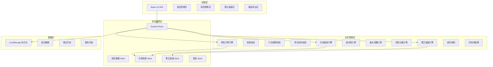
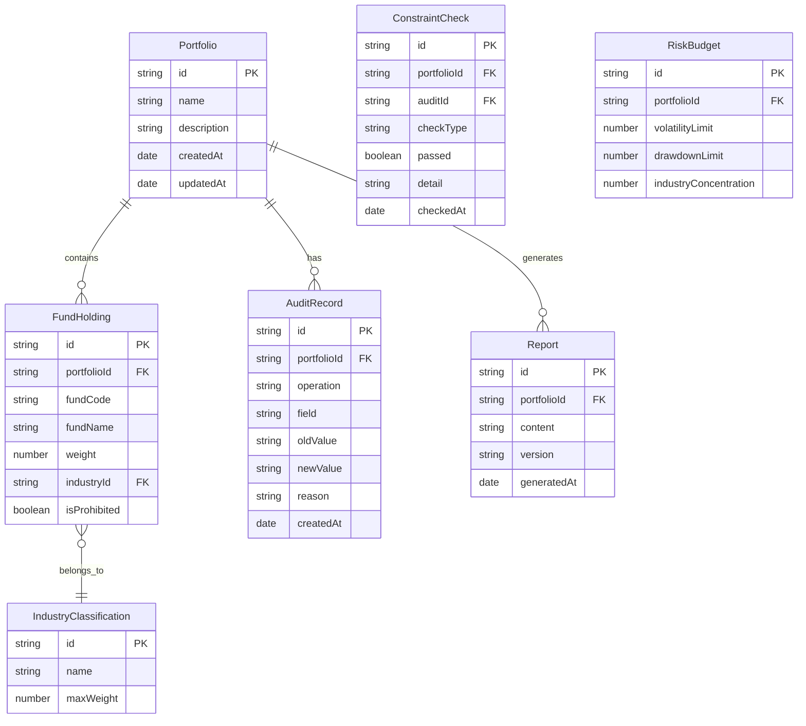

## 1. 架构设计



## 2. 技术说明
- 前端：React@18 + TypeScript + Tailwind CSS@3 + Vite
- 初始化工具：vite-init（react-ts 模板）
- 后端：无（纯前端，数据存 LocalStorage）
- 状态管理：Zustand
- 图表库：recharts
- 数据持久化：LocalStorage（组合、修正历史、报告归档）

## 3. 路由定义
| 路由 | 用途 |
|------|------|
| / | 组合管理页：样例导入、基金持仓编辑、行业分布 |
| /risk-budget | 风险预算页：约束检查、风险分数、图表 |
| /audit-trail | 修正留痕页：修正时间线、差异对比 |
| /report | 报告导出页：报告预览、导出、历史版本 |

## 4. 数据模型

### 4.1 数据模型定义



### 4.2 数据定义

#### FundHolding（基金持仓）
```typescript
interface FundHolding {
  id: string
  portfolioId: string
  fundCode: string
  fundName: string
  weight: number
  industryId: string
  industryName: string
  isProhibited: boolean
}
```

#### IndustryClassification（行业分类）
```typescript
interface IndustryClassification {
  id: string
  name: string
  maxWeight: number
}
```

#### ConstraintCheckResult（约束检查结果）
```typescript
interface ConstraintCheckResult {
  id: string
  auditId: string
  weightCheck: { passed: boolean; totalWeight: number; detail: string }
  industryCheck: { passed: boolean; violations: IndustryViolation[]; detail: string }
  prohibitedCheck: { passed: boolean; prohibitedFunds: string[]; detail: string }
  checkedAt: string
}
```

#### AuditRecord（修正留痕）
```typescript
interface AuditRecord {
  id: string
  portfolioId: string
  operation: string
  field: string
  oldValue: string
  newValue: string
  reason: string
  constraintCheckId: string
  createdAt: string
}
```

#### RiskBudget（风险预算配置）
```typescript
interface RiskBudget {
  id: string
  portfolioId: string
  volatilityLimit: number
  drawdownLimit: number
  industryConcentration: number
}
```

#### RiskScore（风险分数）
```typescript
interface RiskScore {
  concentration: number
  volatility: number
  drawdown: number
  liquidity: number
  compliance: number
  overall: number
  explanations: Record<string, string>
}
```

#### Report（报告）
```typescript
interface Report {
  id: string
  portfolioId: string
  version: string
  generatedAt: string
  constraintChecks: ConstraintCheckResult[]
  riskScore: RiskScore
  holdings: FundHolding[]
  riskBudget: RiskBudget
}
```

## 5. 核心算法

### 5.1 约束检查引擎
1. **权重检查**：遍历所有持仓权重，判断 sum(weights) === 100，容差 ±0.01
2. **行业超限检查**：按行业聚合权重，若某行业权重 > 该行业 maxWeight，标记违规
3. **禁买标的检查**：遍历持仓，若 isProhibited === true，标记违规

### 5.2 风险分数计算
- 集中度 = 1 - HHI（赫芬达尔指数），越高越分散
- 波动率 = sqrt(sum(wi^2 * σi^2 + 2*sum(wi*wj*σi*σj*ρij)))，简化为等权相关
- 回撤 = 基于历史模拟的最大回撤
- 流动性 = 加权平均赎回天数
- 合规 = 1 - 违规数 / 总检查项

### 5.3 修正留痕
- 每次编辑持仓/风险预算参数，自动生成 AuditRecord
- AuditRecord 记录：操作类型、修改字段、旧值、新值、触发原因（关联约束检查）
