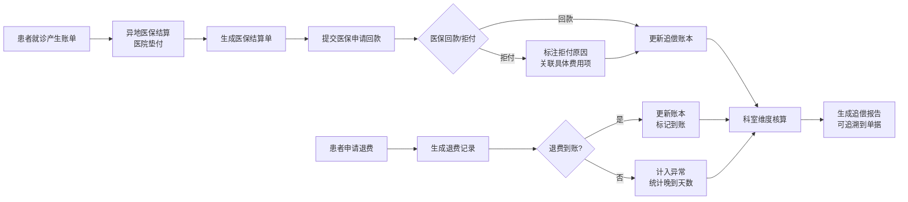

## 1. 产品概述

医院医保垫付追偿管理系统，解决异地医保先垫付后追偿场景下患者退费与医保回款错开问题，帮助结算员和科室清晰追踪未收回金额。

- 核心目标：实现患者账单→医保结算单→垫付账本→追偿报告的全链路数据贯通，异常数据可追溯到具体单据位置
- 目标用户：医院结算员、科室核算员、财务管理人员
- 核心价值：解决退费晚到数据混乱、医保拒付定位难、科室核算不清晰等痛点

## 2. 核心功能

### 2.1 用户角色

| 角色 | 登录方式 | 核心权限 |
|------|----------|----------|
| 结算员 | 账号登录 | 患者账单查询、医保结算单管理、退费登记、追偿导出 |
| 科室核算员 | 账号登录 | 本科室未收回金额查看、异常数据追踪 |
| 财务管理员 | 账号登录 | 全量数据查看、追偿报告导出、系统配置 |

### 2.2 功能模块

1. **患者账单查询页**：患者信息展示、账单明细、关联医保结算单、关联退费记录
2. **医保结算单管理页**：结算单列表、明细查看、医保拒付标注、关联患者账单
3. **垫付追偿账本页**：科室维度未收回金额、垫付记录、异常告警、数据追溯
4. **退费记录管理页**：退费列表、退费回滚、退费到账标记、关联结算单
5. **追偿报告导出页**：多维度统计图表、异常说明、Excel/CSV导出

### 2.3 页面详情

| 页面名称 | 模块名称 | 功能描述 |
|----------|----------|----------|
| 患者账单查询页 | 搜索筛选 | 按患者姓名、住院号、日期范围搜索 |
| 患者账单查询页 | 账单卡片 | 展示患者基本信息、总费用、医保垫付金额、退费状态 |
| 患者账单查询页 | 账单明细 | 费用明细列表、科室编码标注、异常项高亮 |
| 患者账单查询页 | 关联追溯 | 一键跳转到对应医保结算单、退费记录 |
| 医保结算单管理页 | 结算单列表 | 展示结算单号、患者信息、医保应回款、实际回款、差额 |
| 医保结算单管理页 | 拒付标注 | 医保拒付项标注、原因说明、关联具体费用项 |
| 医保结算单管理页 | 科室编码校验 | 自动检测错误科室编码，指回具体账单位置 |
| 垫付追偿账本页 | 科室汇总卡片 | 各科室未收回金额、已垫付金额、已追偿金额 |
| 垫付追偿账本页 | 异常说明面板 | 退费晚到清单、医保拒付清单、编码错误清单，带具体位置链接 |
| 垫付追偿账本页 | 数据联动 | 账本数据变更后自动更新所有关联页面 |
| 退费记录管理页 | 退费列表 | 退费申请时间、实际到账时间、金额、关联结算单 |
| 退费记录管理页 | 退费回滚 | 支持误操作退费回滚，自动更新账本和关联单据 |
| 退费记录管理页 | 到账标记 | 标记退费到账状态，晚到退费给出明确天数统计 |
| 追偿报告导出页 | 统计图表 | 科室垫付趋势图、医保回款率、异常类型分布图 |
| 追偿报告导出页 | 异常说明 | 每条异常数据附具体单据定位链接，与图表数据一致 |
| 追偿报告导出页 | 导出功能 | 导出Excel包含完整追溯链路，数据与页面展示完全一致 |

## 3. 核心流程

## 4. 用户界面设计

### 4.1 设计风格

- 主色调：深蓝(#165DFF) - 专业稳重，适合医疗金融场景
- 辅助色：橙红(#FF7D00) - 异常告警；绿色(#00B42A) - 正常状态；红色(#F53F3F) - 严重异常
- 按钮风格：直角微圆角(4px)，实线边框，hover时有轻微浮起效果
- 字体：Noto Sans SC - 中文显示清晰，数字等宽
- 布局风格：卡片式布局，左侧导航+右侧内容区，表格为主
- 图标风格：线性图标，简洁专业

### 4.2 页面设计概览

| 页面名称 | 模块名称 | UI元素 |
|----------|----------|--------|
| 患者账单查询页 | 搜索区 | 下拉选择器、日期范围、搜索按钮 |
| 患者账单查询页 | 数据表格 | 斑马纹、悬停高亮、异常行红框标注 |
| 患者账单查询页 | 详情抽屉 | 右侧滑出，分级展示账单明细、关联单据链接 |
| 医保结算单管理页 | 状态标签 | 不同颜色标签区分回款/拒付/处理中 |
| 医保结算单管理页 | 拒付标注 | 弹窗表单，下拉选择拒付原因，输入具体位置说明 |
| 垫付追偿账本页 | 科室卡片 | 数字大号突出显示，进度条展示追偿完成率 |
| 垫付追偿账本页 | 异常面板 | 可展开/收起，每条异常带跳转按钮 |
| 退费记录管理页 | 晚到标记 | 红色数字标注晚到天数，悬浮提示预计影响 |
| 追偿报告导出页 | 统计图表 | ECharts柱状图/饼图，支持点击钻取 |
| 追偿报告导出页 | 导出按钮组 | 区分Excel/CSV导出，导出前预览数据摘要 |

### 4.3 响应式

- 桌面端优先设计，适配1920×1080及以上分辨率
- 平板端支持左右滑动查看表格，保持核心功能可用
- 不做移动端深度适配

### 4.4 交互细节

- 数据追溯：所有关联ID均可点击跳转，打开对应单据详情
- 异常高亮：表格中异常行使用浅红背景+左边框红条
- 实时联动：账本数据变更后，所有页面数据自动刷新
- 导出预览：导出前显示数据行数、异常条数等摘要信息
