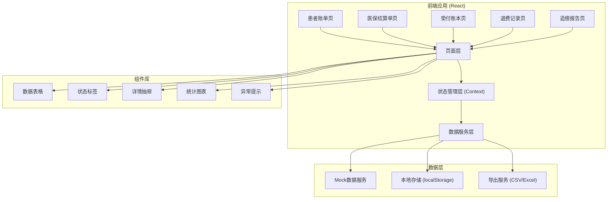
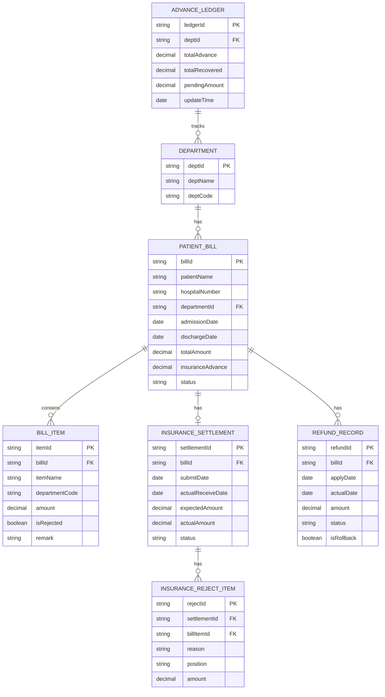

## 1. 架构设计



## 2. 技术描述

- 前端框架：React@18 + TypeScript
- 构建工具：Vite@5
- 样式方案：TailwindCSS@3
- 状态管理：React Context + useReducer
- 图表库：ECharts@5
- 组件库：Ant Design@5
- 导出功能：xlsx (Excel) + 原生CSV导出
- 数据持久化：localStorage（用于演示数据变更持久化）
- 路由：React Router@6

## 3. 路由定义

| 路由 | 页面 | 功能 |
|------|------|------|
| / | 首页/数据概览 | 关键指标卡片、快速入口 |
| /patient-bills | 患者账单查询 | 账单列表、详情、关联追溯 |
| /insurance-settlements | 医保结算单管理 | 结算单列表、拒付标注、编码校验 |
| /advance-ledger | 垫付追偿账本 | 科室汇总、异常面板、数据联动 |
| /refund-records | 退费记录管理 | 退费列表、回滚、到账标记 |
| /recovery-report | 追偿报告导出 | 统计图表、异常说明、数据导出 |

## 4. 数据模型定义

### 4.1 ER图



### 4.2 类型定义

```typescript
// 患者账单
interface PatientBill {
  billId: string;
  patientName: string;
  hospitalNumber: string;
  departmentId: string;
  departmentName: string;
  admissionDate: string;
  dischargeDate: string;
  totalAmount: number;
  insuranceAdvance: number;
  status: 'pending' | 'processing' | 'completed' | 'exception';
  items: BillItem[];
  settlementId?: string;
  refundIds: string[];
}

// 账单明细
interface BillItem {
  itemId: string;
  billId: string;
  itemName: string;
  departmentCode: string;
  amount: number;
  isRejected: boolean;
  remark?: string;
}

// 医保结算单
interface InsuranceSettlement {
  settlementId: string;
  billId: string;
  patientName: string;
  submitDate: string;
  actualReceiveDate?: string;
  expectedAmount: number;
  actualAmount: number;
  status: 'submitted' | 'partial' | 'completed' | 'rejected';
  rejectItems: InsuranceRejectItem[];
}

// 医保拒付项
interface InsuranceRejectItem {
  rejectId: string;
  settlementId: string;
  billItemId: string;
  reason: string;
  position: string;
  amount: number;
}

// 退费记录
interface RefundRecord {
  refundId: string;
  billId: string;
  patientName: string;
  applyDate: string;
  actualDate?: string;
  amount: number;
  status: 'applied' | 'received' | 'delayed' | 'rollback';
  lateDays?: number;
}

// 科室
interface Department {
  deptId: string;
  deptName: string;
  deptCode: string;
  validCodes: string[];
}

// 垫付账本
interface AdvanceLedger {
  ledgerId: string;
  departmentId: string;
  departmentName: string;
  totalAdvance: number;
  totalRecovered: number;
  pendingAmount: number;
  exceptionCount: number;
  updateTime: string;
}

// 异常类型
interface ExceptionRecord {
  exceptionId: string;
  type: 'refund_delay' | 'insurance_reject' | 'code_error';
  relatedBillId: string;
  relatedSettlementId?: string;
  relatedItemId?: string;
  description: string;
  amount: number;
  position: string;
}
```

## 5. 核心数据计算规则

### 5.1 科室未收回金额计算

```
未收回金额 = 总垫付金额 - 已追偿金额
其中：
- 总垫付金额 = Σ 所有医保垫付金额（按科室汇总）
- 已追偿金额 = Σ 医保实际回款 + Σ 患者实际退费（按科室汇总）
```

### 5.2 退费晚到判定

```
晚到天数 = 当前日期 - 退费申请日期 - 标准到账周期(7天)
晚到天数 > 0 标记为晚到
```

### 5.3 科室编码校验

```
有效编码集合 = [科室预设编码列表]
账单明细.科室编码 ∉ 有效编码集合 → 标记编码错误
```

## 6. 状态管理设计

### 6.1 全局状态结构

```typescript
interface AppState {
  patientBills: PatientBill[];
  settlements: InsuranceSettlement[];
  refunds: RefundRecord[];
  ledgers: AdvanceLedger[];
  departments: Department[];
  exceptions: ExceptionRecord[];
  lastUpdate: string;
}

type AppAction =
  | { type: 'MARK_REFUND_RECEIVED'; payload: { refundId: string; actualDate: string } }
  | { type: 'ROLLBACK_REFUND'; payload: { refundId: string } }
  | { type: 'ADD_INSURANCE_REJECT'; payload: { settlementId: string; rejectItem: InsuranceRejectItem } }
  | { type: 'RECALCULATE_LEDGERS' }
  | { type: 'REFRESH_ALL' };
```

### 6.2 数据联动机制

1. 退费到账标记 → 触发账本重新计算
2. 退费回滚 → 触发账本重新计算 + 异常列表更新
3. 医保拒付新增 → 触发账本重新计算 + 异常列表更新
4. 账本计算 → 触发所有页面数据刷新
