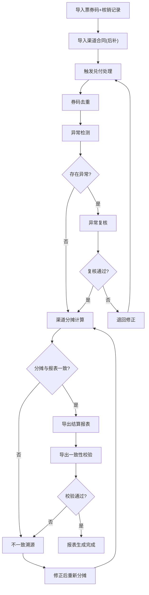

## 1. 产品概述

影城票券兑付结算系统——解决团购券、会员券、渠道券混合核销后，月底渠道结算服务费漏算、错算的问题。目标用户为影院财务人员，核心价值是让"从造数到导出"的兑付结算链路清晰可追溯、异常可筛选、改动可回溯。

- 覆盖票券核销全流程：数据导入 → 去重处理 → 异常复核 → 渠道分摊 → 报表导出
- 解决三大痛点：券重复核销误过、渠道合同迟到导致服务费版本错、改券码后无法感知影响范围

## 2. 核心功能

### 2.1 用户角色

| 角色 | 注册方式 | 核心权限 |
|------|----------|----------|
| 财务操作员 | 管理员分配账号 | 导入数据、触发处理、复核异常、导出报表 |
| 财务主管 | 管理员分配账号 | 审核复核结果、确认渠道结算、查看变更影响 |

### 2.2 功能模块

1. **工作台首页**：处理进度总览、待复核异常数、最近结算批次、快捷操作入口
2. **数据导入页**：票券码导入、核销记录导入、渠道合同导入（含时序标记）、导入批次管理
3. **兑付处理页**：去重处理、异常检测（重复核销/跨影院/服务费版本错）、处理批次管理、变更影响追踪
4. **异常复核页**：异常列表筛选、逐条复核操作、券码去重回看、复核历史记录
5. **渠道结算页**：渠道分摊计算、分摊明细核对、结算单生成、不一致原因溯源
6. **报表导出页**：结算报表导出、导出一致性校验、历史版本对比

### 2.3 页面详情

| 页面名称 | 模块名称 | 功能描述 |
|----------|----------|----------|
| 工作台首页 | 进度总览 | 显示当前处理批次状态（导入→处理→复核→导出），各环节待处理数量 |
| 工作台首页 | 异常提醒 | 待复核异常数、严重异常高亮（重复核销/跨影院） |
| 工作台首页 | 最近批次 | 最近5个结算批次的处理状态和创建时间 |
| 数据导入页 | 数据源切换 | Tab切换：票券码 / 核销记录 / 渠道合同，每个Tab独立上传 |
| 数据导入页 | 导入时序标记 | 每次导入记录时间戳和批次号，列表展示导入顺序，迟到数据标注"后补" |
| 数据导入页 | 批次管理 | 已导入批次列表，支持查看明细、删除、重新导入 |
| 兑付处理页 | 去重引擎 | 基于券码去重，展示去重前后对比，去重记录可回看 |
| 兑付处理页 | 异常检测 | 自动检测三类异常：重复核销、跨影院使用、服务费版本错，不自动通过 |
| 兑付处理页 | 变更追踪 | 券码修改后重跑，对比前后结果差异，标注受影响的记录 |
| 异常复核页 | 异常筛选 | 按异常类型（重复核销/跨影院/服务费版本错）筛选，支持多条件组合 |
| 异常复核页 | 逐条复核 | 展示异常详情，操作员可标记"确认异常"或"放行"并填写理由 |
| 异常复核页 | 去重回看 | 点击券码可查看该券码的所有核销记录、去重决策过程 |
| 渠道结算页 | 分摊计算 | 按渠道合同计算服务费分摊，展示分摊公式和计算过程 |
| 渠道结算页 | 不一致溯源 | 渠道分摊与报表导出数值不一致时，可追溯至具体原因（合同版本/费率变更） |
| 渠道结算页 | 结算单生成 | 按渠道生成月度结算单，含服务费明细 |
| 报表导出页 | 导出校验 | 导出前自动校验分摊与报表数据一致性，不一致则阻断并提示原因 |
| 报表导出页 | 版本对比 | 同一批次多次导出时可对比差异 |

## 3. 核心流程

### 3.1 主流程

1. 财务操作员导入票券码和核销记录（先到），随后补充导入渠道合同（后到），系统按导入时间标记先后顺序
2. 触发兑付处理：系统执行券码去重、异常检测（重复核销/跨影院/服务费版本错），异常不自动通过
3. 操作员在异常复核页筛选并逐条处理异常，可回看券码去重决策
4. 系统按渠道合同进行服务费分摊计算，操作员核对分摊明细
5. 若分摊与报表数据不一致，系统自动溯源原因
6. 导出结算报表，导出前校验一致性，通过后生成报表

### 3.2 变更追踪流程

1. 操作员修改某券码信息后重新触发处理
2. 系统对比修改前后的处理结果，标注所有受影响的记录
3. 操作员确认影响范围后继续后续流程

### 3.3 流程图

## 4. 用户界面设计

### 4.1 设计风格

- **主色调**：深炭灰(#1A1A2E) + 琥珀金(#E8A838)，传递财务系统的严谨与影院行业的质感
- **辅助色**：冷石灰(#F0EDE8)作底、警示红(#E74C3C)标异常、通行绿(#2ECC71)标放行
- **按钮风格**：圆角4px，主操作实心琥珀金，次操作描边灰，危险操作红色警示
- **字体**：标题用 Noto Serif SC（宋体质感），正文用 Noto Sans SC，数据用 JetBrains Mono
- **布局风格**：左侧固定导航 + 右侧内容区，数据表格为主，卡片式统计面板
- **图标风格**：线性图标，2px线宽，与数字搭配时左对齐

### 4.2 页面设计概览

| 页面名称 | 模块名称 | UI要素 |
|----------|----------|--------|
| 工作台首页 | 进度总览 | 步骤条组件（横向4步），当前步骤高亮，各步数字徽标 |
| 工作台首页 | 异常提醒 | 红色/黄色警示卡片，含异常类型标签和数量 |
| 工作台首页 | 最近批次 | 紧凑表格，状态用色点标记，时间右对齐 |
| 数据导入页 | 数据源切换 | 顶部Tab栏，3个Tab，当前Tab底部琥珀金下划线 |
| 数据导入页 | 导入时序标记 | 时间轴组件（纵向），各导入节点按时间排序，后补数据标"后补"橙色标签 |
| 数据导入页 | 批次管理 | 数据表格，含批次号/数据源/导入时间/记录数/状态列 |
| 兑付处理页 | 去重引擎 | 去重前后双栏对比，差异行高亮，去重记录可展开 |
| 兑付处理页 | 异常检测 | 三类异常各为Tab，异常列表含类型标签/券码/影院/详情 |
| 兑付处理页 | 变更追踪 | 前后对比面板，受影响记录红框标注，差异字段黄色高亮 |
| 异常复核页 | 异常筛选 | 顶部筛选栏：异常类型多选/影院选择/日期范围，实时过滤 |
| 异常复核页 | 逐条复核 | 详情面板：左侧异常信息，右侧操作区（确认异常/放行+理由输入） |
| 异常复核页 | 去重回看 | 弹窗：券码所有核销记录时间线，去重决策节点标注 |
| 渠道结算页 | 分摊计算 | 渠道列表+分摊明细表，分摊公式可展开查看 |
| 渠道结算页 | 不一致溯源 | 不一致记录标红，点击展开溯源链：合同版本→费率→计算过程 |
| 渠道结算页 | 结算单 | 结算单预览卡片，含渠道名/总金额/服务费/净额 |
| 报表导出页 | 导出校验 | 校验进度条，校验结果：通过/不通过+原因列表 |
| 报表导出页 | 版本对比 | 左右对照布局，差异行背景色标注 |

### 4.3 响应式设计

- 桌面优先设计，最小支持1280px宽度
- 表格在窄屏下支持横向滚动
- 数据导入时间轴在移动端切换为简化列表视图

### 4.4 3D场景指引

不适用
