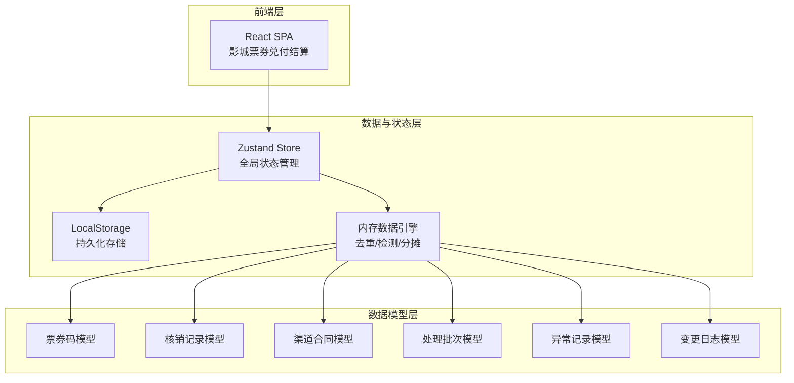
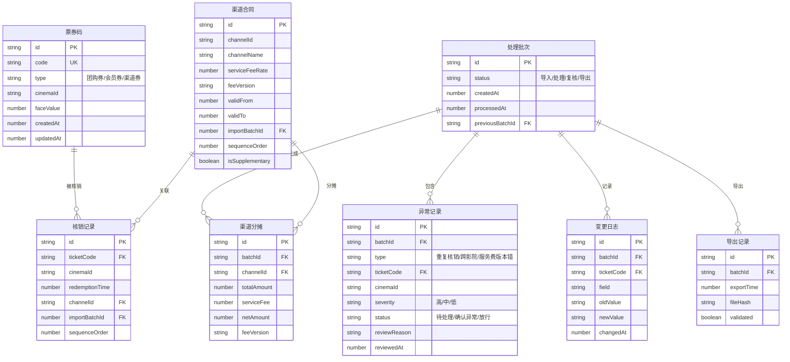

## 1. 架构设计



## 2. 技术说明

- **前端**：React@18 + TypeScript + TailwindCSS@3 + Vite
- **初始化工具**：Vite (react-ts 模板)
- **后端**：无后端，纯前端数据引擎 + LocalStorage 持久化
- **数据库**：LocalStorage + 内存数据引擎（符合"先跑明白"的轻量定位）
- **状态管理**：Zustand（轻量、支持持久化中间件）
- **路由**：React Router v6
- **数据导出**：xlsx (SheetJS) 导出 Excel 报表
- **图标**：Lucide React
- **动画**：Framer Motion

## 3. 路由定义

| 路由 | 用途 |
|------|------|
| `/` | 工作台首页：处理进度总览、异常提醒、最近批次 |
| `/import` | 数据导入页：票券码/核销记录/渠道合同导入 |
| `/process` | 兑付处理页：去重、异常检测、变更追踪 |
| `/review` | 异常复核页：异常筛选、逐条复核、去重回看 |
| `/settlement` | 渠道结算页：分摊计算、不一致溯源、结算单 |
| `/export` | 报表导出页：导出校验、版本对比 |

## 4. API 定义（前端数据引擎接口）

### 4.1 数据导入接口

```typescript
interface ImportService {
  importTicketCodes(file: ParsedFile): Promise<ImportResult>;
  importRedemptionRecords(file: ParsedFile): Promise<ImportResult>;
  importChannelContracts(file: ParsedFile): Promise<ImportResult>;
  getImportBatches(): ImportBatch[];
  removeImportBatch(batchId: string): void;
}

interface ImportBatch {
  id: string;
  source: "ticket_code" | "redemption_record" | "channel_contract";
  importTime: number;
  recordCount: number;
  isSupplementary: boolean;
  sequenceOrder: number;
}

interface ImportResult {
  batchId: string;
  successCount: number;
  failCount: number;
  errors: ImportError[];
}
```

### 4.2 兑付处理接口

```typescript
interface ProcessService {
  runDeduplication(batchId: string): DeduplicationResult;
  runAnomalyDetection(batchId: string): AnomalyDetectionResult;
  runChangeTracking(batchId: string, previousResult: ProcessResult): ChangeTrackingResult;
  getProcessHistory(batchId: string): ProcessResult[];
}

interface DeduplicationResult {
  totalCodes: number;
  uniqueCodes: number;
  duplicates: DuplicateRecord[];
}

interface AnomalyDetectionResult {
  anomalies: AnomalyRecord[];
  byType: Record<AnomalyType, number>;
}

type AnomalyType = "duplicate_redemption" | "cross_cinema" | "fee_version_mismatch";

interface AnomalyRecord {
  id: string;
  type: AnomalyType;
  ticketCode: string;
  cinemaId: string;
  details: string;
  severity: "high" | "medium" | "low";
  status: "pending" | "confirmed" | "released";
}

interface ChangeTrackingResult {
  affectedRecords: AffectedRecord[];
  summary: { added: number; removed: number; modified: number };
}
```

### 4.3 异常复核接口

```typescript
interface ReviewService {
  getAnomalies(filters: AnomalyFilter): AnomalyRecord[];
  reviewAnomaly(id: string, action: "confirm" | "release", reason: string): void;
  getDeduplicationReview(ticketCode: string): DeduplicationReview;
  getReviewHistory(): ReviewAction[];
}

interface AnomalyFilter {
  types?: AnomalyType[];
  cinemaId?: string;
  dateRange?: [number, number];
  status?: AnomalyRecord["status"];
}

interface DeduplicationReview {
  ticketCode: string;
  allRedemptions: RedemptionRecord[];
  dedupDecision: string;
  keptRecord: RedemptionRecord;
  discardedRecords: RedemptionRecord[];
}
```

### 4.4 渠道结算接口

```typescript
interface SettlementService {
  calculateAllocation(batchId: string): AllocationResult;
  checkConsistency(batchId: string): ConsistencyCheckResult;
  generateSettlementSheet(channelId: string): SettlementSheet;
  traceInconsistency(recordId: string): InconsistencyTrace;
}

interface AllocationResult {
  channelAllocations: ChannelAllocation[];
  totalServiceFee: number;
  totalNetAmount: number;
}

interface ConsistencyCheckResult {
  isConsistent: boolean;
  inconsistencies: InconsistencyRecord[];
}

interface InconsistencyTrace {
  recordId: string;
  chain: TraceStep[];
  rootCause: string;
}

interface TraceStep {
  step: string;
  value: number;
  expected: number;
  source: string;
}
```

### 4.5 报表导出接口

```typescript
interface ExportService {
  validateBeforeExport(batchId: string): ExportValidationResult;
  exportSettlementReport(batchId: string): Blob;
  getExportHistory(batchId: string): ExportRecord[];
  compareExports(exportIdA: string, exportIdB: string): ExportDiff;
}
```

## 5. 服务器架构图

不适用（纯前端应用）

## 6. 数据模型

### 6.1 数据模型定义



### 6.2 数据定义语言（TypeScript 类型）

```typescript
type TicketType = "group_buy" | "membership" | "channel";

interface TicketCode {
  id: string;
  code: string;
  type: TicketType;
  cinemaId: string;
  faceValue: number;
  createdAt: number;
  updatedAt: number;
}

interface RedemptionRecord {
  id: string;
  ticketCode: string;
  cinemaId: string;
  redemptionTime: number;
  channelId: string;
  importBatchId: string;
  sequenceOrder: number;
}

interface ChannelContract {
  id: string;
  channelId: string;
  channelName: string;
  serviceFeeRate: number;
  feeVersion: string;
  validFrom: number;
  validTo: number;
  importBatchId: string;
  sequenceOrder: number;
  isSupplementary: boolean;
}

interface ProcessBatch {
  id: string;
  status: "imported" | "processing" | "reviewing" | "exported";
  createdAt: number;
  processedAt: number | null;
  previousBatchId: string | null;
}

interface ChannelAllocation {
  id: string;
  batchId: string;
  channelId: string;
  totalAmount: number;
  serviceFee: number;
  netAmount: number;
  feeVersion: string;
}

interface ExportRecord {
  id: string;
  batchId: string;
  exportTime: number;
  fileHash: string;
  validated: boolean;
}

interface ChangeLog {
  id: string;
  batchId: string;
  ticketCode: string;
  field: string;
  oldValue: string;
  newValue: string;
  changedAt: number;
}
```
