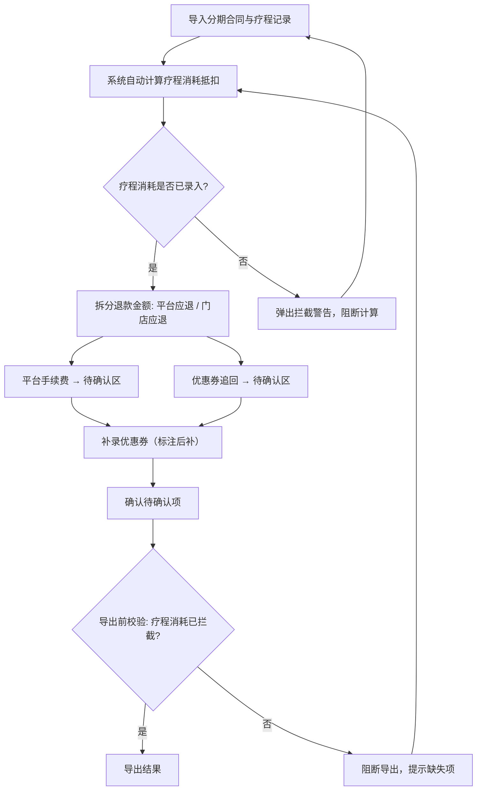

## 1. 产品概述

医美分期退款拆账是一个面向医美门店财务人员的本地 Web 应用，解决客户退项目时分期平台、门店优惠和已做疗程三项金额拆分容易出错的问题。核心目标是确保疗程已消耗金额被准确拦截，平台手续费和优惠券追回进入待确认区，让退款拆账从"前台临时算"变为"系统按规则拆"。

- 目标用户：医美门店财务人员
- 核心价值：退款拆分零返工、疗程消耗必拦截、待确认项不遗漏

## 2. 核心功能

### 2.1 用户角色

| 角色 | 进入方式 | 核心权限 |
|------|----------|----------|
| 财务人员 | 本地直接访问 | 导入数据、拆账计算、确认待确认项、导出结果 |

### 2.2 功能模块

1. **退款拆账工作台**：数据导入（分期合同/疗程记录/优惠券，含导入时序标记）、退款案件列表与筛选、快速状态总览
2. **退款拆分明细**：疗程已消耗抵扣（核心）、退款金额拆分、平台状态追踪、待确认项挂载
3. **待确认区与导出**：平台手续费与优惠券追回的待确认池、导出前疗程消耗拦截校验、结构化导出

### 2.3 页面详情

| 页面名称 | 模块名称 | 功能描述 |
|----------|----------|----------|
| 退款拆账工作台 | 数据导入区 | 支持分期合同、疗程记录、优惠券三类数据批量导入，每条记录标注导入时间和来源序号，可看出谁先谁后；优惠券补录时高亮显示"后补"标记 |
| 退款拆账工作台 | 退款案件列表 | 展示所有退款案件，支持按客户姓名、分期平台、状态、日期筛选；状态包括：待拆账、拆账中、待确认、已完成 |
| 退款拆账工作台 | 状态总览卡片 | 顶部展示：待处理案件数、待确认项数、本周已完成数、疗程消耗拦截次数 |
| 退款拆分明细 | 疗程消耗抵扣 | 核心区域，自动计算已做疗程的消耗金额并从退款基数中扣除；消耗金额以醒目红色大字显示，标注"已拦截"；若未录入疗程记录则弹出拦截警告 |
| 退款拆分明细 | 退款拆分计算 | 展示拆分结果：分期平台应退金额、门店应退金额、疗程消耗扣除金额；每项可手动微调，修改记录落库 |
| 退款拆分明细 | 平台状态追踪 | 展示分期平台当前状态（如：分期未结清/已结清/退款申请中），作为独立状态卡片而非提示文本；状态变化有历史记录 |
| 退款拆分明细 | 待确认项挂载 | 将平台手续费和优惠券追回自动挂入待确认区，卡片上显示来源和金额，点击可跳转待确认区 |
| 待确认区与导出 | 待确认池 | 分"平台手续费"和"优惠券追回"两个分组；每项显示来源案件、金额、挂入时间；支持确认或退回操作 |
| 待确认区与导出 | 导出拦截校验 | 导出前自动校验：疗程已消耗是否已计入；若未计入则阻断导出并提示具体缺失项 |
| 待确认区与导出 | 结构化导出 | 导出为 Excel/CSV，字段包括：客户姓名、分期平台、合同金额、疗程消耗、平台应退、门店应退、平台手续费状态、优惠券追回状态、平台结清状态 |

## 3. 核心流程

用户操作流程：导入分期合同和疗程记录 → 系统计算疗程消耗抵扣 → 拆分退款金额 → 平台手续费和优惠券追回挂入待确认区 → 补录优惠券 → 确认待确认项 → 导出前校验疗程消耗拦截 → 导出结果

## 4. 用户界面设计

### 4.1 设计风格

- 主色调：深炭灰 (#1A1A2E) + 医疗青 (#0F9B8E) + 警示橙 (#E8813B)
- 辅助色：柔和白 (#F5F5F0) 用于卡片底色、浅灰 (#E0E0E0) 用于表格隔行
- 按钮：圆角 8px，主要操作用医疗青填充，危险操作用警示橙填充，次要操作用浅灰描边
- 字体：思源黑体 Noto Sans SC，标题 20px/700，正文 14px/400，数字 16px/600 等宽
- 布局：左侧固定导航栏 + 右侧内容区，内容区采用卡片式布局
- 图标：线性图标，2px 描边，与医疗青色系一致

### 4.2 页面设计概览

| 页面名称 | 模块名称 | UI 元素 |
|----------|----------|----------|
| 退款拆账工作台 | 数据导入区 | 三列上传卡片（分期合同/疗程记录/优惠券），每个卡片显示导入时间戳和序号标签，后补优惠券带橙色"后补"角标 |
| 退款拆账工作台 | 退款案件列表 | 表格布局，表头固定，行悬停高亮，状态列用彩色圆点标识，筛选栏在表格上方 |
| 退款拆账工作台 | 状态总览卡片 | 四个横向排列的统计卡片，数字大字突出，带微妙渐变底色 |
| 退款拆分明细 | 疗程消耗抵扣 | 独立红色边框卡片，消耗金额用 28px 红色大字显示，旁边标注"✓ 已拦截"绿色勾标 |
| 退款拆分明细 | 退款拆分计算 | 三列金额卡片，每列顶部为标题，中部大字金额，底部说明文字 |
| 退款拆分明细 | 平台状态追踪 | 独立状态卡片，状态标签用圆角胶囊样式，历史记录折叠在下方 |
| 退款拆分明细 | 待确认项挂载 | 右侧悬浮面板，显示待确认项数量角标，点击展开列表 |
| 待确认区与导出 | 待确认池 | 两个分组卡片（平台手续费/优惠券追回），每项为可操作行，右侧有确认/退回按钮 |
| 待确认区与导出 | 导出拦截校验 | 导出按钮点击后弹出校验弹窗，校验通过显示绿色勾，不通过显示红色叉和缺失项列表 |
| 待确认区与导出 | 结构化导出 | 简洁导出按钮组（Excel/CSV），导出内容为纯数据表格无多余装饰 |

### 4.3 响应式

桌面优先设计，最小支持 1280px 宽度；平板端隐藏左侧导航改为顶部导航；移动端暂不做适配。

### 4.4 3D 场景指引

不适用
