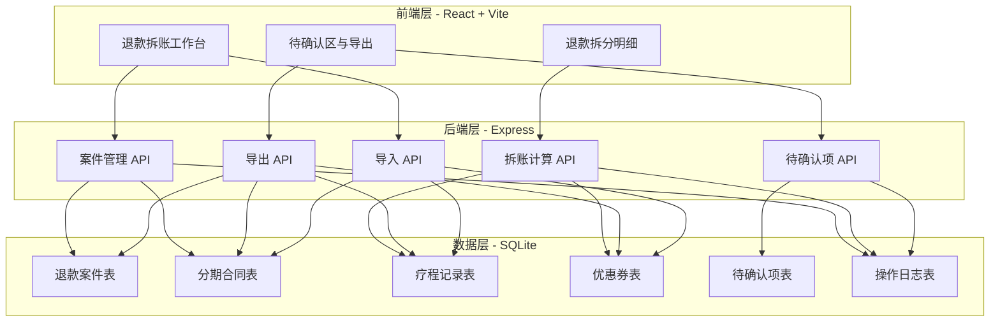
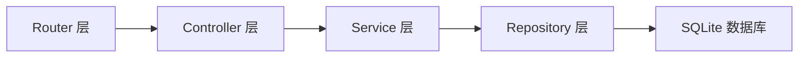
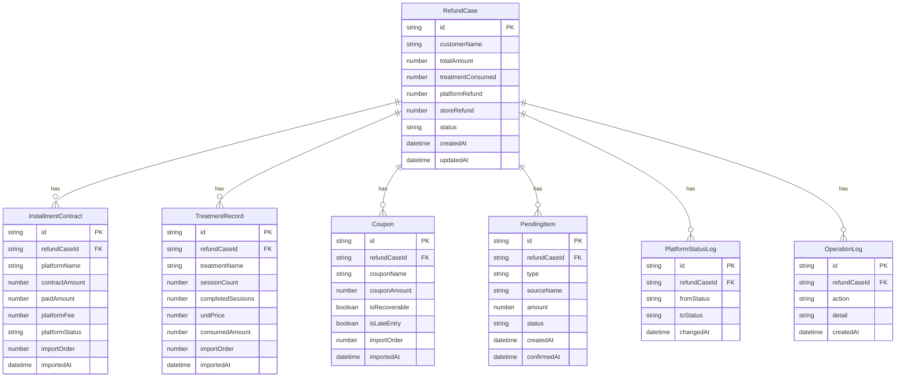

## 1. 架构设计



## 2. 技术说明

- 前端：React@18 + TailwindCSS@3 + Vite
- 初始化工具：Vite
- 后端：Express@4
- 数据库：SQLite（本地文件，无需额外安装）
- 导出库：xlsx（Excel 导出）

## 3. 路由定义

| 路由 | 用途 |
|------|------|
| / | 退款拆账工作台：数据导入、案件列表、状态总览 |
| /refund/:id | 退款拆分明细：消耗抵扣、拆分计算、平台状态、待确认挂载 |
| /pending | 待确认区与导出：待确认池、导出校验、结构化导出 |

## 4. API 定义

### 4.1 TypeScript 类型定义

```typescript
interface InstallmentContract {
  id: string;
  refundCaseId: string;
  platformName: string;
  contractAmount: number;
  paidAmount: number;
  platformFee: number;
  platformStatus: "未结清" | "已结清" | "退款申请中";
  importOrder: number;
  importedAt: string;
}

interface TreatmentRecord {
  id: string;
  refundCaseId: string;
  treatmentName: string;
  sessionCount: number;
  completedSessions: number;
  unitPrice: number;
  consumedAmount: number;
  importOrder: number;
  importedAt: string;
}

interface Coupon {
  id: string;
  refundCaseId: string;
  couponName: string;
  couponAmount: number;
  isRecoverable: boolean;
  isLateEntry: boolean;
  importOrder: number;
  importedAt: string;
}

interface RefundCase {
  id: string;
  customerName: string;
  totalAmount: number;
  treatmentConsumed: number;
  platformRefund: number;
  storeRefund: number;
  status: "待拆账" | "拆账中" | "待确认" | "已完成";
  createdAt: string;
  updatedAt: string;
}

interface PendingItem {
  id: string;
  refundCaseId: string;
  type: "平台手续费" | "优惠券追回";
  sourceName: string;
  amount: number;
  status: "待确认" | "已确认" | "已退回";
  createdAt: string;
  confirmedAt: string | null;
}

interface PlatformStatusLog {
  id: string;
  refundCaseId: string;
  fromStatus: string;
  toStatus: string;
  changedAt: string;
}

interface OperationLog {
  id: string;
  refundCaseId: string;
  action: string;
  detail: string;
  operator: string;
  createdAt: string;
}
```

### 4.2 请求/响应模式

| API | 方法 | 路径 | 请求体 | 响应体 |
|-----|------|------|--------|--------|
| 获取案件列表 | GET | /api/cases | - | RefundCase[] |
| 获取案件详情 | GET | /api/cases/:id | - | RefundCase + 关联数据 |
| 创建案件 | POST | /api/cases | { customerName, totalAmount } | RefundCase |
| 更新案件 | PUT | /api/cases/:id | Partial<RefundCase> | RefundCase |
| 删除案件 | DELETE | /api/cases/:id | - | { success: boolean } |
| 导入分期合同 | POST | /api/contracts | InstallmentContract[] | { count: number } |
| 导入疗程记录 | POST | /api/treatments | TreatmentRecord[] | { count: number } |
| 导入优惠券 | POST | /api/coupons | Coupon[] | { count: number } |
| 计算拆账 | POST | /api/cases/:id/calculate | - | 拆账结果 |
| 获取待确认项 | GET | /api/pending | - | PendingItem[] |
| 确认待确认项 | PUT | /api/pending/:id/confirm | - | PendingItem |
| 退回待确认项 | PUT | /api/pending/:id/reject | - | PendingItem |
| 导出前校验 | GET | /api/export/validate/:id | - | { pass: boolean, missing: string[] } |
| 导出 | POST | /api/export | { caseIds: string[], format: "xlsx" \| "csv" } | 文件流 |
| 筛选案件 | GET | /api/cases/filter | query: 筛选参数 | RefundCase[] |
| 平台状态变更 | PUT | /api/cases/:id/platform-status | { status: string } | PlatformStatusLog |
| 操作日志 | GET | /api/cases/:id/logs | - | OperationLog[] |

## 5. 服务端架构图



## 6. 数据模型

### 6.1 数据模型定义



### 6.2 数据定义语言

```sql
CREATE TABLE refund_cases (
    id TEXT PRIMARY KEY,
    customer_name TEXT NOT NULL,
    total_amount REAL NOT NULL DEFAULT 0,
    treatment_consumed REAL NOT NULL DEFAULT 0,
    platform_refund REAL NOT NULL DEFAULT 0,
    store_refund REAL NOT NULL DEFAULT 0,
    status TEXT NOT NULL DEFAULT '待拆账' CHECK(status IN ('待拆账','拆账中','待确认','已完成')),
    created_at TEXT NOT NULL DEFAULT (datetime('now','localtime')),
    updated_at TEXT NOT NULL DEFAULT (datetime('now','localtime'))
);

CREATE TABLE installment_contracts (
    id TEXT PRIMARY KEY,
    refund_case_id TEXT NOT NULL REFERENCES refund_cases(id) ON DELETE CASCADE,
    platform_name TEXT NOT NULL,
    contract_amount REAL NOT NULL DEFAULT 0,
    paid_amount REAL NOT NULL DEFAULT 0,
    platform_fee REAL NOT NULL DEFAULT 0,
    platform_status TEXT NOT NULL DEFAULT '未结清' CHECK(platform_status IN ('未结清','已结清','退款申请中')),
    import_order INTEGER NOT NULL,
    imported_at TEXT NOT NULL DEFAULT (datetime('now','localtime'))
);

CREATE TABLE treatment_records (
    id TEXT PRIMARY KEY,
    refund_case_id TEXT NOT NULL REFERENCES refund_cases(id) ON DELETE CASCADE,
    treatment_name TEXT NOT NULL,
    session_count INTEGER NOT NULL DEFAULT 0,
    completed_sessions INTEGER NOT NULL DEFAULT 0,
    unit_price REAL NOT NULL DEFAULT 0,
    consumed_amount REAL NOT NULL DEFAULT 0,
    import_order INTEGER NOT NULL,
    imported_at TEXT NOT NULL DEFAULT (datetime('now','localtime'))
);

CREATE TABLE coupons (
    id TEXT PRIMARY KEY,
    refund_case_id TEXT NOT NULL REFERENCES refund_cases(id) ON DELETE CASCADE,
    coupon_name TEXT NOT NULL,
    coupon_amount REAL NOT NULL DEFAULT 0,
    is_recoverable INTEGER NOT NULL DEFAULT 0,
    is_late_entry INTEGER NOT NULL DEFAULT 0,
    import_order INTEGER NOT NULL,
    imported_at TEXT NOT NULL DEFAULT (datetime('now','localtime'))
);

CREATE TABLE pending_items (
    id TEXT PRIMARY KEY,
    refund_case_id TEXT NOT NULL REFERENCES refund_cases(id) ON DELETE CASCADE,
    type TEXT NOT NULL CHECK(type IN ('平台手续费','优惠券追回')),
    source_name TEXT NOT NULL,
    amount REAL NOT NULL DEFAULT 0,
    status TEXT NOT NULL DEFAULT '待确认' CHECK(status IN ('待确认','已确认','已退回')),
    created_at TEXT NOT NULL DEFAULT (datetime('now','localtime')),
    confirmed_at TEXT
);

CREATE TABLE platform_status_logs (
    id TEXT PRIMARY KEY,
    refund_case_id TEXT NOT NULL REFERENCES refund_cases(id) ON DELETE CASCADE,
    from_status TEXT NOT NULL,
    to_status TEXT NOT NULL,
    changed_at TEXT NOT NULL DEFAULT (datetime('now','localtime'))
);

CREATE TABLE operation_logs (
    id TEXT PRIMARY KEY,
    refund_case_id TEXT NOT NULL REFERENCES refund_cases(id) ON DELETE CASCADE,
    action TEXT NOT NULL,
    detail TEXT NOT NULL,
    created_at TEXT NOT NULL DEFAULT (datetime('now','localtime'))
);

CREATE INDEX idx_contracts_case ON installment_contracts(refund_case_id);
CREATE INDEX idx_treatments_case ON treatment_records(refund_case_id);
CREATE INDEX idx_coupons_case ON coupons(refund_case_id);
CREATE INDEX idx_pending_case ON pending_items(refund_case_id);
CREATE INDEX idx_pending_status ON pending_items(status);
CREATE INDEX idx_cases_status ON refund_cases(status);
CREATE INDEX idx_status_logs_case ON platform_status_logs(refund_case_id);
CREATE INDEX idx_op_logs_case ON operation_logs(refund_case_id);
```
