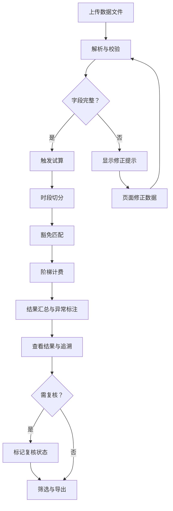

## 1. 产品概述

港口滞期费试算系统——面向航运结算员的本地 Web 应用，将船舶靠泊、装卸记录、合同费率和天气豁免等散落在邮件和表格中的数据统一导入，自动完成滞期费时段切分、豁免规则匹配和阶梯计费，给出可追溯的试算结果。解决船公司与货主因滞期费争议反复对账到深夜的问题，让结算员从手工拼算中解放出来。

- 目标用户：航运结算员、港口操作人员
- 核心价值：将滞期费试算从"邮件 + Excel + 人工心算"升级为结构化、可追溯、可导出的标准流程

## 2. 核心功能

### 2.1 用户角色

| 角色 | 注册方式 | 核心权限 |
|------|----------|----------|
| 航运结算员 | 本地直接使用 | 导入数据、试算、修正、筛选、导出 |
| 复核人员 | 本地直接使用 | 查看试算结果、追溯时段与规则 |

### 2.2 功能模块

1. **数据导入与校验页**：批量导入船舶靠泊记录、装卸记录、合同费率、天气豁免；对缺失字段给出可读的修正提示
2. **试算结果页**：展示滞期费试算结果，支持从结果追溯时段切分、豁免规则、阶梯计费；标注天气豁免跨时段卡点、装卸暂停和费率阶梯需复核项
3. **筛选与导出页**：按船名、港口、日期范围筛选，导出试算明细为 CSV/Excel

### 2.3 页面详情

| 页面名称 | 模块名称 | 功能描述 |
|----------|----------|----------|
| 数据导入与校验 | 文件上传区 | 支持上传 CSV/Excel 文件（靠泊记录、装卸记录、合同费率、天气豁免四类），解析后以表格预览 |
| 数据导入与校验 | 字段校验提示 | 缺失字段高亮并给出可操作提示（如"合同费率缺失，请补充费率阶梯或使用默认费率试算"） |
| 数据导入与校验 | 数据修正区 | 允许在页面上直接修正缺失/错误字段，修正后实时更新校验状态 |
| 试算结果 | 试算结果总览 | 按船舶维度展示滞期费合计、免费期、计费期、豁免时长等汇总信息 |
| 试算结果 | 时段追溯面板 | 点击任一结果行可展开时段切分详情，显示每个时段的起止时间、费率阶梯、豁免类型 |
| 试算结果 | 异常标注 | 天气豁免跨时段标注卡点位置，装卸暂停/费率阶梯标记为"需复核" |
| 试算结果 | 计算流水 | 展示完整计算步骤链：原始数据 → 时段切分 → 豁免匹配 → 阶梯计费 → 结果 |
| 筛选与导出 | 筛选条件 | 按船名、港口、日期范围、异常状态筛选 |
| 筛选与导出 | 导出操作 | 导出试算明细为 CSV，导出计算流水为 PDF |

## 3. 核心流程

航运结算员登录系统后，首先上传四类数据文件（靠泊记录、装卸记录、合同费率、天气豁免）。系统解析并校验数据，对缺失字段给出可操作提示；结算员可直接在页面上修正。确认数据无误后触发试算，引擎按以下步骤执行：

1. **时段切分**：根据靠泊时间、装卸开始/结束时间，将整个滞期拆分为免费期和计费期
2. **豁免匹配**：将天气豁免时间与计费期重叠部分扣除，跨时段的标注卡点位置
3. **阶梯计费**：按合同费率阶梯对计费期逐段计费
4. **结果汇总**：汇总各时段费用，标注需复核项

结算员查看试算结果，可逐条追溯计算流水；对异常项（跨时段豁免、装卸暂停、费率阶梯缺失）标记复核状态。最终按条件筛选并导出。

## 4. 用户界面设计

### 4.1 设计风格

- 主色调：深海蓝 (#0F2B46) + 港口橙 (#E87C3E) 作为强调色，辅以钢灰 (#6B7B8D)
- 按钮风格：圆角矩形，带微弱投影，主操作按钮使用港口橙
- 字体：使用 IBM Plex Sans 作为界面字体（工业感、航运行业适配），数字使用 JetBrains Mono（等宽，便于对账）
- 布局风格：左侧导航栏 + 右侧内容区，表格为主的信息密度布局，顶部操作栏
- 图标风格：线性图标，使用 lucide-react

### 4.2 页面设计概览

| 页面名称 | 模块名称 | UI 元素 |
|----------|----------|---------|
| 数据导入与校验 | 文件上传区 | 拖拽上传区域，四个分类标签页切换，上传进度条 |
| 数据导入与校验 | 字段校验提示 | 表格行内红色高亮缺失字段，行右侧悬浮修正按钮和提示气泡 |
| 数据导入与校验 | 数据修正区 | 行内编辑弹窗，修正后字段变绿表示已修正 |
| 试算结果 | 试算结果总览 | 卡片式汇总，每船一张卡片，关键数字大字号展示 |
| 试算结果 | 时段追溯面板 | 点击卡片展开时间轴组件，每个时段为时间轴节点 |
| 试算结果 | 异常标注 | 橙色标签"跨时段豁免"，黄色标签"需复核"，红色标签"费率缺失" |
| 试算结果 | 计算流水 | 步骤条组件，每步可展开查看详细参数 |
| 筛选与导出 | 筛选条件 | 顶部筛选栏，下拉选择 + 日期范围选择器 |
| 筛选与导出 | 导出操作 | 顶部操作栏导出按钮，下拉选择导出格式 |

### 4.3 响应式设计

- 桌面优先设计，最小宽度 1280px
- 表格区域支持横向滚动
- 侧边导航在窄屏时折叠为图标模式

### 4.4 动效设计

- 数据导入时解析步骤逐步展开动画
- 试算结果卡片加载时淡入
- 时段追溯面板展开/收起使用滑动动画
- 异常标签使用轻微脉冲动画吸引注意
