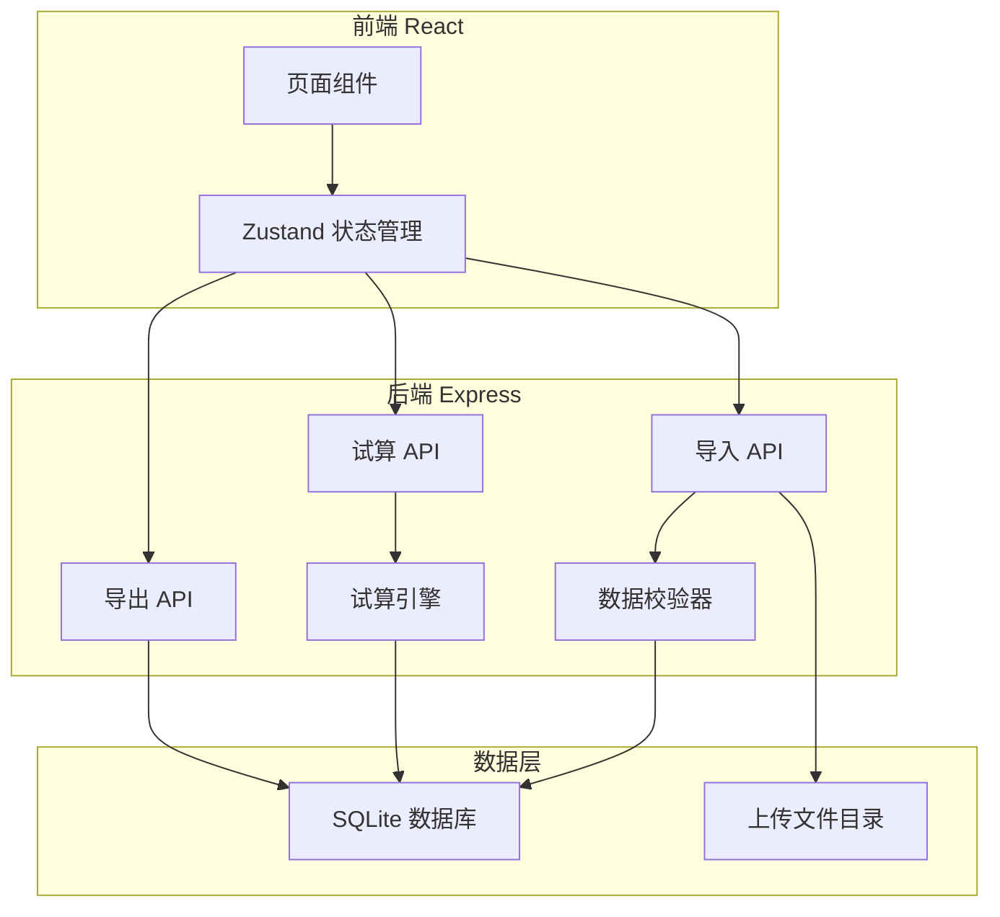
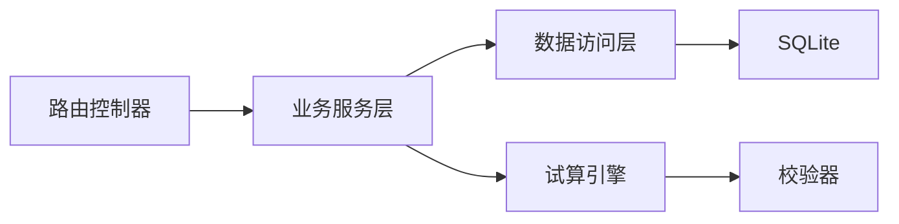
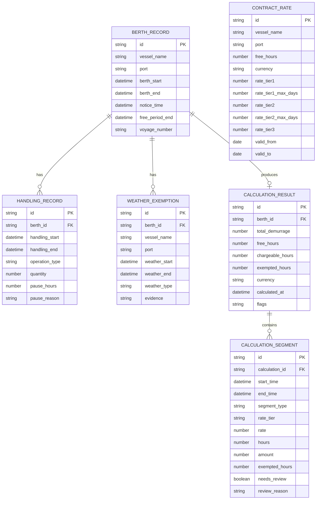

## 1. 架构设计



## 2. 技术说明

- 前端：React@18 + TailwindCSS@3 + Vite + Zustand
- 初始化工具：vite-init（react-express-ts 模板）
- 后端：Express@4 + TypeScript (ESM)
- 数据库：SQLite（本地文件数据库，无需额外服务）
- 文件解析：xlsx（Excel 解析）、papaparse（CSV 解析）
- 导出：xlsx（Excel 导出）、json2csv（CSV 导出）

## 3. 路由定义

| 路由 | 用途 |
|------|------|
| / | 重定向到 /import |
| /import | 数据导入与校验页 |
| /result | 试算结果与追溯页 |
| /export | 筛选与导出页 |

## 4. API 定义

### 4.1 数据导入

```typescript
POST /api/import/upload
Content-Type: multipart/form-data

Request:
  file: File
  type: "berth" | "handling" | "contract" | "weather"

Response:
  {
    success: boolean
    recordCount: number
    warnings: Array<{
      row: number
      field: string
      message: string
      suggestion: string
    }>
    missingFields: string[]
  }
```

### 4.2 数据校验与修正

```typescript
GET /api/import/validate?type=berth|handling|contract|weather

Response:
  {
    valid: boolean
    totalRows: number
    issues: Array<{
      row: number
      field: string
      severity: "error" | "warning"
      message: string
      suggestion: string
    }>
  }

PATCH /api/import/record
Request:
  {
    type: "berth" | "handling" | "contract" | "weather"
    rowId: string
    updates: Record<string, any>
  }

Response:
  {
    success: boolean
    validation: { valid: boolean; issues: Array<{field: string; message: string}> }
  }
```

### 4.3 试算

```typescript
POST /api/calculation/run

Request:
  {
    vesselName?: string
    port?: string
  }

Response:
  {
    calculations: Array<{
      id: string
      vesselName: string
      port: string
      berthTime: string
      totalDemurrage: number
      freePeriodHours: number
      chargeableHours: number
      exemptedHours: number
      currency: string
      flags: Array<"rate_missing" | "weather_cross_period" | "handling_pause" | "rate_step_review">
      segments: Array<{
        id: string
        startTime: string
        endTime: string
        type: "free" | "chargeable"
        rateTier: string
        rate: number
        hours: number
        amount: number
        exemptions: Array<{
          type: "weather" | "other"
          hours: number
          detail: string
          crossPeriodBoundary?: boolean
          stuckAt?: string
        }>
        needsReview: boolean
        reviewReason?: string
      }>
      auditTrail: Array<{
        step: string
        description: string
        input: Record<string, any>
        output: Record<string, any>
        timestamp: string
      }>
    }>
  }
```

### 4.4 获取试算列表

```typescript
GET /api/calculation/list

Query:
  vesselName?: string
  port?: string
  dateFrom?: string
  dateTo?: string
  flag?: string

Response:
  {
    calculations: Array<{
      id: string
      vesselName: string
      port: string
      berthTime: string
      totalDemurrage: number
      flags: string[]
    }>
  }
```

### 4.5 获取试算详情

```typescript
GET /api/calculation/:id

Response: 同试算响应中的单个 calculation 对象
```

### 4.6 导出

```typescript
POST /api/export

Request:
  {
    calculationIds: string[]
    format: "csv" | "excel"
    includeAuditTrail: boolean
  }

Response: 文件流 (application/octet-stream)
```

## 5. 服务端架构



### 5.1 目录结构

```
api/
  index.ts              # Express 入口
  routes/
    import.ts           # 导入路由
    calculation.ts      # 试算路由
    export.ts           # 导出路由
  services/
    importService.ts    # 导入服务（解析、校验）
    calculationService.ts # 试算服务（引擎调度）
    exportService.ts    # 导出服务
  engine/
    segmenter.ts        # 时段切分
    exemptionMatcher.ts # 豁免匹配
    rateCalculator.ts   # 阶梯计费
    trailBuilder.ts     # 计算流水构建
  validators/
    berthValidator.ts   # 靠泊记录校验
    handlingValidator.ts # 装卸记录校验
    contractValidator.ts # 合同费率校验
    weatherValidator.ts # 天气豁免校验
  db/
    index.ts            # SQLite 初始化
    schema.ts           # 建表语句
    repositories/
      berthRepo.ts
      handlingRepo.ts
      contractRepo.ts
      weatherRepo.ts
      calculationRepo.ts
shared/
  types.ts              # 前后端共享类型定义
```

## 6. 数据模型

### 6.1 数据模型定义



### 6.2 数据定义语言

```sql
CREATE TABLE berth_record (
    id TEXT PRIMARY KEY,
    vessel_name TEXT NOT NULL,
    port TEXT NOT NULL,
    berth_start TEXT,
    berth_end TEXT,
    notice_time TEXT,
    free_period_end TEXT,
    voyage_number TEXT,
    created_at TEXT DEFAULT (datetime('now'))
);

CREATE TABLE handling_record (
    id TEXT PRIMARY KEY,
    berth_id TEXT NOT NULL REFERENCES berth_record(id),
    handling_start TEXT,
    handling_end TEXT,
    operation_type TEXT,
    quantity REAL,
    pause_hours REAL DEFAULT 0,
    pause_reason TEXT,
    created_at TEXT DEFAULT (datetime('now'))
);

CREATE TABLE contract_rate (
    id TEXT PRIMARY KEY,
    vessel_name TEXT NOT NULL,
    port TEXT NOT NULL,
    free_hours REAL,
    currency TEXT DEFAULT 'USD',
    rate_tier1 REAL,
    rate_tier1_max_days REAL,
    rate_tier2 REAL,
    rate_tier2_max_days REAL,
    rate_tier3 REAL,
    valid_from TEXT,
    valid_to TEXT,
    created_at TEXT DEFAULT (datetime('now'))
);

CREATE TABLE weather_exemption (
    id TEXT PRIMARY KEY,
    berth_id TEXT,
    vessel_name TEXT,
    port TEXT,
    weather_start TEXT,
    weather_end TEXT,
    weather_type TEXT,
    evidence TEXT,
    created_at TEXT DEFAULT (datetime('now'))
);

CREATE TABLE calculation_result (
    id TEXT PRIMARY KEY,
    berth_id TEXT NOT NULL REFERENCES berth_record(id),
    total_demurrage REAL,
    free_hours REAL,
    chargeable_hours REAL,
    exempted_hours REAL,
    currency TEXT DEFAULT 'USD',
    calculated_at TEXT DEFAULT (datetime('now')),
    flags TEXT
);

CREATE TABLE calculation_segment (
    id TEXT PRIMARY KEY,
    calculation_id TEXT NOT NULL REFERENCES calculation_result(id),
    start_time TEXT NOT NULL,
    end_time TEXT NOT NULL,
    segment_type TEXT NOT NULL,
    rate_tier TEXT,
    rate REAL,
    hours REAL,
    amount REAL,
    exempted_hours REAL DEFAULT 0,
    needs_review INTEGER DEFAULT 0,
    review_reason TEXT
);

CREATE INDEX idx_berth_vessel ON berth_record(vessel_name);
CREATE INDEX idx_berth_port ON berth_record(port);
CREATE INDEX idx_handling_berth ON handling_record(berth_id);
CREATE INDEX idx_contract_vessel_port ON contract_rate(vessel_name, port);
CREATE INDEX idx_weather_berth ON weather_exemption(berth_id);
CREATE INDEX idx_calc_berth ON calculation_result(berth_id);
CREATE INDEX idx_segment_calc ON calculation_segment(calculation_id);
```
