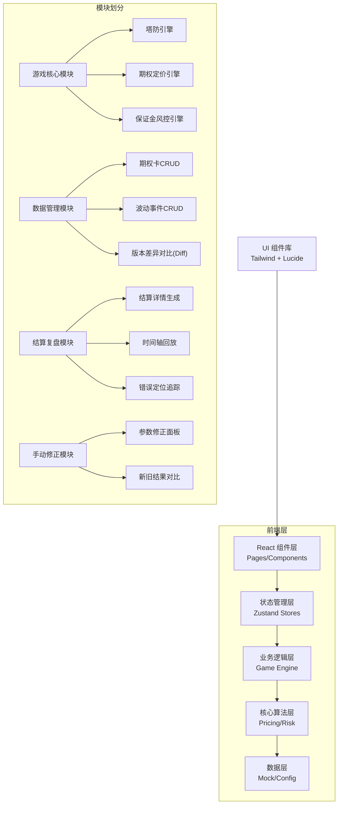
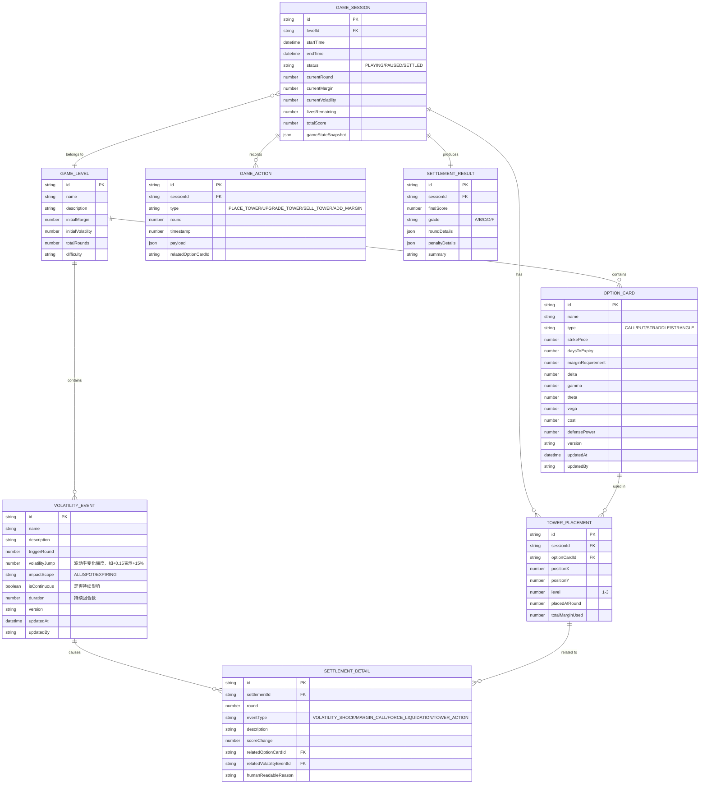

## 1. 架构设计



## 2. 技术描述

- **前端框架**: React@18 + TypeScript + Vite
- **状态管理**: Zustand（轻量、无需Provider，适合游戏状态）
- **路由**: react-router-dom@6
- **样式**: TailwindCSS@3 + CSS Variables 主题系统
- **图标**: lucide-react
- **动画**: CSS Transitions + framer-motion（复杂动效）
- **数据可视化**: recharts（波动率曲线、资金曲线）
- **Diff算法**: 自研对象深度对比（用于期权卡和波动事件版本对比）
- **后端**: 无后端，纯前端实现，数据存储在 localStorage
- **数据持久化**: localStorage + IndexedDB（游戏录像存储）

## 3. 路由定义

| Route | Purpose |
|-------|---------|
| `/` | 游戏大厅 - 关卡列表 |
| `/game/:levelId` | 游戏主界面 |
| `/game/:levelId/settlement` | 结算页面 |
| `/game/:levelId/replay` | 复盘回放 |
| `/admin/option-cards` | 期权卡管理 |
| `/admin/volatility-events` | 波动事件管理 |
| `/admin/compare-results` | 新旧结果对比 |

## 4. 数据模型

### 4.1 实体关系图



### 4.2 核心类型定义

```typescript
// 期权类型
type OptionType = 'CALL' | 'PUT' | 'STRADDLE' | 'STRANGLE' | 'BUTTERFLY';

// 期权卡接口
interface OptionCard {
  id: string;
  name: string;
  type: OptionType;
  strikePrice: number;
  daysToExpiry: number;
  marginRequirement: number;
  delta: number;
  gamma: number;
  theta: number;
  vega: number;
  cost: number;
  defensePower: number;
  version: string;
  updatedAt: Date;
  updatedBy: string;
}

// 波动事件接口
interface VolatilityEvent {
  id: string;
  name: string;
  description: string;
  triggerRound: number;
  volatilityJump: number;
  impactScope: 'ALL' | 'SPOT' | 'EXPIRING';
  isContinuous: boolean;
  duration: number;
  version: string;
  updatedAt: Date;
  updatedBy: string;
}

// 防御塔放置
interface Tower {
  id: string;
  optionCardId: string;
  position: { x: number; y: number };
  level: number;
  placedAtRound: number;
  marginUsed: number;
  currentValue: number;
}

// 游戏状态
interface GameState {
  sessionId: string;
  levelId: string;
  status: 'IDLE' | 'PLAYING' | 'PAUSED' | 'SETTLED';
  currentRound: number;
  totalRounds: number;
  currentMargin: number;
  initialMargin: number;
  currentVolatility: number;
  initialVolatility: number;
  lives: number;
  score: number;
  speed: number;
  towers: Tower[];
  availableCards: OptionCard[];
  volatilityEvents: VolatilityEvent[];
  triggeredEvents: string[];
  actionLog: GameAction[];
}

// 游戏操作
interface GameAction {
  id: string;
  type: 'PLACE_TOWER' | 'UPGRADE_TOWER' | 'SELL_TOWER' | 'ADD_MARGIN' | 'FORCE_LIQUIDATION';
  round: number;
  timestamp: number;
  payload: Record<string, any>;
  relatedCardId?: string;
  relatedEventId?: string;
}

// 结算详情
interface SettlementDetail {
  id: string;
  round: number;
  eventType: 'VOLATILITY_SHOCK' | 'MARGIN_CALL' | 'FORCE_LIQUIDATION' | 'TOWER_ACTION' | 'PENALTY';
  description: string;
  scoreChange: number;
  relatedCardId?: string;
  relatedEventId?: string;
  humanReadableReason: string;
}

// 版本差异
interface VersionDiff<T> {
  field: keyof T;
  oldValue: any;
  newValue: any;
  changeType: 'ADDED' | 'REMOVED' | 'MODIFIED';
}

// 对比结果
interface ComparisonResult {
  oldResult: SettlementResult;
  newResult: SettlementResult;
  differences: {
    round: number;
    field: string;
    oldValue: any;
    newValue: any;
    explanation: string;
  }[];
}
```

## 5. 核心算法模块

### 5.1 期权定价引擎（Black-Scholes 简化版）

```typescript
// 计算期权理论价值
function calculateOptionValue(
  option: OptionCard,
  spotPrice: number,
  volatility: number,
  riskFreeRate: number = 0.03
): number;

// 计算波动率变化对期权价值的影响（Vega * 波动率变化）
function calculateVegaImpact(vega: number, volatilityChange: number): number;

// 计算保证金占用
function calculateMarginRequirement(
  option: OptionCard,
  quantity: number,
  volatility: number
): number;
```

### 5.2 保证金风控引擎

```typescript
// 检查保证金是否充足
function checkMarginAdequacy(
  currentMargin: number,
  totalMarginUsed: number,
  maintenanceMarginRatio: number = 0.8
): { adequate: boolean; deficit: number; relatedCards: string[] };

// 计算强平顺序（按风险度排序）
function calculateLiquidationOrder(
  towers: Tower[],
  targetDeficit: number
): { towerId: string; amount: number; reason: string }[];

// 触发强平并生成可追溯记录
function executeForceLiquidation(
  gameState: GameState,
  deficit: number
): { newState: GameState; actions: GameAction[]; details: SettlementDetail[] };
```

### 5.3 波动事件处理引擎

```typescript
// 处理波动事件，返回精确的波动率变化
function processVolatilityEvent(
  event: VolatilityEvent,
  currentVolatility: number,
  round: number
): {
  newVolatility: number;
  jumpAmount: number;
  isContinuous: boolean;
  remainingDuration: number;
  exactCalculation: string; // 精确计算过程，用于展示
};

// 计算波动率连跳的累积效应
function calculateCumulativeVolatility(
  events: VolatilityEvent[],
  baseVolatility: number,
  upToRound: number
): {
  volatility: number;
  jumps: {
    eventId: string;
    round: number;
    jumpAmount: number;
    cumulativeAfter: number;
  }[];
};
```

### 5.4 版本差异对比引擎

```typescript
// 对比两个版本的期权卡
function compareOptionCards(
  oldCard: OptionCard,
  newCard: OptionCard
): VersionDiff<OptionCard>[];

// 对比两个版本的波动事件
function compareVolatilityEvents(
  oldEvent: VolatilityEvent,
  newEvent: VolatilityEvent
): VersionDiff<VolatilityEvent>[];

// 合并冲突时的决策（不默默采用，而是展示差异让用户选择）
function resolveMergeConflict<T>(
  base: T,
  theirs: T,
  ours: T
): {
  autoMerged: T;
  conflicts: VersionDiff<T>[];
  requiresManualReview: boolean;
};
```

### 5.5 结算报告生成引擎

```typescript
// 生成人文化的扣分原因
function generateHumanReadableReason(
  detail: SettlementDetail,
  card?: OptionCard,
  event?: VolatilityEvent
): string;

// 生成回合事件的可理解描述
function generateRoundDescription(
  round: number,
  actions: GameAction[],
  events: VolatilityEvent[]
): string;

// 将错误定位到具体数据位置
function locateErrorSource(
  detail: SettlementDetail
): {
  type: 'OPTION_CARD' | 'VOLATILITY_EVENT';
  id: string;
  field: string;
  lineNumber?: number; // 模拟源代码行号
  value: any;
  expectedValue?: any;
};
```

### 5.6 复盘回放引擎

```typescript
// 记录游戏状态快照（用于回放）
function recordGameSnapshot(
  state: GameState,
  round: number
): GameStateSnapshot;

// 按回合回放游戏
function replayGame(
  snapshots: GameStateSnapshot[],
  targetRound: number
): GameState;

// 对比两次游戏结果
function compareGameResults(
  resultA: SettlementResult,
  resultB: SettlementResult
): ComparisonResult;
```

## 6. 状态管理设计

### 6.1 GameStore（游戏主状态）

```typescript
interface GameStore {
  state: GameState;
  actions: {
    startGame: () => void;
    pauseGame: () => void;
    resumeGame: () => void;
    restartGame: () => void;
    setSpeed: (speed: number) => void;
    placeTower: (cardId: string, position: { x: number; y: number }) => void;
    upgradeTower: (towerId: string) => void;
    sellTower: (towerId: string) => void;
    addMargin: (amount: number) => void;
    nextRound: () => void;
    settleGame: () => void;
  };
}
```

### 6.2 DataStore（数据管理）

```typescript
interface DataStore {
  optionCards: OptionCard[];
  volatilityEvents: VolatilityEvent[];
  levels: GameLevel[];
  actions: {
    saveOptionCard: (card: OptionCard) => void;
    saveVolatilityEvent: (event: VolatilityEvent) => void;
    compareAndMerge: (
      type: 'OPTION_CARD' | 'VOLATILITY_EVENT',
      oldId: string,
      newData: any
    ) => { merged: any; conflicts: VersionDiff<any>[] };
    deleteOptionCard: (id: string) => void;
    deleteVolatilityEvent: (id: string) => void;
  };
}
```

### 6.3 SettlementStore（结算复盘）

```typescript
interface SettlementStore {
  currentSettlement: SettlementResult | null;
  historicalResults: SettlementResult[];
  comparisonResult: ComparisonResult | null;
  actions: {
    generateSettlement: (sessionId: string) => SettlementResult;
    loadSettlement: (id: string) => void;
    compareResults: (oldId: string, newId: string) => ComparisonResult;
    exportReport: (id: string) => string;
  };
}
```
