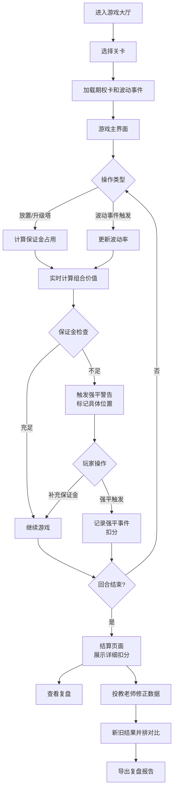

## 1. 产品概述

"期权波动塔防"是一款面向期权投教场景的浏览器小游戏，旨在通过塔防游戏形式让学生直观理解隐含波动率对期权组合的影响，掌握保证金管理和风险控制能力。

- **核心价值**：解决投教课堂上波动率概念抽象难懂的问题，通过互动游戏让学生"守住客户组合不被穿仓"
- **目标用户**：期权投教老师、期权学习学生
- **核心功能**：塔防游戏玩法 + 期权保证金计算 + 波动事件冲击 + 复盘教学

## 2. 核心功能

### 2.1 用户角色

| 角色 | 使用方式 | 核心权限 |
|------|----------|----------|
| 投教老师 | 编辑波动事件、调整期权卡参数、手动修正结果 | 修改游戏数据、对比新旧结果、导出复盘报告 |
| 学生用户 | 进行游戏、查看结算、学习复盘 | 游戏操作、查看详细扣分原因、回放复盘 |

### 2.2 功能模块

1. **游戏主界面**：塔防地图、防御塔（期权策略）、怪物（波动冲击）、状态栏
2. **游戏控制**：开始、暂停、重开、速度调节
3. **期权卡管理**：期权策略卡片编辑、版本差异对比
4. **波动事件管理**：市场波动事件编辑、版本差异对比
5. **结算页面**：回合详情、扣分原因、总分展示
6. **复盘系统**：游戏回放、事件时间轴、操作回溯
7. **手动修正入口**：投教老师修正数据、新旧结果并排对比
8. **错误定位系统**：保证金不足、强平错误指向具体期权卡或波动事件

### 2.3 页面详情

| 页面名称 | 模块名称 | 功能描述 |
|-----------|-------------|---------------------|
| 游戏大厅 | 游戏列表 | 显示可玩的课程关卡，选择进入游戏 |
| 游戏主界面 | 塔防地图 | 显示客户资金池、防御塔位置、怪物行进路线 |
| 游戏主界面 | 期权卡面板 | 展示可用期权策略卡，拖拽放置防御塔 |
| 游戏主界面 | 波动事件栏 | 显示当前/即将发生的波动事件和影响 |
| 游戏主界面 | 状态栏 | 显示剩余保证金、当前波动率、回合数、生命值 |
| 游戏主界面 | 控制面板 | 开始、暂停、重开、速度×1/×2/×4 |
| 结算页面 | 回合事件列表 | 每回合发生的事件、对应扣分、人文化解释 |
| 结算页面 | 塔防升级记录 | 每次升级/放置塔的决策、对应效果、扣分原因 |
| 结算页面 | 错误定位 | 保证金不足/强平错误高亮，点击跳转对应期权卡或波动事件 |
| 结算页面 | 总分面板 | 最终得分、评级、知识点总结 |
| 复盘页面 | 时间轴回放 | 可拖动进度条回放游戏全过程 |
| 复盘页面 | 操作日志 | 玩家每一步操作的时间点和效果 |
| 数据管理 | 期权卡编辑器 | 编辑期权合约参数：行权价、到期日、保证金率、希腊字母 |
| 数据管理 | 波动事件编辑器 | 编辑波动率跳跃事件：幅度、时间点、影响范围 |
| 数据管理 | 版本差异对比 | 合并期权卡/波动事件时显示diff，不默默覆盖 |
| 手动修正 | 修正面板 | 投教老师修改波动事件参数 |
| 手动修正 | 结果对比 | 旧结果与新结果左右并排展示差异 |

## 3. 核心流程

## 4. 用户界面设计

### 4.1 设计风格

- **主色调**：深青色系 `#0F172A`（专业金融感）搭配警示红 `#EF4444` 和安全绿 `#10B981`
- **辅助色**：波动率橙 `#F59E0B`、信息蓝 `#3B82F6`
- **按钮风格**：微立体圆角按钮，悬停时有浮起效果，危险操作有红色边框警示
- **字体**：
  - 标题：`Chakra Petch`（等宽赛博风格，增强金融科技感）
  - 正文：`Noto Sans SC`（清晰易读的中文无衬线）
  - 数值：`JetBrains Mono`（等宽数字，便于对比）
- **布局风格**：模块化卡片布局，数据可视化区域采用深色仪表盘风格
- **图标风格**：Lucide 线性图标，关键数据点用彩色圆点标记

### 4.2 页面设计概述

| 页面名称 | 模块名称 | UI Elements |
|-----------|-------------|-------------|
| 游戏主界面 | 塔防地图 | 网格布局、防御塔用不同形状表示期权类型、怪物用脉冲动画表示波动率冲击、资金池用发光圆环表示 |
| 游戏主界面 | 期权卡面板 | 半透明玻璃态卡片、拖拽时有缩放投影、希腊字母用角标显示 |
| 游戏主界面 | 波动事件栏 | 时间轴横向排列、即将发生事件用闪烁动画、红色表示负面冲击 |
| 结算页面 | 回合事件列表 | 交替行背景、扣分项用红色展开卡片、点击定位到游戏中对应时刻 |
| 结算页面 | 错误定位 | 高亮红框、悬停显示期权卡/波动事件详情弹窗、"查看原文"按钮 |
| 手动修正 | 结果对比 | 左右分栏布局、差异项用黄色背景标记、数值变化用红绿箭头指示 |

### 4.3 响应性

- **设计原则**：桌面端优先，平板自适应，手机端提供简化视图
- **断点**：1280px（桌面）、768px（平板）、480px（手机）
- **触摸优化**：拖拽放置区域最小 44×44px，按钮点击区域放大 20%

### 4.4 游戏动效

- **防御塔放置**：从期权卡飞出，带拖尾特效，落地时产生涟漪
- **波动冲击**：红色波纹从地图边缘向资金池扩散，命中时屏幕震动
- **保证金警告**：顶部状态栏脉冲红色闪烁，数值跳动
- **强平触发**：防御塔爆炸粒子效果，伴随扣分飘字
- **升级成功**：金色光环环绕，数值+飘字
