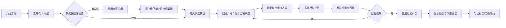

## 1. 产品概述

城市公交调度棋是一款面向公交培训的交互式游戏，帮助新调度员学习早高峰路况应对策略。通过回合制调度决策，玩家需要平衡客流累积、班次约束和异常情况处理，最终生成可用于汇报的运营报告。

- **核心问题**：新调度员面对早高峰临时封路只盯单线、站点积压无人提前预警、手工制表效率低下
- **目标用户**：公交培训主管、新调度员、培训课堂学生
- **产品价值**：沉浸式培训体验，决策真实影响结果，自动生成培训报告

## 2. 核心功能

### 2.1 用户角色
| 角色 | 使用方式 | 核心需求 |
|------|----------|----------|
| 培训主管 | 导入数据、设置场景、查看报告 | 验证培训效果、异常检测可视化 |
| 学员/调度员 | 进行调度决策 | 学习调度策略、理解客流规律 |

### 2.2 功能模块
1. **数据导入模块**：上传公交数据、字段缺失检测、修正提示
2. **调度游戏模块**：回合制决策、车辆调度、封路应对
3. **异常检测模块**：车辆扎堆、司机超时、换乘断档实时预警
4. **报告生成模块**：胜负判断、KPI统计、改进建议

### 2.3 页面详情
| 页面名称 | 模块名称 | 功能描述 |
|---------|----------|----------|
| 首页 | 游戏入口 | 开始游戏、载入样例、导入自定义数据 |
| 调度棋盘 | 主游戏区 | 线路可视化、车辆状态、客流热力、决策操作 |
| 异常面板 | 实时预警 | 异常列表、责任人标注、整改建议 |
| 结果报告 | 结算页面 | KPI评分、胜负判定、改进清单 |

## 3. 核心流程

## 4. 用户界面设计

### 4.1 设计风格
- **主色调**：交通蓝 (#165DFF) + 警示橙 (#FF7D00) + 安全绿 (#00B42A)
- **辅助色**：客流红 (#F53F3F) + 信息灰 (#86909C)
- **按钮风格**：圆角矩形，悬停微放大，点击反馈
- **字体**：标题用思源黑体 Bold，正文用思源黑体 Regular
- **布局**：左侧棋盘主区域，右侧信息面板，顶部状态栏
- **图标风格**：线性图标配合emoji，直观易懂

### 4.2 页面设计概述
| 页面名称 | 模块名称 | UI元素 |
|---------|----------|--------|
| 首页 | 游戏入口 | 大标题、三个主按钮（开始/样例/导入）、说明卡片 |
| 调度棋盘 | 主游戏区 | 线路地图（SVG绘制）、车辆图标、站点客流柱、回合控制、决策按钮 |
| 异常面板 | 实时预警 | 异常卡片列表、颜色编码、责任人标签、一键跳转 |
| 结果报告 | 结算页面 | KPI仪表盘、胜负判定横幅、改进清单、导出按钮 |

### 4.3 响应式
- 桌面端优先设计，适配1280px以上屏幕
- 平板端可折叠右侧面板
- 移动端建议横屏使用，简化操作

## 5. 游戏规则与胜负判定

### 5.1 核心约束
- **客流累积**：每回合站点客流自然增长，超过承载量扣分
- **班次约束**：发车间隔必须在规定范围内，违规扣分
- **司机工时**：连续驾驶不得超过4小时，超时预警

### 5.2 异常类型
1. **车辆扎堆**：同站点同时≥3辆车 → 标注调度员责任
2. **司机超时**：连续驾驶＞4小时 → 标注排班员责任
3. **换乘断档**：换乘站两车衔接＞15分钟 → 标注线路协调员责任

### 5.3 胜负条件
- **胜利**：总分≥80分（客流疏导率+准点率-异常扣分）
- **失败**：总分＜60分 或 任意站点客流连续3回合超载
