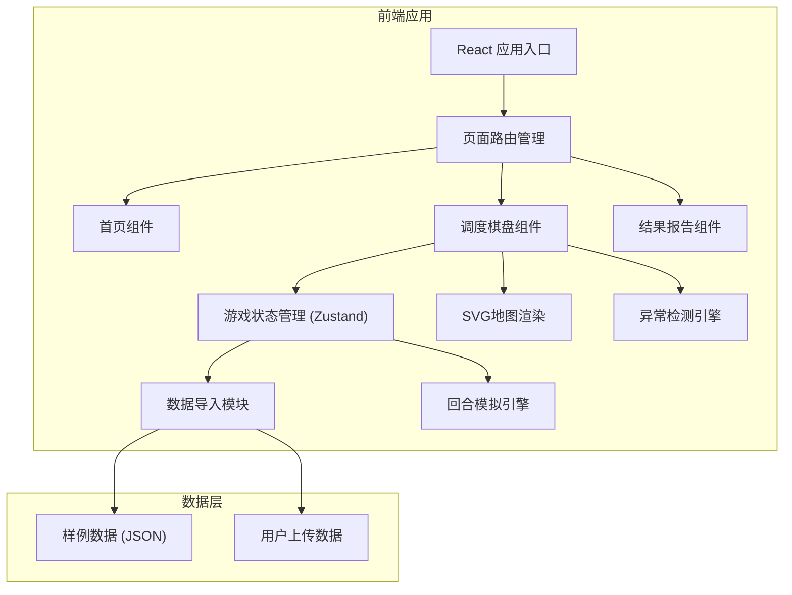

## 1. 架构设计



## 2. 技术描述

- **前端框架**: React@18 + TypeScript
- **构建工具**: Vite
- **样式方案**: TailwindCSS@3
- **状态管理**: Zustand (轻量级状态管理)
- **图表渲染**: SVG原生 + CSS动画
- **后端**: 无 (纯前端应用，数据本地处理)
- **数据格式**: JSON导入导出

## 3. 路由定义

| 路由 | 页面 | 功能 |
|------|------|------|
| / | 首页 | 游戏入口、数据导入 |
| /game | 调度棋盘 | 主游戏界面 |
| /report | 结果报告 | 结算与改进建议 |

## 4. 数据模型

### 4.1 核心数据结构

```typescript
// 站点数据
interface Station {
  id: string;
  name: string;
  x: number;
  y: number;
  passengerFlow: number;
  maxCapacity: number;
  isTransfer: boolean;
  connectedLines: string[];
}

// 线路数据
interface BusLine {
  id: string;
  name: string;
  color: string;
  stations: string[];
  interval: number;
  firstBus: string;
  lastBus: string;
}

// 车辆数据
interface Bus {
  id: string;
  lineId: string;
  plateNumber: string;
  driverName: string;
  currentStation: number;
  direction: 'forward' | 'backward';
  status: 'running' | 'stopped' | 'broken';
  passengerCount: number;
  maxPassengers: number;
  continuousDriving: number;
  lastDepartureTime: number;
}

// 游戏状态
interface GameState {
  currentRound: number;
  maxRounds: number;
  timeOfDay: number;
  score: number;
  stations: Station[];
  lines: BusLine[];
  buses: Bus[];
  anomalies: Anomaly[];
  decisions: Decision[];
  isRoadClosed: boolean;
  closedStationId: string | null;
}

// 异常数据
interface Anomaly {
  id: string;
  type: 'clustering' | 'overtime' | 'transfer_gap';
  severity: 'warning' | 'critical';
  description: string;
  responsibleRole: string;
  busIds: string[];
  stationId?: string;
  suggestion: string;
  resolved: boolean;
}
```

### 4.2 数据校验规则

导入数据时自动检测以下字段缺失：
- **站点缺失字段**: passengerFlow, maxCapacity, isTransfer
- **线路缺失字段**: stations, interval
- **车辆缺失字段**: driverName, continuousDriving, maxPassengers

## 5. 核心算法

### 5.1 客流累积算法
```
每回合客流增长 = 基础增长 × (1 + 早高峰系数 × 时段权重)
站点客流 = min(当前客流 + 增长量, 最大容量)
```

### 5.2 车辆扎堆检测
```
对每个站点:
  当前站点车辆数 = count(buses where currentStation == 站点)
  if 车辆数 >= 3:
    触发扎堆异常
```

### 5.3 换乘断档检测
```
对每个换乘站:
  获取所有经过线路的最近到站时间
  计算相邻两车时间差
  if 时间差 > 15分钟:
    触发换乘断档异常
```

### 5.4 胜负判定算法
```
总分 = (客流疏导率 × 40) + (准点率 × 30) + (异常处理率 × 30)
客流疏导率 = 1 - (总积压客流 / 总容量)
准点率 = 准点班次 / 总班次
异常处理率 = 1 - (未解决异常数 / 总异常数)
```

## 6. 坏掉的公交车样例配置

用于测试异常检测的预设场景：
```json
{
  "brokenScenario": {
    "name": "早高峰混乱场景",
    "buses": [
      {
        "id": "bus-broken-1",
        "plateNumber": "明显坏掉-001",
        "driverName": "测试司机A",
        "continuousDriving": 5.5,
        "status": "broken",
        "currentStation": 3
      }
    ],
    "clusteringTest": {
      "stationId": "station-5",
      "busCount": 4,
      "description": "站点5同时有4辆车，触发扎堆预警"
    }
  }
}
```
