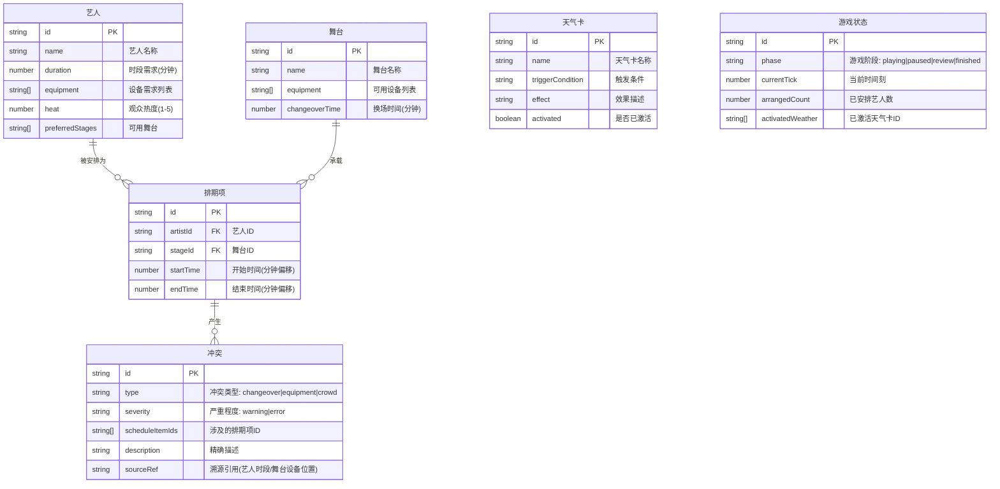

## 1. 架构设计

```mermaid
flowchart TD
    "前端 React 应用" --> "游戏状态管理（Zustand）"
    "游戏状态管理（Zustand）" --> "排期引擎"
    "游戏状态管理（Zustand）" --> "冲突检测引擎"
    "游戏状态管理（Zustand）" --> "天气卡系统"
    "游戏状态管理（Zustand）" --> "观众热度计算"
    "游戏状态管理（Zustand）" --> "复盘/回放系统"
    "排期引擎" --> "时间轴数据"
    "冲突检测引擎" --> "换场超时检测"
    "冲突检测引擎" --> "设备冲突检测"
    "冲突检测引擎" --> "人流拥堵检测"
```

纯前端应用，无后端依赖。所有游戏逻辑、冲突检测、状态管理均在前端完成。

## 2. 技术说明

- 前端：React@18 + TypeScript + Tailwind CSS@3 + Vite
- 初始化工具：vite-init（react-ts 模板）
- 状态管理：Zustand
- 图表：recharts（雷达图、柱状图）
- 拖拽：@dnd-kit/core + @dnd-kit/sortable
- 后端：无
- 数据库：无（使用内存数据 + Zustand 持久化）

## 3. 路由定义

| 路由 | 用途 |
|------|------|
| / | 排期主界面（游戏主页面，含时间轴、艺人池、冲突面板） |
| /report | 最终报告页（排期总评、图表、冲突时间线） |

## 4. API 定义

无后端 API，所有数据通过 Zustand store 管理。

## 5. 数据模型

### 5.1 数据模型定义



### 5.2 核心类型定义

```typescript
interface Artist {
  id: string;
  name: string;
  duration: number;
  equipment: string[];
  heat: number;
  preferredStages: string[];
}

interface Stage {
  id: string;
  name: string;
  equipment: string[];
  changeoverTime: number;
}

interface ScheduleItem {
  id: string;
  artistId: string;
  stageId: string;
  startTime: number;
  endTime: number;
}

interface Conflict {
  id: string;
  type: 'changeover' | 'equipment' | 'crowd';
  severity: 'warning' | 'error';
  scheduleItemIds: string[];
  description: string;
  sourceRef: string;
}

interface WeatherCard {
  id: string;
  name: string;
  triggerAfterCount: number;
  effect: string;
  activated: boolean;
}

interface GameState {
  phase: 'playing' | 'paused' | 'review' | 'finished';
  currentTick: number;
  arrangedCount: number;
  activatedWeather: string[];
  history: HistorySnapshot[];
}
```

## 6. 项目结构

```
src/
  components/
    Timeline/          # 时间轴轨道组件
    ArtistCard/        # 艺人卡片组件
    ConflictPanel/     # 冲突溯源面板
    WeatherBanner/     # 天气卡横幅
    HeatPanel/         # 观众热度面板
    GameControls/      # 暂停/重开/复盘控制栏
    Report/            # 最终报告组件
  pages/
    GamePage.tsx       # 排期主界面
    ReportPage.tsx     # 最终报告页
  store/
    gameStore.ts       # Zustand 游戏状态
  engine/
    scheduler.ts       # 排期引擎
    conflictDetector.ts # 冲突检测引擎
    weatherSystem.ts   # 天气卡系统
    heatCalculator.ts  # 观众热度计算
  data/
    artists.ts         # 艺人数据
    stages.ts          # 舞台数据
    weatherCards.ts    # 天气卡数据
  types/
    index.ts           # TypeScript 类型定义
  utils/
    timeUtils.ts       # 时间转换工具
    scoring.ts         # 评分计算
```
