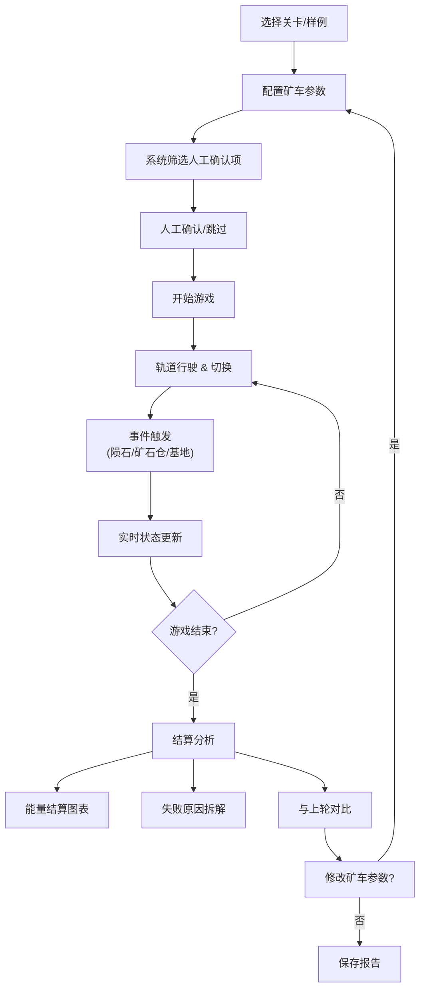
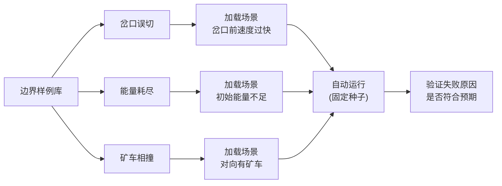

## 1. 产品概述

月球矿车轨道赛是一款策略型物理模拟游戏，玩家在低重力月球矿区操控矿车切换轨道，将矿石安全送回基地，同时需要精打细算地使用能量。游戏针对独立游戏开发者设计，提供完整的原型验证框架，帮助快速测试玩法平衡性和物理参数。

- 核心解决问题：帮助开发者验证低重力物理、轨道切换、能量管理等核心玩法的可行性
- 目标用户：独立游戏开发者、游戏设计师、玩法测试人员
- 产品价值：提供可重现的测试环境、详细的失败分析、参数修改对比功能，避免"表格撑"式的模糊测试

## 2. 核心特性

### 2.1 用户角色

| 角色 | 注册方式 | 核心权限 |
|------|----------|----------|
| 游戏设计师 | 无需注册 | 配置游戏参数、运行测试、查看详细报告 |
| 玩法测试员 | 无需注册 | 操作矿车、完成关卡、查看结算数据 |

### 2.2 功能模块

1. **主界面**：关卡选择、矿车配置、系统设置
2. **游戏场景**：低重力矿区轨道、矿车控制、实时状态显示
3. **结算页面**：能量分析、失败原因拆解、性能指标
4. **测试系统**：边界样例库、自动运行、对比分析
5. **内容审核**：人工确认项筛选、事件日志回放

### 2.3 页面详情

| 页面名称 | 模块名称 | 功能描述 |
|----------|----------|----------|
| 主界面 | 关卡选择 | 预设3个边界样例（岔口误切、能量耗尽、矿车相撞）和自定义关卡 |
| 主界面 | 矿车配置 | 调整矿车参数（质量、摩擦系数、能耗、初始能量） |
| 主界面 | 内容审核 | 筛选出需要人工确认的事件（矿车异常、矿石仓过载、陨石事件） |
| 游戏场景 | 轨道系统 | 多轨道网络、岔口切换、低重力惯性物理 |
| 游戏场景 | 矿车控制 | 加速、减速、切换轨道，操作有即时视觉反馈 |
| 游戏场景 | HUD显示 | 实时能量、速度、矿石数量、当前轨道 |
| 游戏场景 | 事件系统 | 陨石撞击、矿石仓收集、基地送达 |
| 结算页面 | 能量结算 | 分阶段能量消耗图表、节能评分 |
| 结算页面 | 失败分析 | 拆解失败原因（能量耗尽/轨道错误/碰撞/超时） |
| 结算页面 | 对比模式 | 显示与上一次运行的差异（哪些结果受参数修改影响） |
| 测试系统 | 自动运行 | 使用固定种子重复运行，确保结果一致 |
| 测试系统 | 边界样例 | 预设3种典型失败场景的测试用例 |

## 3. 核心流程

### 3.1 主流程

设计师在主界面选择关卡或边界样例，配置矿车参数后开始游戏。玩家通过键盘控制矿车在低重力轨道上行驶，在岔口处切换轨道，躲避陨石，收集矿石仓，最终将矿石送达基地。游戏结束后进入结算页，查看详细的能量分析和失败原因拆解。如果修改了矿车参数再次运行，结算页会高亮显示受影响的结果项。

### 3.2 边界样例流程

## 4. 用户界面设计

### 4.1 设计风格

**整体风格：工业科幻 + 月球低重力氛围**

- **主色调**：深空蓝 (#0a1628) 作为背景，月球灰 (#8b95a5) 作为轨道，警示橙 (#ff6b35) 作为能量警告，科技青 (#00d4ff) 作为成功状态
- **辅助色**：矿石金 (#ffd700)、陨石红 (#ff4444)、基地绿 (#44ff88)
- **按钮风格**：带发光边框的工业风按钮，按下时有凹陷效果，状态变化有明显过渡动画
- **字体**：使用 Orbitron 作为显示字体（科技感数字），使用 JetBrains Mono 作为数据显示字体（等宽易读）
- **布局风格**：深色仪表盘布局，左侧控制面板，中央游戏画面，右侧数据面板
- **视觉特效**：低重力粒子漂浮、轨道发光效果、能量护盾波纹、陨石拖尾

### 4.2 页面设计概述

| 页面名称 | 模块名称 | UI元素 |
|----------|----------|--------|
| 主界面 | 关卡选择 | 卡片式布局，hover时有3D倾斜效果，显示样例类型和难度 |
| 主界面 | 矿车配置 | 滑块控件，实时预览参数变化对性能的影响曲线 |
| 主界面 | 内容审核 | 列表展示待确认项，每项有色标标识风险等级，支持批量确认 |
| 游戏场景 | 游戏画布 | Canvas 2D渲染，轨道有深度感，矿车有惯性拖影 |
| 游戏场景 | HUD面板 | 左上角能量条（带低电量闪烁），右上角速度表，左下角矿石计数 |
| 游戏场景 | 操作反馈 | 按键时有屏幕边缘闪光，轨道切换时有轨道高亮动画 |
| 结算页面 | 能量图表 | 面积图显示能量随时间变化，关键事件点标注 |
| 结算页面 | 失败分析 | 瀑布流布局，每项原因有百分比占比和改进建议 |
| 结算页面 | 对比面板 | 左右分栏对比两次运行，差异项用红/绿色高亮 |

### 4.3 响应式

- **桌面端优先**：1280px以上分辨率，三栏布局（左控制+中游戏+右数据）
- **平板适配**：1024px-1279px，改为上下布局（上游戏+下控制+数据并排）
- **移动端**：768px-1023px，单栏滚动布局，游戏画面自适应
- **触控优化**：移动端提供虚拟摇杆和按键，点击区域不小于48x48px

### 4.4 2D场景指引

- **背景**：深空渐变+随机星星+缓慢漂浮的月球尘埃粒子
- **轨道**：多层金属质感，有接缝和铆钉细节，激活的轨道段有蓝色发光
- **矿车**：六边形工业设计，有太阳能板、探照灯、悬浮气垫，移动时有喷气粒子
- **矿石仓**：圆柱形金色容器，有脉动发光效果，收集时有爆炸粒子
- **陨石**：不规则形状，带红色拖尾，撞击时有震动效果
- **基地**：大型圆顶建筑，有着陆平台，接收矿石时有能量环扩散
- **相机**：跟随矿车平滑移动，速度快时有轻微动态模糊
- **后处理**：低重力下的慢动作效果、碰撞时的屏幕震动、能量耗尽时的灰度滤镜
