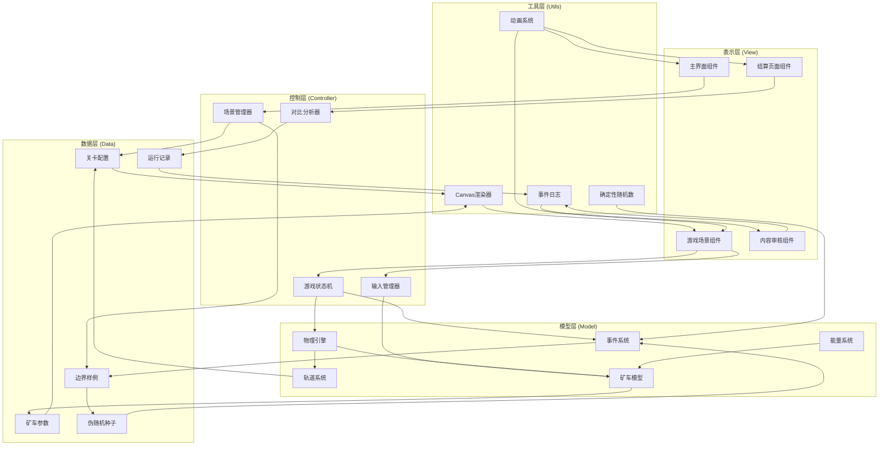
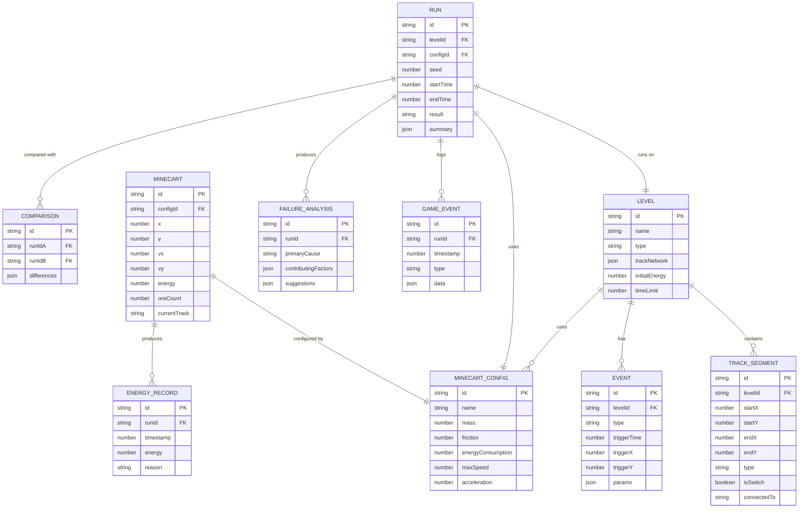

## 1. 架构设计



## 2. 技术描述

### 2.1 技术栈选择

| 层级 | 技术选型 | 版本 | 选型理由 |
|------|----------|------|----------|
| 前端框架 | React | 18.x | 组件化开发，状态管理清晰，生态成熟 |
| 构建工具 | Vite | 5.x | 快速热更新，构建性能优异 |
| 样式方案 | Tailwind CSS | 3.x | 原子化CSS，快速构建UI，主题统一 |
| 语言 | TypeScript | 5.x | 类型安全，减少运行时错误 |
| 渲染 | HTML5 Canvas | - | 2D游戏渲染性能最优，支持像素级控制 |
| 图表 | Recharts | 2.x | React生态图表库，支持能量曲线绘制 |
| 状态管理 | Zustand | 4.x | 轻量级状态管理，支持时间旅行调试 |
| 动画 | Framer Motion | 11.x | 流畅的UI动画，支持手势和物理效果 |
| 图标 | Lucide React | 0.x | 现代简洁图标库，与工业风格匹配 |

### 2.2 核心设计原则

1. **确定性执行**：所有随机事件使用固定种子生成，确保相同输入得到相同输出
2. **数据驱动**：所有游戏配置（关卡、矿车、事件）均为JSON数据，易于修改和扩展
3. **事件溯源**：记录所有游戏事件，支持回放和调试
4. **关注点分离**：物理逻辑、游戏逻辑、渲染逻辑严格分层
5. **可测试性**：核心算法纯函数化，便于单元测试

## 3. 路由定义

| 路由 | 页面 | 主要功能 |
|------|------|----------|
| `/` | 主界面 | 关卡选择、矿车配置、内容审核、系统设置 |
| `/game/:levelId` | 游戏场景 | 轨道行驶、矿车控制、事件处理、HUD显示 |
| `/result/:runId` | 结算页面 | 能量分析、失败原因、对比模式、报告导出 |
| `/test-cases` | 测试系统 | 边界样例列表、自动运行、结果验证 |

## 4. 数据模型

### 4.1 数据模型定义



### 4.2 核心数据结构

```typescript
// 伪随机数生成器（确保可重现）
interface SeededRandom {
  seed: number;
  next(): number;
  nextInt(min: number, max: number): number;
}

// 轨道节点
interface TrackNode {
  id: string;
  x: number;
  y: number;
  connections: string[];
  isSwitch?: boolean;
  switchState?: string;
}

// 矿车物理状态
interface CartPhysics {
  position: { x: number; y: number };
  velocity: { x: number; y: number };
  acceleration: { x: number; y: number };
  angularVelocity: number;
  onGround: boolean;
}

// 能量状态
interface EnergyState {
  current: number;
  max: number;
  consumptionRate: number;
  rechargeRate: number;
  lowThreshold: number;
}

// 游戏状态
interface GameState {
  phase: 'menu' | 'playing' | 'paused' | 'finished';
  currentLevel: Level | null;
  minecart: Minecart;
  energy: EnergyState;
  trackNetwork: TrackNetwork;
  events: GameEvent[];
  time: number;
  deltaTime: number;
  seed: number;
}

// 运行结果
interface RunResult {
  runId: string;
  levelId: string;
  configId: string;
  seed: number;
  success: boolean;
  totalTime: number;
  finalEnergy: number;
  oreCollected: number;
  maxSpeed: number;
  energyUsed: number;
  events: GameEvent[];
  energyHistory: { time: number; energy: number }[];
  failureAnalysis?: FailureAnalysis;
}

// 失败分析
interface FailureAnalysis {
  primaryCause: 'energy' | 'collision' | 'track' | 'timeout' | 'other';
  causePercentage: Record<string, number>;
  timeline: { time: number; event: string; impact: number }[];
  suggestions: string[];
}

// 对比结果
interface ComparisonResult {
  field: string;
  oldValue: number | string | boolean;
  newValue: number | string | boolean;
  change: number;
  impact: 'positive' | 'negative' | 'neutral';
}
```

## 5. 核心模块设计

### 5.1 物理引擎模块

```typescript
// 低重力物理引擎
class LowGravityPhysics {
  gravity: number = 1.62; // 月球重力加速度 m/s²
  airResistance: number = 0.01; // 极低空气阻力
  
  update(cart: CartPhysics, input: InputState, dt: number): void {
    // 应用重力
    cart.acceleration.y = this.gravity;
    
    // 应用输入
    cart.acceleration.x += input.acceleration * cart.friction;
    
    // 应用空气阻力
    cart.acceleration.x -= cart.velocity.x * this.airResistance;
    cart.acceleration.y -= cart.velocity.y * this.airResistance * 0.5;
    
    // 积分速度
    cart.velocity.x += cart.acceleration.x * dt;
    cart.velocity.y += cart.acceleration.y * dt;
    
    // 限速
    const speed = Math.hypot(cart.velocity.x, cart.velocity.y);
    if (speed > cart.maxSpeed) {
      cart.velocity.x *= cart.maxSpeed / speed;
      cart.velocity.y *= cart.maxSpeed / speed;
    }
    
    // 积分位置
    cart.position.x += cart.velocity.x * dt;
    cart.position.y += cart.velocity.y * dt;
  }
}
```

### 5.2 轨道系统模块

```typescript
// 轨道网络管理
class TrackSystem {
  nodes: Map<string, TrackNode>;
  currentNode: string;
  nextNode: string;
  
  // 检查矿车是否在轨道上
  isOnTrack(position: { x: number; y: number }): boolean;
  
  // 获取岔口状态
  getSwitchState(nodeId: string): string | null;
  
  // 切换岔口
  toggleSwitch(nodeId: string): void;
  
  // 计算矿车在轨道上的位置
  getTrackPosition(progress: number): { x: number; y: number; angle: number };
  
  // 检测碰撞
  checkCollision(other: { x: number; y: number; radius: number }): boolean;
}
```

### 5.3 能量系统模块

```typescript
// 能量管理系统
class EnergySystem {
  state: EnergyState;
  
  // 消耗能量
  consume(amount: number, reason: string): boolean;
  
  // 回收能量
  recharge(amount: number, reason: string): void;
  
  // 检查能量是否充足
  hasEnough(amount: number): boolean;
  
  // 更新能量（每帧）
  update(dt: number, activityLevel: number): void;
  
  // 获取能量状态
  getStatus(): 'critical' | 'low' | 'medium' | 'high';
}
```

### 5.4 确定性事件系统

```typescript
// 基于种子的事件系统
class EventSystem {
  random: SeededRandom;
  eventQueue: GameEvent[];
  handlers: Map<string, EventHandler>;
  
  // 注册事件处理器
  on(eventType: string, handler: EventHandler): void;
  
  // 触发事件
  trigger(event: GameEvent): void;
  
  // 生成陨石事件
  generateMeteorEvent(time: number): GameEvent;
  
  // 生成矿石仓事件
  generateOreEvent(time: number): GameEvent;
  
  // 更新事件队列
  update(currentTime: number): void;
}
```

### 5.5 对比分析模块

```typescript
// 运行结果对比分析
class ComparisonAnalyzer {
  // 对比两次运行
  compare(runA: RunResult, runB: RunResult): ComparisonResult[];
  
  // 分析参数修改的影响
  analyzeParameterImpact(
    oldConfig: MinecartConfig,
    newConfig: MinecartConfig,
    oldResult: RunResult,
    newResult: RunResult
  ): {
    parameter: string;
    affectedMetrics: string[];
    correlation: number;
  }[];
  
  // 生成对比报告
  generateReport(comparisons: ComparisonResult[]): string;
}
```

## 6. 性能优化

1. **固定时间步长**：物理更新使用固定dt（16.67ms），确保物理行为一致
2. **对象池**：粒子系统、事件对象使用对象池，减少GC
3. **脏渲染**：仅在状态变化时重绘UI，Canvas每帧重绘
4. **Web Worker**：物理计算和事件生成在Worker中执行，不阻塞主线程
5. **离屏Canvas**：背景和静态元素预渲染到离屏Canvas
6. **增量更新**：能量曲线等大数据采用增量更新策略
