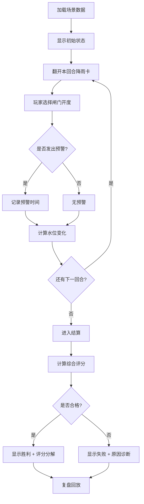
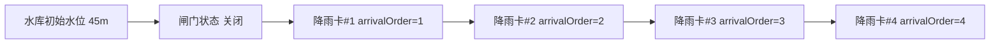

## 1. 产品概述

「河道防洪闸门局」是一款面向水利科普课堂的浏览器端教学游戏，核心目标是让学生亲身体验"开闸不是越快越好"——在降雨来临时，平衡上游蓄水安全与下游村镇防洪风险。
- 目标用户：水利科普教师及课堂上的中学生/大学生
- 核心价值：将抽象的"闸门调度决策"转化为可交互、可复盘的游戏体验，让失败也有原因可查

## 2. 核心功能

### 2.1 用户角色

| 角色 | 注册方式 | 核心权限 |
|------|----------|----------|
| 玩家（学生） | 无需注册，直接开始 | 选择闸门开度、触发预警、查看结算 |
| 观察者（教师） | 无需注册 | 使用预设数据导入、查看复盘分析 |

### 2.2 功能模块

1. **游戏主界面**：河道全景画布、闸门控制面板、降雨卡牌区、水位仪表盘、预警按钮、回合信息
2. **结算与复盘界面**：风险评分分解、每回合决策回放、失败原因诊断

### 2.3 页面详情

| 页面名称 | 模块名称 | 功能说明 |
|----------|----------|----------|
| 游戏主界面 | 河道画布 | 可视化上游水库水位、闸门开度、下游村镇区域，水位随回合变化动态渲染 |
| 游戏主界面 | 闸门控制面板 | 每回合选择闸门开度（0%/25%/50%/75%/100%），显示当前选择对上下游的即时预估影响 |
| 游戏主界面 | 降雨卡牌区 | 按时间顺序依次翻开的降雨卡，显示降雨量、到达时间，已翻开和待翻开卡牌视觉区分 |
| 游戏主界面 | 水位仪表盘 | 上游水位线 + 下游流量柱，关键阈值（安全/警戒/危险）用颜色区分 |
| 游戏主界面 | 预警按钮 | 向下游发出预警，提前预警可降低下游风险分，但过晚预警无效果 |
| 游戏主界面 | 回合信息 | 当前回合数、已用时间、已翻开降雨卡数量 |
| 游戏主界面 | 控制栏 | 开始、暂停、重新开始按钮 |
| 结算界面 | 综合评分 | 闸门调度分 + 预警时效分 + 下游安全分 → 总分，显示胜/负 |
| 结算界面 | 风险分解 | 将总分拆成上游溢坝风险、下游洪峰风险、预警延迟风险三个维度，雷达图展示 |
| 结算界面 | 失败诊断 | 若总分不合格，给出具体原因文本（如"第3回合开闸过猛，下游流量突增200%，超出安全阈值"） |
| 复盘界面 | 回合回放 | 逐回合回放：显示该回合降雨卡、闸门选择、水位变化、风险值变化 |
| 复盘界面 | 对比视图 | 将玩家决策与"推荐决策"并排对比 |

## 3. 核心流程

玩家进入游戏后，系统加载一组预设场景数据（包含水库初始水位、闸门状态、按时间排序的降雨卡）。每回合玩家需要：查看新翻开的降雨卡 → 评估上下游形势 → 选择闸门开度 → 决定是否发出预警。所有回合结束后进入结算，显示评分与诊断，支持复盘回放。

### 数据导入时序

场景数据导入时，水库初始条件和闸门状态总是先加载（作为基础状态），降雨卡按 `arrivalOrder` 字段排序后依次入场。界面需清晰标识"已到场"与"尚未到场"的降雨卡，让玩家知道谁先谁后。

## 4. 用户界面设计

### 4.1 设计风格

- **主色调**：深蓝（水库/河流）+ 琥珀色（预警/危险）+ 翠绿（安全/正常）
- **辅助色**：浅灰背景、白色卡片、红色危险标记
- **字体**：标题用 Noto Serif SC（中文衬线体，沉稳庄重），正文用 Noto Sans SC
- **按钮风格**：圆角矩形，闸门开度按钮用滑块/分段选择器，预警按钮用醒目的琥珀色脉冲动画
- **布局**：上方河道全景画布（占屏幕 55%），下方左右分栏（左侧控制面板 + 右侧卡牌与信息）
- **图标风格**：线条图标 + 天气/水利相关 emoji 辅助标识

### 4.2 页面设计概览

| 页面名称 | 模块名称 | UI 要素 |
|----------|----------|---------|
| 游戏主界面 | 河道画布 | 深蓝渐变背景，水库区域用蓝色填充随水位变化，闸门用灰色可旋转挡板表示开度，下游村镇用小房屋图标，水位线用动态波浪动画 |
| 游戏主界面 | 闸门控制 | 5 档分段选择器（0%→100%），选中档位高亮，旁边显示该开度下的预估流量文字 |
| 游戏主界面 | 降雨卡牌 | 横向排列的卡牌，已翻开显示降雨云+雨量数值，未翻开显示"?"背面，新翻开时有翻转动画 |
| 游戏主界面 | 水位仪表盘 | 左侧垂直进度条（上游水位，三色分区），右侧柱状图（下游流量） |
| 游戏主界面 | 预警按钮 | 大圆形按钮，点击后变为"已预警"状态并带脉冲效果，未点击时带呼吸灯提示 |
| 结算界面 | 雷达图 | 三轴雷达图：上游溢坝风险、下游洪峰风险、预警延迟风险 |
| 结算界面 | 诊断文本 | 按时间顺序的失败原因列表，每条标红关键数值 |
| 复盘界面 | 时间轴 | 横向时间轴，每回合一个节点，点击节点回放该回合状态 |

### 4.3 响应式

桌面优先设计，最低支持 1280×720 分辨率。平板端缩小画布比例，手机端暂不做适配（课堂场景以大屏为主）。

### 4.4 3D 场景

不使用 3D，全部采用 2D Canvas 绘制河道与水位动画。
