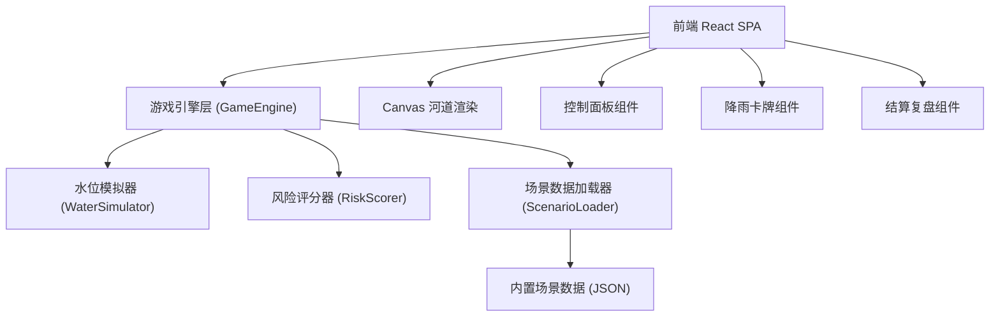
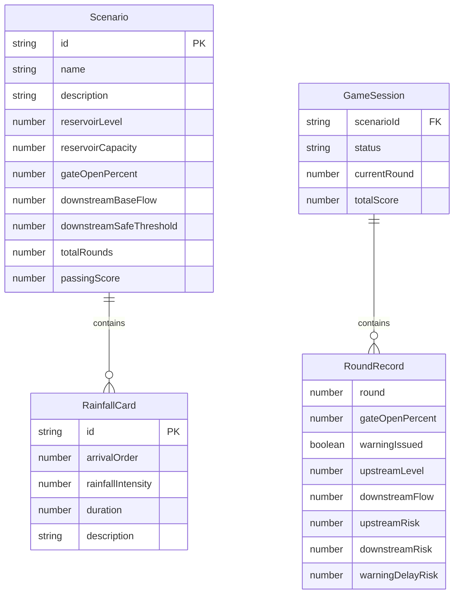

## 1. 架构设计



纯前端单页应用，无后端服务。所有游戏逻辑和数据均在前端完成。

## 2. 技术说明

- **前端框架**：React 18 + TypeScript
- **样式方案**：Tailwind CSS 3
- **构建工具**：Vite
- **图表**：纯 CSS/SVG 实现雷达图，不引入第三方图表库
- **动画**：CSS transitions + requestAnimationFrame 驱动 Canvas 水位动画
- **数据存储**：内置 JSON 场景数据，无数据库
- **状态管理**：React useReducer + Context，无需引入额外状态库

## 3. 路由定义

| 路由 | 用途 |
|------|------|
| `/` | 游戏主界面（含开始、暂停、重开控制） |
| `/result` | 结算界面（评分分解 + 失败诊断） |
| `/replay` | 复盘界面（回合回放 + 对比视图） |

## 4. API 定义

无后端 API。所有数据通过内置 JSON 场景文件加载。

### 场景数据结构

```typescript
interface ScenarioData {
  id: string;
  name: string;
  description: string;
  initialState: {
    reservoirLevel: number;       // 上游水位 (m)
    reservoirCapacity: number;    // 水库容量上限 (m)
    gateOpenPercent: number;      // 初始闸门开度 (%)
    downstreamBaseFlow: number;   // 下游基础流量 (m³/s)
    downstreamSafeThreshold: number; // 下游安全流量阈值
  };
  rainfallCards: RainfallCard[];
  totalRounds: number;
  passingScore: number;           // 及格线
}

interface RainfallCard {
  id: string;
  arrivalOrder: number;           // 到达顺序，1开始
  rainfallIntensity: number;      // 降雨强度 (mm/h)
  duration: number;               // 持续回合数
  description: string;            // 描述文本，如"暴雨来袭"
}

interface RoundDecision {
  round: number;
  gateOpenPercent: number;        // 玩家选择的闸门开度
  warningIssued: boolean;         // 是否发出预警
  warningRound: number | null;    // 预警发出的回合
}

interface RoundResult {
  round: number;
  upstreamLevel: number;          // 回合末上游水位
  downstreamFlow: number;         // 回合末下游流量
  upstreamRisk: number;           // 上游溢坝风险 (0-100)
  downstreamRisk: number;         // 下游洪峰风险 (0-100)
  warningDelayRisk: number;       // 预警延迟风险 (0-100)
}
```

### 水位模拟公式（轻量级）

```
上游水位变化 = 降雨增量 - 闸门泄洪量 - 自然蒸发
  降雨增量 = Σ(本回合有效降雨卡) × 降雨系数
  闸门泄洪量 = gateOpenPercent × 泄洪系数 × (上游水位 - 基准水位)
  自然蒸发 = 固定小值

下游流量 = 下游基础流量 + 闸门泄洪量 - 下游消纳量
```

### 评分公式

```
总分 = 闸门调度分(40%) + 预警时效分(30%) + 下游安全分(30%)

闸门调度分 = 100 - Σ(每回合溢坝风险 × 权重) - Σ(每回合闸门突变惩罚)
预警时效分 = 根据预警发出时机与洪峰到达时间的差值评分
下游安全分 = 100 - max(下游峰值流量 - 安全阈值, 0) / 安全阈值 × 100
```

## 5. 服务器架构

无服务器，纯前端应用。

## 6. 数据模型

### 6.1 数据模型定义



### 6.2 内置场景数据

提供两条预设场景：

1. **顺利调度样例** (`scenario-smooth`)：4回合降雨，合理开闸节奏，最终评分合格
2. **开闸过猛样例** (`scenario-rush`)：4回合降雨，第2回合开闸100%导致下游洪峰，评分不合格，需给出诊断原因
