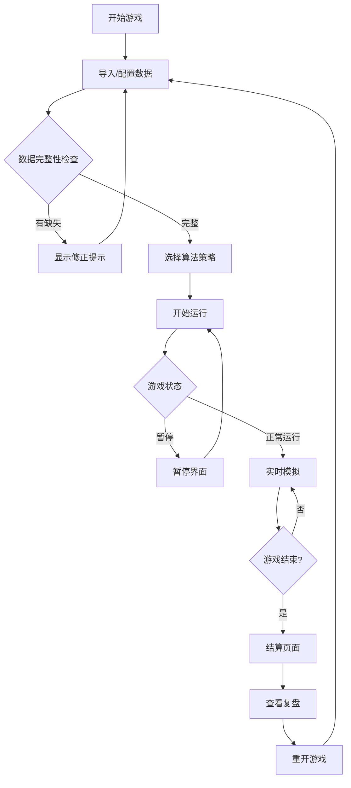

## 1. 产品概述

"算法面试餐厅"是一款基于浏览器的教育类小游戏，通过餐厅经营模拟让玩家直观理解队列、缓存和最短路径算法的实际应用。玩家扮演餐厅经理，通过选择不同的算法策略来处理顾客订单，在游戏过程中暴露算法选择的优劣。

- **核心目的**：通过游戏化方式教学数据结构与算法，让抽象概念具体化
- **目标用户**：编程社成员、算法学习者、面试准备者
- **产品价值**：将算法理论转化为可交互的游戏体验，加深理解并暴露常见问题

## 2. 核心功能

### 2.1 用户角色
| 角色 | 注册方式 | 核心权限 |
|------|----------|----------|
| 玩家 | 无需注册，直接使用 | 进行游戏、导入数据、查看结算复盘 |

### 2.2 功能模块
1. **游戏主界面**：餐厅场景、顾客队列、厨师工作台、菜单缓存区、路径可视化
2. **控制面板**：开始/暂停/重开按钮、算法策略选择器、游戏速度调节
3. **数据导入**：顾客订单导入、厨师队列配置、缓存菜单配置、字段缺失修正提示
4. **结算页面**：最终得分、订单完成情况、缓存淘汰统计、路径分析图表
5. **复盘功能**：问题追溯、订单追踪链路、算法改进建议

### 2.3 页面详情
| 页面名称 | 模块名称 | 功能描述 |
|----------|----------|----------|
| 游戏主界面 | 餐厅场景 | 实时显示顾客排队、厨师状态、菜品缓存、送餐路径 |
| 游戏主界面 | 算法选择 | 队列策略(FIFO/SJF/优先级)、缓存策略(LRU/LFU/FIFO)、路径算法(Dijkstra/A*) |
| 数据导入 | 订单导入 | 支持JSON格式导入，自动检测缺失字段并提供修正建议 |
| 数据导入 | 配置校验 | 厨师队列字段校验、缓存菜单完整性检查、可读性修正提示 |
| 结算页面 | 结果统计 | 完成率、平均等待时间、缓存命中率、路径效率 |
| 结算页面 | 问题追踪 | 标记缓存淘汰错误订单、路径绕远订单、饥饿订单，提供改进责任人/修改点 |
| 复盘页面 | 链路追踪 | 从顾客订单→厨师处理→最终结果的完整追溯链，支持反向查询 |

## 3. 核心流程

玩家导入数据后系统自动校验完整性，修正完成后选择算法策略开始游戏。游戏过程中可暂停调整，结束后查看结算和问题追溯，最后决定重开或退出。

## 4. 用户界面设计

### 4.1 设计风格
- **主色调**：深棕色(#5D4037) - 体现餐厅温馨感
- **辅助色**：暖橙色(#FF9800) - 强调按钮和重要信息
- **警示色**：红色(#F44336) - 标记问题订单、缓存淘汰
- **成功色**：绿色(#4CAF50) - 完成订单、正确路径
- **字体**：标题使用 'Playfair Display' 衬线字体，正文使用 'Roboto' 无衬线字体
- **按钮风格**：圆角设计，带有微妙阴影，hover时有上浮动画
- **布局风格**：卡片式布局，模块化分区，信息层次清晰
- **图标风格**：线性图标配合emoji，保持活泼感

### 4.2 页面设计概述
| 页面名称 | 模块名称 | UI元素 |
|----------|----------|--------|
| 游戏主界面 | 顶部控制栏 | 开始/暂停/重开按钮、时间显示、得分、算法选择下拉 |
| 游戏主界面 | 顾客队列区 | 垂直列表展示等待顾客，显示订单详情、等待时间、状态标签 |
| 游戏主界面 | 厨师工作区 | 横向排列厨师卡片，显示当前处理订单、进度条、状态指示 |
| 游戏主界面 | 缓存菜单区 | 网格布局菜品，显示命中次数、LRU/LFU状态指示 |
| 游戏主界面 | 路径可视化区 | 简化餐厅平面图，动画显示送餐路径，高亮最优/实际路径对比 |
| 数据导入弹窗 | 表单区域 | 文件上传、预览表格、字段缺失高亮、修正建议列表 |
| 结算页面 | 统计面板 | 大数字展示核心指标，环形图显示完成率，柱状图对比不同算法 |
| 结算页面 | 问题列表 | 可展开的问题卡片，标记问题类型、影响订单、改进建议 |
| 复盘页面 | 链路追踪 | 时间线+网络图展示订单流转，点击节点查看详情 |

### 4.3 响应式
- **设计策略**：桌面端优先，移动端自适应
- **桌面端**：完整四栏布局（顾客队列+厨师区+缓存区+路径图）
- **平板端**：两栏布局，路径图可折叠
- **移动端**：垂直堆叠布局，重要信息优先展示

## 5. 游戏规则与机制

### 5.1 队列策略
- **FIFO**：先到先服务，简单公平但可能让短订单等待
- **SJF**：短作业优先，总等待时间最短但可能导致长订单饥饿
- **优先级**：根据订单金额/会员等级排序，VIP顾客优先

### 5.2 缓存策略
- **LRU**：最近最少使用淘汰，适合访问模式稳定的场景
- **LFU**：最不经常使用淘汰，适合热点菜品
- **FIFO**：先进先出淘汰，实现简单但可能淘汰热门菜品

### 5.3 路径算法
- **Dijkstra**：保证最短路径，但计算较慢
- **A***：启发式搜索，更快找到近似最优解
- **贪心**：每次选最近节点，计算最快但可能绕远

### 5.4 计分规则
- 完成订单：+100分 × 订单金额系数
- 超时订单：-50分，计入顾客满意度
- 缓存命中：+20分，减少准备时间
- 最优路径：+10分，节省送餐时间
- 算法错误惩罚：缓存淘汰错误订单额外-30分，路径绕远额外-20分，饥饿订单额外-40分
