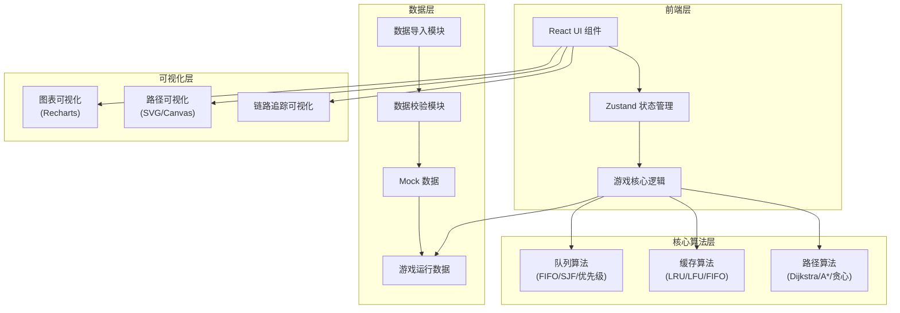

## 1. 架构设计



## 2. 技术选型

| 层级 | 技术栈 | 版本 | 说明 |
|------|--------|------|------|
| 前端框架 | React | 18.x | 组件化开发 |
| 构建工具 | Vite | 5.x | 快速开发构建 |
| 样式方案 | TailwindCSS | 3.x | 原子化CSS |
| 状态管理 | Zustand | 4.x | 轻量级状态管理 |
| 图表库 | Recharts | 2.x | 数据可视化 |
| 图标库 | Lucide React | 0.3.x | 矢量图标 |
| 语言 | TypeScript | 5.x | 类型安全 |

## 3. 目录结构

```
src/
├── components/          # 组件目录
│   ├── game/           # 游戏核心组件
│   │   ├── GameBoard.tsx      # 游戏主面板
│   │   ├── CustomerQueue.tsx  # 顾客队列
│   │   ├── ChefStation.tsx    # 厨师工作台
│   │   ├── CacheMenu.tsx      # 缓存菜单
│   │   └── PathVisualizer.tsx # 路径可视化
│   ├── control/        # 控制组件
│   │   ├── ControlBar.tsx     # 控制栏
│   │   └── AlgorithmSelector.tsx # 算法选择器
│   ├── modal/          # 弹窗组件
│   │   ├── DataImportModal.tsx  # 数据导入
│   │   └── PauseModal.tsx       # 暂停弹窗
│   └── result/         # 结果组件
│       ├── SettlementPage.tsx   # 结算页面
│       ├── ReviewPage.tsx       # 复盘页面
│       └── TraceChain.tsx       # 链路追踪
├── store/              # 状态管理
│   ├── useGameStore.ts         # 游戏状态
│   └── useDataStore.ts         # 数据状态
├── algorithms/         # 算法实现
│   ├── queue/          # 队列算法
│   │   ├── fifo.ts
│   │   ├── sjf.ts
│   │   └── priority.ts
│   ├── cache/          # 缓存算法
│   │   ├── lru.ts
│   │   ├── lfu.ts
│   │   └── fifoCache.ts
│   └── path/           # 路径算法
│       ├── dijkstra.ts
│       ├── aStar.ts
│       └── greedy.ts
├── types/              # 类型定义
│   ├── game.ts
│   ├── order.ts
│   └── algorithm.ts
├── utils/              # 工具函数
│   ├── dataValidator.ts        # 数据校验
│   ├── dataImporter.ts         # 数据导入
│   └── traceUtils.ts           # 追踪工具
├── data/               # Mock数据
│   ├── orders.json
│   ├── chefs.json
│   └── menu.json
└── App.tsx             # 根组件
```

## 4. 路由定义

| 路由 | 页面/组件 | 说明 |
|------|-----------|------|
| / | GameBoard | 游戏主界面 |
| /settlement | SettlementPage | 结算页面 |
| /review | ReviewPage | 复盘页面 |

## 5. 数据模型

### 5.1 核心数据类型

```typescript
// 顾客订单
interface Order {
  id: string;
  customerId: string;
  customerName: string;
  items: OrderItem[];
  priority: 'normal' | 'vip' | 'super_vip';
  arriveTime: number;
  deadline: number;
  status: 'waiting' | 'processing' | 'completed' | 'timeout' | 'starved';
  assignedChefId?: string;
  startTime?: number;
  endTime?: number;
  totalPrice: number;
  tableNumber: number;
}

// 订单项
interface OrderItem {
  menuId: string;
  menuName: string;
  quantity: number;
  prepTime: number;
}

// 厨师
interface Chef {
  id: string;
  name: string;
  efficiency: number;
  status: 'idle' | 'busy' | 'resting';
  currentOrderId?: string;
  skillLevel: number;
}

// 菜单项
interface MenuItem {
  id: string;
  name: string;
  price: number;
  prepTime: number;
  category: string;
}

// 缓存状态
interface CacheState {
  items: CachedItem[];
  capacity: number;
  strategy: 'LRU' | 'LFU' | 'FIFO';
  hitCount: number;
  missCount: number;
  evictionErrors: EvictionError[];
}

interface CachedItem {
  menuId: string;
  lastAccessed: number;
  accessCount: number;
  insertedAt: number;
}

// 路径节点
interface PathNode {
  id: string;
  x: number;
  y: number;
  type: 'kitchen' | 'table' | 'corridor' | 'entrance';
}

// 追踪链路
interface TraceLink {
  orderId: string;
  events: TraceEvent[];
}

interface TraceEvent {
  timestamp: number;
  type: 'arrive' | 'queue' | 'assign' | 'start' | 'cache_hit' | 'cache_miss' | 'complete' | 'deliver';
  description: string;
  relatedEntityId?: string;
}
```

### 5.2 游戏状态

```typescript
interface GameState {
  status: 'idle' | 'running' | 'paused' | 'ended';
  score: number;
  currentTime: number;
  speed: number;
  algorithms: {
    queue: 'FIFO' | 'SJF' | 'PRIORITY';
    cache: 'LRU' | 'LFU' | 'FIFO';
    path: 'DIJKSTRA' | 'A_STAR' | 'GREEDY';
  };
  orders: Order[];
  chefs: Chef[];
  cache: CacheState;
  completedOrders: Order[];
  problemOrders: ProblemOrder[];
}

interface ProblemOrder {
  orderId: string;
  type: 'cache_eviction_error' | 'path_detour' | 'starvation';
  severity: 'low' | 'medium' | 'high';
  description: string;
  responsible: string;
  fixSuggestion: string;
}
```

## 6. 核心算法接口

### 6.1 队列算法接口

```typescript
interface QueueStrategy {
  name: string;
  enqueue(order: Order): void;
  dequeue(): Order | undefined;
  peek(): Order | undefined;
  size(): number;
  reorder(): void;
}
```

### 6.2 缓存算法接口

```typescript
interface CacheStrategy {
  name: string;
  get(menuId: string): CachedItem | undefined;
  put(menuId: string): void;
  evict(): CachedItem | undefined;
  getStats(): { hits: number; misses: number; hitRate: number };
}
```

### 6.3 路径算法接口

```typescript
interface PathStrategy {
  name: string;
  findPath(start: PathNode, end: PathNode, nodes: PathNode[]): {
    path: PathNode[];
    distance: number;
    optimal: boolean;
  };
}
```

## 7. 数据校验模块

```typescript
interface ValidationResult {
  valid: boolean;
  errors: ValidationError[];
  warnings: ValidationWarning[];
  suggestions: string[];
}

interface ValidationError {
  field: string;
  recordId?: string;
  message: string;
  fixHint: string;
}

interface ValidationWarning {
  field: string;
  recordId?: string;
  message: string;
  suggestion: string;
}
```
