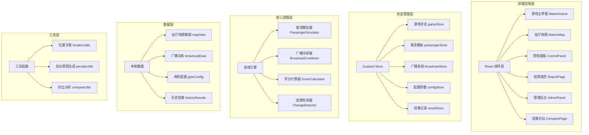
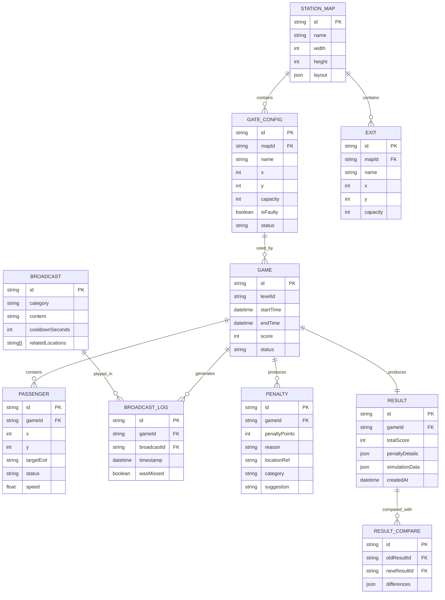

## 1. 架构设计



## 2. 技术栈说明

- **前端框架**：React@18 + TypeScript
- **构建工具**：Vite@5
- **样式方案**：TailwindCSS@3 + CSS Variables
- **状态管理**：Zustand（轻量状态管理，适合游戏实时状态更新）
- **可视化**：SVG + React Transition Group（动画）
- **路由**：React Router DOM@6
- **图标**：Lucide React
- **数据持久化**：localStorage（存储历史结果和配置）

## 3. 路由定义

| 路由路径 | 页面用途 |
|---------|----------|
| `/` | 首页/关卡选择页面 |
| `/game/:levelId` | 游戏主界面 |
| `/report/:gameId` | 结算报告页 |
| `/admin` | 管理后台入口 |
| `/admin/broadcasts` | 广播词管理 |
| `/admin/gates` | 闸机配置管理 |
| `/compare/:oldId/:newId` | 新旧结果对比页 |
| `/changes` | 变更追踪记录页 |

## 4. 核心数据模型

### 4.1 数据模型ER图



### 4.2 TypeScript 类型定义

```typescript
// 位置类型
interface Position {
  x: number;
  y: number;
}

// 闸机状态
type GateStatus = 'normal' | 'faulty' | 'restricted' | 'closed';

// 闸机配置
interface Gate {
  id: string;
  name: string;
  position: Position;
  capacity: number;
  status: GateStatus;
  isFaulty: boolean;
}

// 出口
interface Exit {
  id: string;
  name: string;
  position: Position;
  capacity: number;
  congestionLevel: number;
}

// 乘客
interface Passenger {
  id: string;
  position: Position;
  targetExit: string;
  speed: number;
  status: 'entering' | 'moving' | 'waiting' | 'exited' | 'stuck';
  path: Position[];
}

// 广播分类
type BroadcastCategory = 'evacuation' | 'diversion' | 'lockdown' | 'reassurance';

// 广播词
interface Broadcast {
  id: string;
  category: BroadcastCategory;
  title: string;
  content: string;
  cooldownSeconds: number;
  relatedLocations: string[];
  triggerCondition?: string;
}

// 广播播放记录
interface BroadcastLog {
  id: string;
  broadcastId: string;
  timestamp: number;
  wasMissed: boolean;
  locationRef?: string;
}

// 扣分项
interface Penalty {
  id: string;
  penaltyPoints: number;
  category: 'congestion' | 'missed_broadcast' | 'wrong_diversion' | 'safety_risk';
  reason: string;
  humanReadableReason: string;
  locationRef: string;
  locationType: 'gate' | 'exit' | 'area';
  timestamp: number;
  suggestion: string;
}

// 游戏状态
interface GameState {
  id: string;
  levelId: string;
  status: 'idle' | 'playing' | 'paused' | 'finished';
  currentTime: number;
  totalDuration: number;
  score: number;
  passengers: Passenger[];
  gates: Gate[];
  exits: Exit[];
  broadcastLogs: BroadcastLog[];
  penalties: Penalty[];
  lockdownAreas: string[];
  diversionRoutes: Map<string, string>;
  broadcastCooldowns: Map<string, number>;
}

// 游戏结果
interface GameResult {
  id: string;
  gameId: string;
  totalScore: number;
  maxPossibleScore: number;
  grade: 'S' | 'A' | 'B' | 'C' | 'D' | 'F';
  penalties: Penalty[];
  simulationSummary: {
    totalPassengers: number;
    evacuatedPassengers: number;
    avgEvacuationTime: number;
    maxCongestionLevel: number;
    gateUtilization: Record<string, number>;
  };
  createdAt: number;
  gateConfigSnapshot: Gate[];
}

// 变更记录
interface ChangeRecord {
  id: string;
  timestamp: number;
  type: 'broadcast_added' | 'broadcast_modified' | 'gate_modified' | 'map_modified';
  entityId: string;
  oldValue: unknown;
  newValue: unknown;
  affectedConclusions: string[];
}
```

## 5. 核心算法说明

### 5.1 客流模拟算法

```typescript
// 乘客行为模型
// 1. 每个tick根据目标出口计算最优路径
// 2. 根据前方拥堵程度调整移动速度
// 3. 收到广播后重新规划路径
// 4. 碰到封控区自动绕行
function simulatePassengerMovement(
  passenger: Passenger,
  gates: Gate[],
  exits: Exit[],
  lockdownAreas: string[],
  diversionRoutes: Map<string, string>
): Passenger {
  // 路径规划：A*算法，避开封控区和故障闸机
  const optimalPath = calculateOptimalPath(
    passenger.position,
    exits.find(e => e.id === passenger.targetExit)!.position,
    lockdownAreas,
    gates.filter(g => g.status !== 'normal')
  );
  
  // 速度计算：基础速度 * 拥堵系数 * 广播影响系数
  const congestionFactor = 1 - getCongestionLevel(passenger.position) * 0.8;
  const broadcastFactor = hasRecentDiversionBroadcast(passenger.targetExit) ? 1.2 : 1;
  const actualSpeed = passenger.speed * congestionFactor * broadcastFactor;
  
  // 移动逻辑
  return moveAlongPath(passenger, optimalPath, actualSpeed);
}
```

### 5.2 评分计算算法

```typescript
function calculateScore(gameState: GameState): number {
  const baseScore = 1000;
  
  // 疏散效率分 (40%)
  const evacuationScore = calculateEvacuationScore(gameState);
  
  // 拥堵控制分 (30%)
  const congestionScore = calculateCongestionScore(gameState);
  
  // 广播规范分 (20%)
  const broadcastScore = calculateBroadcastScore(gameState);
  
  // 安全管理分 (10%)
  const safetyScore = calculateSafetyScore(gameState);
  
  // 扣除各项惩罚
  const totalPenalty = gameState.penalties.reduce((sum, p) => sum + p.penaltyPoints, 0);
  
  return Math.max(0, baseScore + evacuationScore + congestionScore + broadcastScore + safetyScore - totalPenalty);
}
```

### 5.3 变更检测算法

```typescript
function detectConclusionChanges(
  oldConfig: Gate[],
  newConfig: Gate[],
  oldBroadcasts: Broadcast[],
  newBroadcasts: Broadcast[]
): ChangeRecord[] {
  const changes: ChangeRecord[] = [];
  
  // 检测闸机配置变更
  for (const newGate of newConfig) {
    const oldGate = oldConfig.find(g => g.id === newGate.id);
    if (oldGate && JSON.stringify(oldGate) !== JSON.stringify(newGate)) {
      changes.push({
        id: generateId(),
        timestamp: Date.now(),
        type: 'gate_modified',
        entityId: newGate.id,
        oldValue: oldGate,
        newValue: newGate,
        affectedConclusions: findAffectedConclusions('gate', newGate.id)
      });
    }
  }
  
  // 检测广播词变更
  for (const newBroadcast of newBroadcasts) {
    const oldBroadcast = oldBroadcasts.find(b => b.id === newBroadcast.id);
    if (!oldBroadcast) {
      changes.push({
        id: generateId(),
        timestamp: Date.now(),
        type: 'broadcast_added',
        entityId: newBroadcast.id,
        oldValue: null,
        newValue: newBroadcast,
        affectedConclusions: findAffectedConclusions('broadcast', newBroadcast.id)
      });
    } else if (JSON.stringify(oldBroadcast) !== JSON.stringify(newBroadcast)) {
      changes.push({
        id: generateId(),
        timestamp: Date.now(),
        type: 'broadcast_modified',
        entityId: newBroadcast.id,
        oldValue: oldBroadcast,
        newValue: newBroadcast,
        affectedConclusions: findAffectedConclusions('broadcast', newBroadcast.id)
      });
    }
  }
  
  return changes;
}
```

## 6. 目录结构

```
src/
├── components/          # React组件
│   ├── game/           # 游戏相关组件
│   │   ├── StationMap.tsx
│   │   ├── ControlPanel.tsx
│   │   ├── GateControl.tsx
│   │   ├── BroadcastPanel.tsx
│   │   ├── PassengerSprite.tsx
│   │   └── AlertPanel.tsx
│   ├── report/         # 报告相关组件
│   │   ├── ReportPage.tsx
│   │   ├── PenaltyTimeline.tsx
│   │   ├── ScoreDashboard.tsx
│   │   └── LocationHighlighter.tsx
│   ├── admin/          # 管理后台组件
│   │   ├── BroadcastEditor.tsx
│   │   ├── GateConfigEditor.tsx
│   │   └── ResultCompare.tsx
│   └── common/         # 公共组件
│       ├── Button.tsx
│       └── Modal.tsx
├── store/              # Zustand状态管理
│   ├── gameStore.ts
│   ├── passengerStore.ts
│   ├── broadcastStore.ts
│   ├── configStore.ts
│   └── resultStore.ts
├── engine/             # 游戏引擎
│   ├── PassengerSimulator.ts
│   ├── BroadcastCooldown.ts
│   ├── ScoreCalculator.ts
│   └── ChangeDetector.ts
├── data/               # 静态数据
│   ├── stationMaps.ts
│   ├── broadcasts.ts
│   └── gateConfigs.ts
├── utils/              # 工具函数
│   ├── locationUtils.ts
│   ├── penaltyUtils.ts
│   └── compareUtils.ts
├── types/              # TypeScript类型
│   └── index.ts
├── hooks/              # 自定义Hooks
│   ├── useGameLoop.ts
│   └── useBroadcastCooldown.ts
└── pages/              # 页面组件
    ├── HomePage.tsx
    ├── GamePage.tsx
    ├── ReportPage.tsx
    ├── AdminPage.tsx
    └── ComparePage.tsx
```
