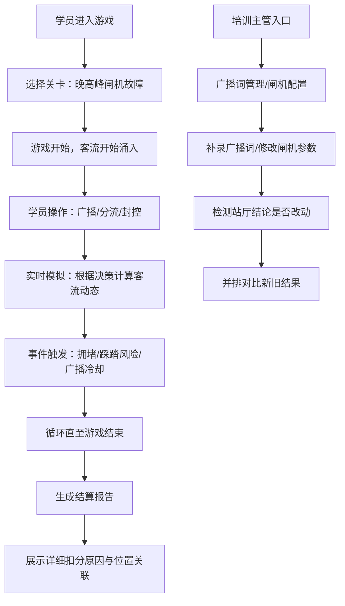

## 1. 产品概述

地铁疏散指挥台是一款面向地铁站务人员的仿真训练游戏，针对晚高峰闸机故障等应急场景，帮助新人练习广播播报、客流分流和区域封控等核心技能。玩家的每一个决策都会实时影响客流走向和最终处置结果，通过沉浸式模拟提升应急处置能力。

- **核心目标**：解决站务新人在应急场景下只会简单关门、缺乏系统性处置能力的问题
- **目标用户**：地铁站务培训主管、新入职站务员
- **产品价值**：将抽象的应急处置流程转化为可操作、可复盘的互动游戏，降低培训成本，提升培训效果

## 2. 核心特征

### 2.1 用户角色

| 角色 | 登录方式 | 核心权限 |
|------|----------|----------|
| 学员 | 直接进入 | 进行游戏、查看个人报告 |
| 培训主管 | 管理入口登录 | 编辑广播词、修改闸机配置、对比新旧结果、查看所有学员报告 |

### 2.2 功能模块

1. **游戏主界面**：站厅地图可视化、实时客流模拟、操作控制面板
2. **广播系统**：广播词库管理、广播播放、冷却计时、漏发追踪
3. **分流封控系统**：闸机状态控制、出口引导、区域封控设置
4. **结算报告页**：详细扣分原因、位置关联、改进建议
5. **管理后台**：广播词编辑、闸机参数配置、历史结果对比
6. **变更追踪**：站厅地图相关结论改动记录与对比

### 2.3 页面详情

| 页面名称 | 模块名称 | 功能描述 |
|---------|----------|----------|
| 首页/关卡选择 | 关卡列表 | 展示不同应急场景（晚高峰闸机故障等），选择进入游戏 |
| 游戏主界面 | 站厅地图 | SVG可视化站厅布局，实时显示闸机、出口、乘客流、封控区位置 |
| 游戏主界面 | 操作面板 | 广播按钮组、闸机控制、分流引导、封控设置 |
| 游戏主界面 | 状态面板 | 实时客流数据、时间倒计时、当前评分、广播冷却状态 |
| 广播词管理 | 词库编辑 | 培训主管增删改广播词，分类管理（疏散/分流/封控/安抚） |
| 广播词管理 | 变更检测 | 补录广播词后自动检测站厅地图相关结论是否需要更新 |
| 结算报告页 | 扣分详情 | 人流模拟和广播冷却对应的扣分原因，用人话描述并关联具体位置 |
| 结算报告页 | 位置回溯 | 点击扣分项可在站厅地图上高亮对应闸机或出口位置 |
| 管理后台 | 闸机配置 | 手动修正闸机参数（位置、通行能力、故障概率） |
| 管理后台 | 结果对比 | 修改闸机后旧结果与新结果并排展示，高亮差异项 |
| 变更追踪页 | 改动记录 | 列出站厅地图相关结论的所有改动，标注改动前后对比 |

## 3. 核心流程

**主流程描述**：
1. 学员选择"晚高峰闸机故障"关卡开始游戏
2. 游戏模拟晚高峰时段，乘客从各个入口涌入，其中一部闸机突发故障
3. 学员需要通过广播引导乘客、控制闸机状态、设置分流路线、划定封控区域
4. 系统实时模拟乘客行为，根据学员决策计算拥堵指数、疏散效率、安全风险
5. 游戏结束后生成详细报告，每项扣分都关联到具体的站厅位置和操作时机
6. 培训主管可以编辑广播词、调整闸机配置，系统自动检测参数变更对结论的影响，并提供新旧结果并排对比

## 4. 用户界面设计

### 4.1 设计风格

- **主色调**：地铁警示黄（#FFB800）+ 安全蓝（#1E88E5）+ 紧急红（#E53935）+ 深色背景（#1A1A2E）
- **风格定位**：工业科技风，模拟地铁控制中心的真实操作界面，营造紧张专业的应急氛围
- **按钮样式**：方形带轻微圆角，按压有深度反馈，紧急按钮带闪烁动画
- **字体**：标题用"JetBrains Mono"等宽字体营造控制台感觉，正文用"Noto Sans SC"保证中文可读性
- **布局风格**：模块化分屏布局，左侧地图、右侧控制面板、底部状态栏
- **视觉元素**：扫描线效果、数据闪烁动画、实时数据流、告警脉冲动画

### 4.2 页面设计概览

| 页面名称 | 模块名称 | UI元素 |
|---------|----------|--------|
| 游戏主界面 | 站厅地图 | SVG矢量地图，闸机用不同颜色区分状态（绿=正常/红=故障/黄=限流），乘客用移动圆点表示，封控区用半透明红色遮罩 |
| 游戏主界面 | 控制面板 | 广播按钮带冷却进度条，闸机开关带状态指示灯，分流按钮可拖拽设置目标出口 |
| 游戏主界面 | 告警面板 | 右上角实时告警列表，新告警有弹跳动画，可点击定位到地图位置 |
| 结算报告页 | 扣分详情 | 时间线布局，每条扣分记录含：时间点、扣分原因、关联位置（可点击高亮）、改进建议 |
| 结算报告页 | 总分展示 | 仪表盘样式展示总分，分项得分用条形图对比 |
| 结果对比页 | 并排对比 | 左右分栏布局，中间用竖线分隔，差异项用黄色背景高亮，箭头指示变化方向 |

### 4.3 响应式设计

- **桌面优先**：核心操作区域保证在1920px宽度下完整展示
- **平板适配**：控制面板可折叠，地图区域自适应缩放
- **触控优化**：按钮最小尺寸44px，支持拖拽设置封控区域

### 4.4 动效设计

- **乘客流动**：平滑的贝塞尔曲线移动，根据拥堵程度自动调整速度
- **告警闪烁**：紧急事件时边框红色脉冲动画（1秒周期）
- **广播播放**：按钮波纹扩散动画，地图上对应区域高亮闪烁
- **封控设置**：拖拽时实时预览封控范围，释放时有吸附对齐效果
- **页面切换**：整体滑动过渡，告警面板从右侧滑入
