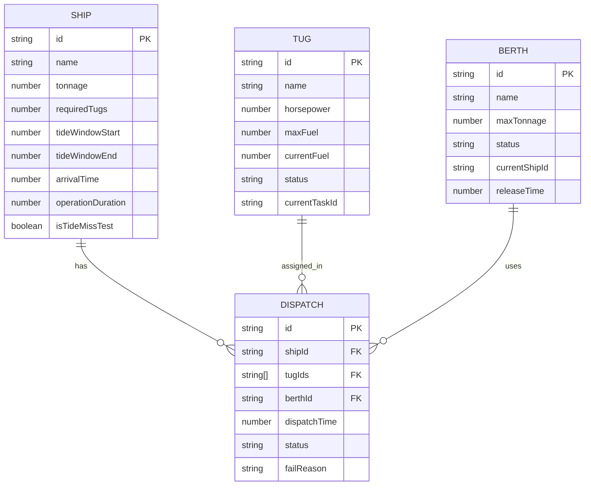

## 1. 架构设计

```mermaid
flowchart TB
    subgraph "前端层"
        "A[React 调度主界面]"
        "B[React 调度报告页]"
    end
    subgraph "状态层 (Zustand)"
        "C[游戏状态 Store]"
        "D[调度引擎]"
    end
    subgraph "数据层"
        "E[样例数据 (TS模块)]"
    end
    "E" --> "C"
    "C" --> "D"
    "D" --> "A"
    "D" --> "B"
    "A" --> "C"
```

纯前端架构，无需后端服务。游戏逻辑全部在浏览器端执行，使用 Zustand 管理状态，TypeScript 模块承载样例数据。

## 2. 技术说明

- 前端：React@18 + TypeScript + Tailwind CSS@3 + Vite
- 初始化工具：vite-init
- 状态管理：Zustand
- 后端：无
- 数据库：无，使用 TypeScript 模块内嵌样例数据

## 3. 路由定义

| 路由 | 用途 |
|------|------|
| / | 调度主界面：港口地图+时间轴+操作面板+实时反馈 |
| /report | 调度报告页：分类失败归因+维度评分 |

## 4. 数据模型

### 4.1 数据模型定义



### 4.2 样例数据说明

**拖轮 (3艘)**：
- TUG-01 "海牛号"：8000马力，满油100，当前油量80
- TUG-02 "港龙号"：6000马力，满油100，当前油量45（燃油紧张测试）
- TUG-03 "潮信号"：10000马力，满油100，当前油量100

**泊位 (4个)**：
- B01：5万吨级
- B02：10万吨级
- B03：2万吨级
- B04：8万吨级

**船舶 (6艘)**：
- S01 "远洋明珠"：8万吨，需2艘拖轮，潮汐窗口 07:00-10:00，到达06:30
- S02 "渤海通途"：3万吨，需1艘拖轮，潮汐窗口 08:00-12:00，到达07:30
- S03 "潮汐错过号"：6万吨，需2艘拖轮，潮汐窗口 09:00-09:30（极窄窗口，专门测试潮汐错过），到达09:15
- S04 "北方曙光"：1.5万吨，需1艘拖轮，潮汐窗口 10:00-14:00，到达09:00
- S05 "燃油测试号"：9万吨，需2艘拖轮，潮汐窗口 11:00-15:00，到达10:30（配合港龙号低燃油测试）
- S06 "深夜潮"：4万吨，需1艘拖轮，潮汐窗口 18:00-21:00，到达17:00

**关键测试场景**：
1. S03 "潮汐错过号"：15分钟窗口，学员若在09:15后才调度则潮汐错过
2. S05 "燃油测试号"：需2艘拖轮但港龙号燃油不足，触发燃油不足失败
3. S01 + S02 同时需要拖轮时，若都指派同一拖轮，触发拖轮冲突
4. 泊位占用：S01占用B02后，S05也需大吨位泊位但B02/B04可能已被占用

## 5. 调度引擎核心逻辑

### 5.1 资源锁定机制

- 拖轮指派后锁定：从调度时间起算，锁定时长 = 操作时长 + 返航时间
- 泊位分配后锁定：从靠泊时间起算，锁定时长 = 船舶操作时长
- 锁定期间该资源不可再次分配

### 5.2 失败原因分类检查顺序

1. **潮汐窗口检查**：当前时间是否在船舶潮汐窗口内
2. **拖轮冲突检查**：指派的拖轮是否处于空闲状态
3. **燃油检查**：拖轮当前燃油是否足够完成本次任务
4. **泊位占用检查**：目标泊位是否空闲且吨位匹配

每项检查独立报告，不合并。即使多项同时失败，也逐条列出。

### 5.3 时间轴推进规则

- 以30分钟为基本步进单位
- 时间范围：06:00 - 24:00
- 每次推进触发：船舶到达事件、潮汐窗口关闭事件、资源释放事件
- 学员可手动步进或自动播放（1步/2秒）

### 5.4 评分维度

| 维度 | 计算方式 |
|------|----------|
| 潮汐管理 | 潮汐窗口内成功调度数 / 总需调度数 × 100 |
| 拖轮利用率 | 拖轮实际工作时长 / 拖轮总可用时长 × 100 |
| 燃油管理 | 剩余总燃油 / 初始总燃油 × 100（燃油浪费扣分） |
| 泊位周转 | 泊位空闲时长 / 泊位总可用时长 × 100（空置太久扣分） |
