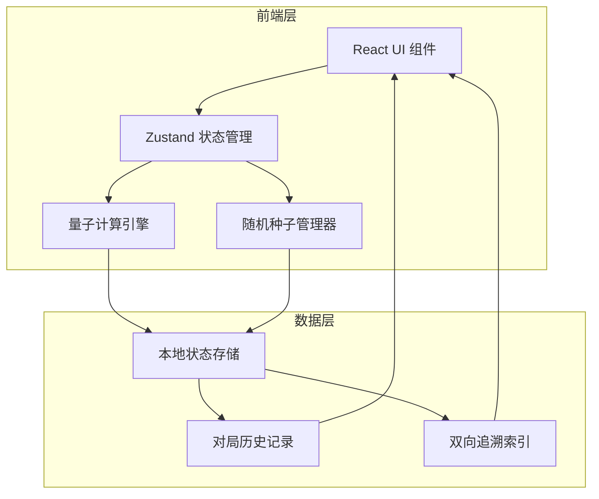
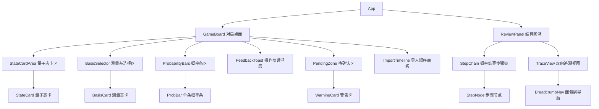

## 1. 架构设计



纯前端架构，无后端服务。量子态计算、概率塌缩、随机种子管理全部在浏览器端完成。状态管理使用 Zustand，数据持久化使用 localStorage。

## 2. 技术说明

- **前端框架**：React@18 + TypeScript
- **样式方案**：Tailwind CSS@3 + CSS Modules（磨砂玻璃等特殊效果）
- **构建工具**：Vite
- **状态管理**：Zustand（轻量、支持中间件）
- **动画库**：Framer Motion
- **后端**：无
- **数据库**：无（使用 localStorage 持久化对局记录）

## 3. 路由定义

| 路由 | 用途 |
|------|------|
| / | 对局桌面——量子态卡展示、测量基选择、概率塌缩、待确认区 |
| /review | 结算回溯面板——概率结算步骤链、双向追溯视图 |

## 4. 量子计算引擎核心模型

### 4.1 量子态定义

```typescript
interface QuantumState {
  id: string;
  label: string;           // 如 "|0⟩" "|+⟩" "|ψ⟩"
  amplitudes: Complex[];   // 在计算基下的振幅 [⟨0|ψ⟩, ⟨1|ψ⟩]
  importOrder: number;     // 导入顺序编号
  importTag: '先到' | '后补';
  basis: 'Z' | 'X' | 'Y'; // 当前表达基
}

interface Complex {
  re: number;
  im: number;
}
```

### 4.2 测量基定义

```typescript
interface MeasurementBasis {
  id: string;
  label: string;          // 如 "Z基" "X基"
  symbol: string;         // 如 "σ_z" "σ_x"
  eigenvectors: QuantumState[];  // 本征态
  importOrder: number;
  importTag: '先到' | '后补';
}
```

### 4.3 测量结果定义

```typescript
interface MeasurementResult {
  id: string;
  stateId: string;           // 被测量子态ID
  basisId: string;           // 使用的测量基ID
  outcomeIndex: number;      // 塌缩到第几个本征态
  outcomeLabel: string;      // 如 "|0⟩" "|+⟩"
  probabilities: number[];   // 各结果概率
  isNormalized: boolean;     // 概率是否归一
  randomSeed: number;        // 本次使用的随机种子
  seedInfluence: string;     // 种子对分数影响的描述
  timestamp: number;
  stepIndex: number;         // 在对局中的步骤编号
}
```

### 4.4 待确认项定义

```typescript
type WarningType = 'PROBABILITY_NOT_NORMALIZED' | 'BASIS_CONFUSION' | 'NO_EXPERIMENT_HISTORY';

interface PendingConfirmation {
  id: string;
  type: WarningType;
  message: string;
  detail: string;           // 展开后的详细说明
  relatedIds: string[];     // 关联的卡牌/结果ID
  confirmed: boolean;
  createdAt: number;
}
```

### 4.5 对局历史与追溯

```typescript
interface GameSession {
  id: string;
  states: QuantumState[];
  bases: MeasurementBasis[];
  results: MeasurementResult[];
  warnings: PendingConfirmation[];
  timeline: TimelineEntry[];
  startTime: number;
  endTime: number | null;
}

interface TimelineEntry {
  stepIndex: number;
  type: 'IMPORT_STATE' | 'IMPORT_BASIS' | 'IMPORT_PROBABILITY' | 'SELECT_BASIS' | 'MEASURE' | 'CONFIRM_WARNING';
  entityId: string;         // 关联的实体ID
  description: string;
  randomSeed?: number;      // 仅MEASURE类型
  seedInfluence?: string;   // 仅MEASURE类型
}
```

### 4.6 双向追溯索引

```typescript
interface TraceIndex {
  forward: Map<string, string[]>;   // stateId → resultIds[]
  backward: Map<string, {          // resultId → 溯源信息
    stateId: string;
    basisId: string;
    stepIndex: number;
  }>;
}
```

## 5. 核心计算逻辑

### 5.1 测量概率计算

给定量子态 |ψ⟩ 和测量基 B = {|b₀⟩, |b₁⟩}：

- P(bᵢ) = |⟨bᵢ|ψ⟩|²
- 概率归一性检查：ΣP(bᵢ) = 1 ± ε（ε = 0.001）

### 5.2 塌缩模拟

1. 使用可追踪的伪随机数生成器（seedrandom），种子记录到 TimelineEntry
2. 生成随机数 r ∈ [0, 1)
3. 找到满足 Σⱼ₌₀ⁱ P(bⱼ) > r 的最小 i，即为塌缩结果
4. 记录种子和种子对结果的影响描述（如"种子值 0.42 导致 r=0.42，落在 |1⟩ 区间，得分−1"）

### 5.3 待确认区触发规则

| 规则 | 触发条件 | 警告类型 |
|------|----------|----------|
| 概率未归一 | ΣP(bᵢ) 偏离 1 超过 ε | PROBABILITY_NOT_NORMALIZED |
| 测量基混淆 | 连续两次测量使用不同基但未重置态 | BASIS_CONFUSION |
| 无实验历史 | 重复相同态+基的测量但无历史记录可参考 | NO_EXPERIMENT_HISTORY |

## 6. 组件架构


