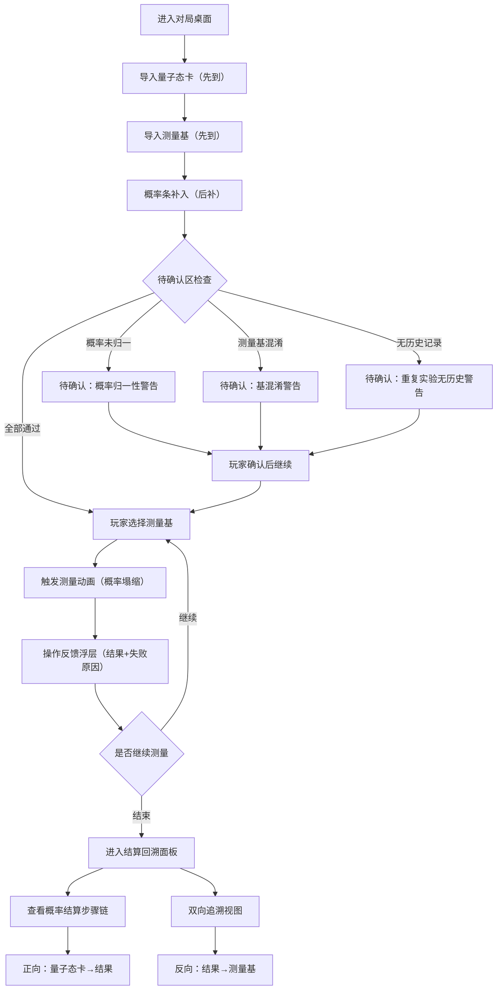

## 1. 产品概述

量子测量卡牌局——一款面向科普教学的量子测量交互原型。玩家通过选择测量基对量子态卡执行测量，观察概率塌缩过程，理解量子测量的核心原理。解决"量子测量只讲公式学生听不住"的痛点，让抽象的概率振幅和基变换在卡牌操作中变得可触摸、可追踪。

- 目标用户：科普社课堂中学生（初中至高中），由科普社老师引导操作
- 核心价值：用量子态卡 + 测量基卡的操作范式替代纯公式讲解，让每次塌缩过程可回溯、可验证

## 2. 核心功能

### 2.1 用户角色

| 角色 | 进入方式 | 核心权限 |
|------|----------|----------|
| 玩家（学生） | 直接进入 | 选择测量基、触发测量、查看结果与回溯 |
| 观察者（老师） | 同一界面 | 导入量子态卡/测量基/概率条、查看待确认区、回放对局 |

### 2.2 功能模块

1. **对局桌面**：量子态卡展示区、测量基选择区、概率条可视化区、操作反馈区
2. **待确认区**：挂载概率未归一、测量基混淆、重复实验无历史等异常提示
3. **结算回溯面板**：逐步回看概率结算触发点、随机种子影响、双向追溯链路

### 2.3 页面详情

| 页面名称 | 模块名称 | 功能描述 |
|----------|----------|----------|
| 对局桌面 | 量子态卡区 | 展示当前量子态（\|0⟩、\|1⟩、\|+⟩、\|−⟩等），显示导入顺序标签 |
| 对局桌面 | 测量基选择区 | 展示可选测量基（Z基、X基、Y基等），点击选择后高亮反馈 |
| 对局桌面 | 概率条可视化区 | 测量后以动画条展示各结果概率，概率条支持延迟补入（先占位后填充） |
| 对局桌面 | 操作反馈浮层 | 每次操作后即时弹出反馈（成功/失败原因），不用总分糊弄 |
| 对局桌面 | 待确认区 | 概率未归一警告、测量基混淆警告、重复实验无历史警告，需玩家确认后才能继续 |
| 对局桌面 | 导入顺序面板 | 显示量子态卡、测量基、概率条的导入时序，标注"先到""后补" |
| 结算回溯面板 | 概率结算步骤链 | 回看每一步触发了概率结算的节点，标注随机种子和种子对分数的影响 |
| 结算回溯面板 | 双向追溯视图 | 从量子态卡正向查到最终结果，或从结果反向查回测量基，路径可点击跳转 |

## 3. 核心流程

玩家进入对局桌面 → 系统导入量子态卡（标注"先到"） → 系统导入测量基（标注"先到"） → 概率条延迟补入（标注"后补"） → 待确认区检查（概率归一性、基混淆、历史缺失） → 玩家选择测量基 → 触发测量动画（概率塌缩） → 操作反馈浮层展示结果与失败原因 → 重复实验或换基测量 → 对局结束 → 进入结算回溯面板 → 双向追溯链路验证

## 4. 用户界面设计

### 4.1 设计风格

- **主题**：赛博量子实验室——深色背景搭配荧光色量子态可视化，科技感与教学感并存
- **主色**：深邃太空黑（#0a0e1a）+ 量子蓝（#00d4ff）荧光强调
- **辅色**：概率绿（#00ff88）用于成功态，警告橙（#ff6b35）用于待确认区，塌缩红（#ff2d55）用于失败态
- **字体**：展示字体使用 Orbitron（科幻几何感），正文字体使用 Noto Sans SC（中文清晰）
- **布局**：桌面中心为量子态卡操作区，左侧为测量基选择，右侧为概率条和待确认区，底部为操作反馈
- **卡片风格**：半透明磨砂玻璃质感（backdrop-filter: blur），悬浮发光边框
- **图标**：线性科技风图标，量子符号⟨⟩作为装饰元素

### 4.2 页面设计概览

| 页面名称 | 模块名称 | UI 元素 |
|----------|----------|----------|
| 对局桌面 | 量子态卡区 | 磨砂玻璃卡牌，卡面显示态矢量符号，左上角导入顺序标签（"先到 #1""后补 #3"），悬浮发光动画 |
| 对局桌面 | 测量基选择区 | 横排基卡片，选中态荧光高亮+脉冲动画，Z基/X基/Y基以不同颜色区分 |
| 对局桌面 | 概率条可视化区 | 水平概率条，占位骨架屏→延迟填充动画，数值标注在条末端，未归一时整体闪烁橙边 |
| 对局桌面 | 操作反馈浮层 | 底部滑入式浮层，绿色勾+成功描述 / 红色叉+具体失败原因，3秒自动收起 |
| 对局桌面 | 待确认区 | 右侧固定面板，黄色警告卡片堆叠，每张可展开详情，确认按钮需点击后才可继续操作 |
| 结算回溯面板 | 概率结算步骤链 | 垂直时间轴，每节点显示触发步骤、随机种子值、种子对分数的影响公式 |
| 结算回溯面板 | 双向追溯视图 | 面包屑导航链，正向/反向切换按钮，点击任意节点高亮整条链路 |

### 4.3 响应式策略

- 桌面优先设计（科普社课堂使用投影/大屏）
- 最小宽度 1024px 保证卡牌可读性
- 触控优化：卡牌点击区域 ≥ 48px，测量基选择按钮加大

### 4.4 3D 场景指引

不适用——本项目以2D卡牌交互为主，通过CSS动画和Canvas概率条实现视觉效果，不引入3D渲染。
