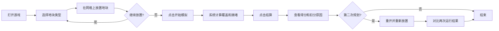

## 1. 产品概述

城市规划积木赛是一款面向规划馆讲解员和小朋友的浏览器小游戏，通过互动式城市规划体验，让玩家理解交通、绿地、消防覆盖之间的平衡取舍，培养城市规划意识。

- 核心目的：通过游戏化方式展示城市规划中的资源分配和覆盖计算问题
- 目标用户：规划馆讲解员（引导使用）、参观小朋友（游戏体验）
- 产品价值：让抽象的城市规划概念变得直观可感，支持讲解员进行互动教学

## 2. 核心 Features

### 2.1 User Roles (if applicable)

| Role | Registration Method | Core Permissions |
|------|---------------------|------------------|
| 讲解员/玩家 | 无需注册 | 进行游戏、查看结算、对比两次运行结果 |

### 2.2 Feature Module

1. **游戏主界面**：网格画布、地块工具栏、游戏控制栏
2. **结算页面**：详细得分、扣分原因列表、各项指标雷达图
3. **复盘对比**：两次运行结果对比、变化点高亮标注

### 2.3 Page Details

| Page Name | Module Name | Feature description |
|-----------|-------------|---------------------|
| 游戏主界面 | 网格画布 | 10x10 可交互网格，支持点击放置/移除地块 |
| 游戏主界面 | 地块工具栏 | 商业区、住宅、道路、绿地、消防站五种地块选择 |
| 游戏主界面 | 游戏控制 | 开始模拟、暂停、重开、结算按钮 |
| 结算页面 | 得分总览 | 总分显示、各维度分项得分 |
| 结算页面 | 扣分详情 | 人能看懂的扣分原因（如"道路断头"、"消防盲区"） |
| 复盘对比 | 结果对比 | 两次运行得分对比、变化点高亮标注 |

## 3. Core Process

用户打开游戏 → 选择地块类型 → 在网格上放置地块 → 点击开始模拟 → 系统计算各项指标 → 点击结算查看得分和扣分原因 → 可进行第二次规划 → 对比两次结果的差异

## 4. User Interface Design

### 4.1 Design Style

- 主色调：深蓝色（#1e3a5f）代表专业规划，搭配明亮的彩色地块
- 配色方案：商业区橙色、住宅蓝色、道路灰色、绿地绿色、消防站红色
- 按钮风格：圆润卡片式，带轻微阴影和 hover 效果
- 字体：使用 ZCOOL KuaiLe（中文趣味字体）配合数字字体
- 布局：左侧工具栏 + 中央网格 + 右侧信息面板
- 图标：使用 emoji 图标使界面更友好（🏬 🏠 🛣️ 🌲 🚒）

### 4.2 Page Design Overview

| Page Name | Module Name | UI Elements |
|-----------|-------------|-------------|
| 游戏主界面 | 网格画布 | 10x10 方格，悬停高亮，点击放置动画 |
| 游戏主界面 | 工具栏 | 彩色地块卡片，选中状态边框高亮 |
| 游戏主界面 | 控制面板 | 开始/暂停/重开/结算按钮组 |
| 结算页面 | 得分面板 | 大号总分数字，分项进度条 |
| 结算页面 | 扣分列表 | 带图标的原因卡片，按严重程度排序 |
| 复盘对比 | 双网格视图 | 左右并列显示两次规划，差异点闪烁标注 |

### 4.3 Responsiveness

- 桌面端优先，支持平板横屏适配
- 网格区域自适应缩放
- 工具栏在小屏幕改为底部横向排列

### 4.4 3D Scene Guidance (if applicable)

本项目为 2D 网格游戏，不涉及 3D 场景。
