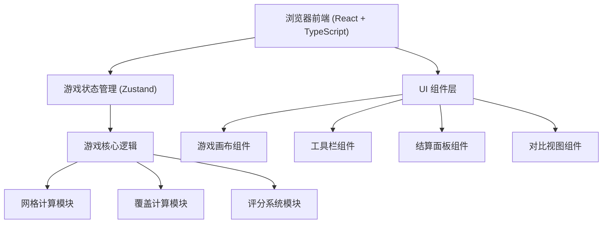
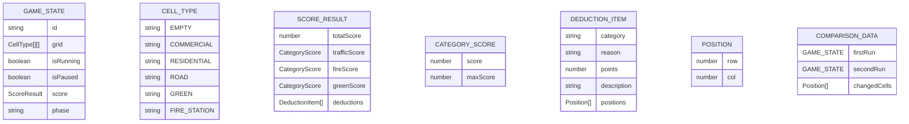

## 1. Architecture Design



## 2. Technology Description

- 前端：React@18 + TypeScript + Vite
- 样式：TailwindCSS@3
- 状态管理：Zustand
- 初始化工具：vite-init
- 后端：无（纯前端游戏）
- 数据库：无（使用本地状态存储两次运行结果）

## 3. Route Definitions

| Route | Purpose |
|-------|---------|
| / | 游戏主页面 |

## 4. API Definitions (if backend exists)

本项目为纯前端应用，无后端 API。

## 5. Server Architecture Diagram (if backend exists)

本项目无后端服务。

## 6. Data Model (if applicable)

### 6.1 Data Model Definition



### 6.2 核心数据结构定义

```typescript
// 地块类型枚举
export enum CellType {
  EMPTY = 'empty',
  COMMERCIAL = 'commercial',
  RESIDENTIAL = 'residential',
  ROAD = 'road',
  GREEN = 'green',
  FIRE_STATION = 'fire_station'
}

// 位置接口
export interface Position {
  row: number;
  col: number;
}

// 分项得分
export interface CategoryScore {
  score: number;
  maxScore: number;
}

// 扣分项
export interface DeductionItem {
  category: 'traffic' | 'fire' | 'green';
  reason: string;
  points: number;
  description: string;
  positions: Position[];
}

// 评分结果
export interface ScoreResult {
  totalScore: number;
  maxScore: number;
  trafficScore: CategoryScore;
  fireScore: CategoryScore;
  greenScore: CategoryScore;
  deductions: DeductionItem[];
}

// 游戏状态
export interface GameState {
  grid: CellType[][];
  isRunning: boolean;
  isPaused: boolean;
  phase: 'planning' | 'simulating' | 'result';
  score: ScoreResult | null;
  selectedTool: CellType | null;
  firstRunGrid: CellType[][] | null;
  firstRunScore: ScoreResult | null;
}
```
