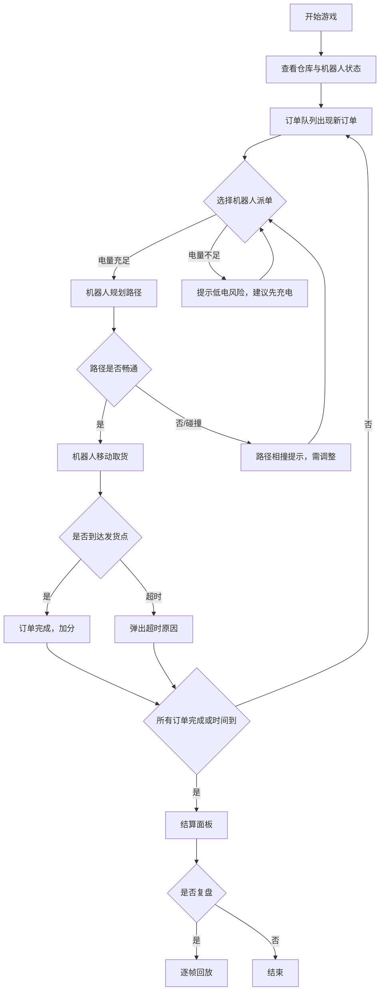

## 1. 产品概述

"机器人仓库拣货赛"是一款浏览器端教学模拟游戏，面向仓储新人训练电量和堵塞意识，通过多机器人拣货场景让玩家体验低电接单、路径相撞、订单超时等常见失误。
- 核心目标：让新人在无风险环境下练习派单决策，理解电量补给和任务优先级对拣货效率的影响
- 目标用户：仓储经理培训新人、物流课堂学生

## 2. 核心功能

### 2.1 用户角色

| 角色 | 说明 | 核心权限 |
|------|------|----------|
| 玩家 | 单人操控全局派单 | 为机器人分配订单、启动/暂停/重开/结算/复盘 |
| 观察者 | 仅查看复盘 | 查看历史回放与结算分析 |

### 2.2 功能模块

1. **游戏主界面**：仓库网格、机器人状态栏、订单队列、操作面板
2. **配置合并页**：机器人配置与货架配置的差异对比与合并

### 2.3 页面详情

| 页面名称 | 模块名称 | 功能描述 |
|----------|----------|----------|
| 游戏主界面 | 仓库网格 | 10×8 网格地图，显示货架、通道、充电桩、机器人位置与路径 |
| 游戏主界面 | 机器人状态栏 | 每台机器人的电量、当前订单、负载状态实时展示 |
| 游戏主界面 | 订单队列 | 待处理订单列表，含优先级标识、倒计时、超时预警 |
| 游戏主界面 | 操作面板 | 开始/暂停/重开/结算按钮，回合信息，当前得分 |
| 游戏主界面 | 超时原因浮层 | 订单超时时弹出具体原因（低电/路径相撞/堵塞货道/无可用机器人） |
| 游戏主界面 | 结算面板 | 最终得分、各项指标（完成率/超时数/碰撞次数/电量枯竭次数）、评级 |
| 游戏主界面 | 复盘面板 | 逐帧回放，可拖动进度条，碰撞事件高亮标记 |
| 配置合并页 | 差异对比 | 左右分栏展示机器人配置与货架配置的差异行，手动选择采用哪一侧 |

## 3. 核心流程

玩家进入游戏后，查看仓库布局和机器人状态，从订单队列中选择订单分配给机器人。机器人沿网格移动到货架取货，再移动到发货点完成订单。游戏过程中需要关注电量（低电需先去充电桩）、路径冲突（多机器人同时占同一格）、货架堵塞（前方货道被堵需绕行）。超时的订单会给出具体原因。游戏结束后进入结算，可复盘全流程。

## 4. 用户界面设计

### 4.1 设计风格

- 主色调：工业灰 (#2D2D2D) + 仓储橙 (#F97316) 作为强调色
- 次要色：电量绿 (#22C55E)、警告红 (#EF4444)、路径蓝 (#3B82F6)
- 按钮风格：圆角矩形，带微阴影，hover 时提升阴影
- 字体：JetBrains Mono（数据/代码区域）+ Noto Sans SC（界面文字）
- 布局：左侧仓库网格为主视觉，右侧状态栏与操作面板
- 图标风格：简洁线条图标，2px 描边

### 4.2 页面设计概览

| 页面名称 | 模块名称 | UI 元素 |
|----------|----------|---------|
| 游戏主界面 | 仓库网格 | 10×8 方格，货架用深灰填充+货箱图标，通道为浅灰，充电桩用闪电图标，机器人用彩色圆形+方向箭头，路径用半透明蓝线 |
| 游戏主界面 | 机器人状态栏 | 电量进度条（绿→黄→红渐变），当前任务标签，位置坐标 |
| 游戏主界面 | 订单队列 | 卡片列表，优先级色标（红=紧急/黄=普通/绿=低），倒计时数字动画 |
| 游戏主界面 | 操作面板 | 主按钮（开始=绿/暂停=黄/重开=灰），结算和复盘为次要按钮 |
| 游戏主界面 | 超时原因浮层 | 暗色半透明遮罩，居中卡片，图标+文字说明，关闭按钮 |
| 游戏主界面 | 结算面板 | 全屏遮罩，指标卡片横排，中央大号评级（S/A/B/C），按钮（复盘/再来一局） |
| 游戏主界面 | 复盘面板 | 底部进度条+播放控件，网格上叠加事件标记点（碰撞=红点/超时=黄点/充电=绿点） |
| 配置合并页 | 差异对比 | 左右分栏，差异行高亮橙色，相同行灰色，选择按钮在差异行右侧 |

### 4.3 响应式

- 桌面优先设计，最小宽度 1024px
- 网格区域在窄屏下可缩放但保持 10×8 比例
- 状态栏在窄屏下折叠为底部抽屉

### 4.4 动效

- 机器人移动：0.3s ease-in-out 逐格过渡
- 碰撞发生：网格抖动 + 红色闪烁
- 超时弹出：从上方滑入 0.2s
- 结算面板：数字从 0 滚动到最终值
- 复盘播放：事件标记点淡入淡出
