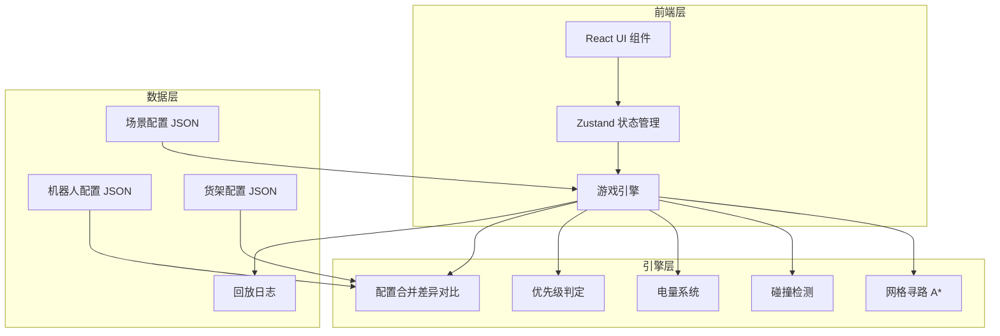

## 1. 架构设计



## 2. 技术说明

- 前端：React@18 + TypeScript + Tailwind CSS@3 + Vite
- 初始化工具：vite-init（react-ts 模板）
- 状态管理：Zustand
- 后端：无（纯前端，配置和回放数据存于内存/LocalStorage）
- 数据库：无（使用 JSON 静态配置 + 内存回放日志）

## 3. 路由定义

| 路由 | 用途 |
|------|------|
| / | 游戏主界面（默认页） |
| /merge | 配置合并差异对比页 |

## 4. 核心数据结构

### 4.1 网格地图

```typescript
type CellType = 'aisle' | 'shelf' | 'charger' | 'dispatch';

interface GridCell {
  x: number;
  y: number;
  type: CellType;
  blocked: boolean;
}

interface WarehouseMap {
  width: number;
  height: number;
  cells: GridCell[][];
}
```

### 4.2 机器人

```typescript
interface Robot {
  id: string;
  name: string;
  color: string;
  position: { x: number; y: number };
  battery: number;
  maxBattery: number;
  speed: number;
  currentOrderId: string | null;
  path: { x: number; y: number }[];
  state: 'idle' | 'moving' | 'picking' | 'charging' | 'blocked';
}
```

### 4.3 订单

```typescript
type OrderPriority = 'urgent' | 'normal' | 'low';
type TimeoutReason = 'low_battery' | 'path_collision' | 'blocked_aisle' | 'no_available_robot';

interface Order {
  id: string;
  shelfPosition: { x: number; y: number };
  dispatchPosition: { x: number; y: number };
  priority: OrderPriority;
  timeLimit: number;
  elapsed: number;
  assignedRobotId: string | null;
  status: 'pending' | 'in_progress' | 'completed' | 'timeout';
  timeoutReason?: TimeoutReason;
}
```

### 4.4 回放日志

```typescript
interface ReplayFrame {
  tick: number;
  robots: { id: string; position: { x: number; y: number }; battery: number; state: string }[];
  events: GameEvent[];
}

interface GameEvent {
  tick: number;
  type: 'collision' | 'timeout' | 'charging' | 'order_complete' | 'low_battery_warning';
  details: string;
  position?: { x: number; y: number };
}
```

### 4.5 配置合并

```typescript
interface ConfigDiff {
  key: string;
  robotValue: unknown;
  shelfValue: unknown;
  resolved: 'robot' | 'shelf' | null;
}
```

## 5. 核心算法说明

### 5.1 网格寻路

- 使用轻量 A* 算法，4 方向移动
- 动态代价：其他机器人占据的格子代价增加
- 堵塞的货道格子不可通行
- 寻路结果缓存，每帧仅在格子状态变化时重新计算

### 5.2 碰撞检测

- 每帧检查所有机器人位置是否重叠
- 检查下一步移动是否会进入其他机器人当前格子
- 碰撞发生时：双方暂停 2 tick，标记碰撞事件，弹出提示

### 5.3 电量系统

- 每移动一格消耗 2% 电量
- 拣货消耗 5% 电量
- 电量低于 20% 时标记低电警告
- 电量低于 10% 时强制前往最近充电桩
- 充电每 tick 恢复 10% 电量，充至 80% 可离开
- 低电接单：若派单时电量不足完成预估消耗，给出红色警告但允许派单

### 5.4 任务优先级与胜负判定

- 订单优先级权重：紧急=3, 普通=2, 低=1
- 完成得分 = 优先级权重 × 100
- 扣分项：超时扣 150 分、碰撞扣 50 分、电量枯竭扣 100 分
- 最终评级：S≥800 / A≥600 / B≥400 / C<400

### 5.5 订单超时原因

超时后自动分析原因，按优先级返回第一个满足的条件：
1. `low_battery`：执行机器人途中电量低于 10%
2. `path_collision`：途中发生路径碰撞导致停滞
3. `blocked_aisle`：货架堵塞导致无可用路径
4. `no_available_robot`：派单时无空闲机器人

### 5.6 配置合并差异对比

- 机器人配置和货架配置分别以 JSON 存储
- 合并时逐 key 对比，生成差异列表
- 差异行以高亮展示两侧值，玩家手动选择采用哪一侧
- 合并结果写入场景配置
