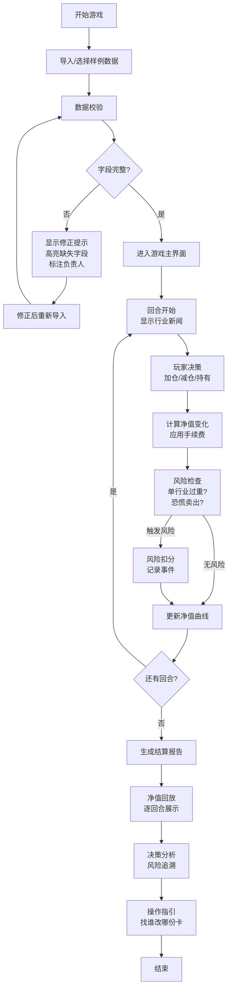

## 1. 产品概述

"基金经理调仓局"是一款面向投资者的投教小游戏，玩家通过在行业新闻和风险预算间做出选择，体验真实的基金调仓决策过程。游戏旨在教育用户理解追涨风险、行业集中度风险、手续费成本和恐慌卖出等投资行为的影响。

- 核心痛点：用户看净值曲线容易追涨，缺乏风险意识
- 目标用户：个人投资者、理财初学者
- 市场价值：通过游戏化方式传递正确的投资理念，降低实际投资中的非理性行为

## 2. 核心特征

### 2.1 用户角色

| 角色 | 注册方式 | 核心权限 |
|------|----------|----------|
| 玩家 | 无需注册，直接进入 | 导入数据、游戏决策、查看报告 |
| 投教产品经理 | 数据配置入口 | 配置行业卡、基金仓位、新闻事件 |

### 2.2 功能模块

1. **数据导入页**：上传/粘贴行业卡、基金仓位、新闻事件数据，显示修正提示
2. **游戏主界面**：回合制调仓决策、风险预算管理、净值曲线实时显示
3. **结算报告页**：净值回放、决策分析、风险事件追溯、后续操作指引

### 2.3 页面详情

| 页面名称 | 模块名称 | 功能描述 |
|----------|----------|----------|
| 数据导入页 | 数据上传区 | 支持 JSON 格式导入行业卡、仓位、新闻事件 |
| 数据导入页 | 修正提示区 | 高亮缺失字段，给出可读的修正建议和负责人 |
| 游戏主界面 | 行业持仓面板 | 显示各行业仓位占比、可用资金、风险预算 |
| 游戏主界面 | 新闻事件面板 | 每回合展示行业新闻，玩家选择加仓/减仓/持有 |
| 游戏主界面 | 净值曲面板 | 实时更新净值曲线，标记关键决策点 |
| 游戏主界面 | 风险提示区 | 单行业过重、手续费漏算、恐慌卖出等风险触发时提示 |
| 结算报告页 | 净值回放 | 逐回合回放净值变化和决策过程 |
| 结算报告页 | 决策分析 | 统计各决策的盈亏贡献、风险事件触发记录 |
| 结算报告页 | 操作指引 | 针对出现的问题，明确找谁改哪份行业卡 |

## 3. 核心流程

玩家进入游戏后，首先导入或使用样例数据，系统检查数据完整性并给出修正提示。确认数据后进入回合制游戏：每回合收到行业新闻，玩家在风险预算约束下做出调仓决策，系统根据决策和市场波动计算净值变化，触发风险事件时扣分并记录。游戏结束后生成结算报告，支持净值回放和问题追溯。

## 4. 用户界面设计

### 4.1 设计风格

- **主色调**：深蓝色系（#1e3a5f）代表专业金融，搭配金色（#d4af37）作为收益上涨色，红色（#e63946）作为风险提示色
- **按钮风格**：圆角矩形，hover 时有微妙的浮起效果，决策按钮采用三态设计（加仓-绿/持有-灰/减仓-红）
- **字体**：标题使用 Lora（衬线字体，专业感），正文使用 Inter（清晰可读），数字使用 JetBrains Mono（等宽字体，数据对比）
- **布局风格**：卡片式布局，重要信息（净值、风险预算）采用大屏展示，决策区居中突出
- **图标风格**：使用 lucide-react 线性图标，风险事件用警示图标，收益用趋势图标

### 4.2 页面设计概述

| 页面名称 | 模块名称 | UI 元素 |
|----------|----------|----------|
| 数据导入页 | 数据上传区 | 拖拽上传框，格式说明，样例数据按钮 |
| 数据导入页 | 修正提示区 | 红黄警示标签，缺失字段列表，负责人联系方式卡片 |
| 游戏主界面 | 持仓面板 | 横向条形图展示行业占比，悬停显示详情 |
| 游戏主界面 | 新闻面板 | 卡片式新闻，带行业标签和影响程度标识 |
| 游戏主界面 | 净值曲线 | 面积图，关键决策点用圆点标记，可悬停查看 |
| 游戏主界面 | 风险提示 | 顶部横幅警示，可展开查看详情和建议 |
| 结算报告页 | 净值回放 | 带时间轴的交互式回放，播放/暂停/逐帧控制 |
| 结算报告页 | 决策分析 | 表格展示每回合决策，盈亏用颜色区分 |
| 结算报告页 | 操作指引 | 步骤卡片，清晰标注问题→负责人→修改文件 |

### 4.3 响应式

- 桌面端优先，采用 12 列网格布局
- 移动端适配：持仓面板改为垂直堆叠，决策按钮放大便于触控
- 净值曲线在移动端简化为关键节点展示

### 4.4 动效设计

- 页面加载：采用渐进式加载，净值曲线有绘制动画
- 决策反馈：点击决策按钮后，有资金流动动效，净值变化有数字滚动动画
- 风险触发：红色脉冲动画，配合轻微震动效果
- 净值回放：曲线从左到右逐步绘制，决策点依次出现
