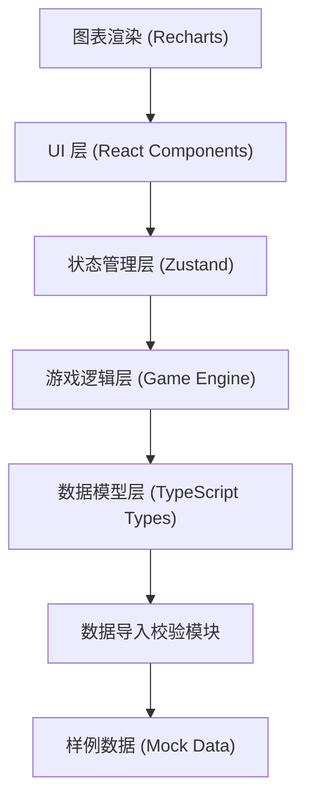
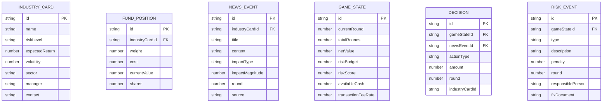

## 1. 架构设计

本项目为纯前端单页应用，所有游戏逻辑和数据处理均在客户端完成。采用分层架构，确保数据层、逻辑层、UI 层职责分离。



## 2. 技术描述

- **前端框架**：React@18 + TypeScript@5 + Vite@5
- **状态管理**：Zustand@4
- **样式方案**：TailwindCSS@3
- **图表库**：Recharts@2（净值曲线、持仓占比图）
- **图标库**：lucide-react@0.344
- **路由**：react-router-dom@6
- **后端**：无（纯前端应用）
- **数据库**：无（使用 localStorage 持久化游戏进度）

## 3. 路由定义

| 路由 | 页面组件 | 功能 |
|------|----------|------|
| `/` | `ImportPage` | 数据导入与校验、样例数据选择 |
| `/game` | `GamePage` | 回合制调仓游戏主界面 |
| `/report` | `ReportPage` | 结算报告、净值回放、操作指引 |

## 4. 数据模型

### 4.1 实体关系图



### 4.2 TypeScript 类型定义

```typescript
// 行业卡
interface IndustryCard {
  id: string;
  name: string;
  riskLevel: 'low' | 'medium' | 'high';
  expectedReturn: number;
  volatility: number;
  sector: string;
  manager: string;
  contact: string;
}

// 基金仓位
interface FundPosition {
  id: string;
  industryCardId: string;
  weight: number;
  cost: number;
  currentValue: number;
  shares: number;
}

// 新闻事件
interface NewsEvent {
  id: string;
  industryCardId: string;
  title: string;
  content: string;
  impactType: 'positive' | 'negative' | 'neutral';
  impactMagnitude: number;
  round: number;
  source?: string;
}

// 游戏状态
interface GameState {
  currentRound: number;
  totalRounds: number;
  netValue: number;
  initialNetValue: number;
  riskBudget: number;
  riskScore: number;
  availableCash: number;
  transactionFeeRate: number;
  positions: FundPosition[];
  decisions: Decision[];
  riskEvents: RiskEvent[];
  netValueHistory: NetValuePoint[];
}

// 决策记录
interface Decision {
  id: string;
  newsEventId: string;
  industryCardId: string;
  actionType: 'buy' | 'sell' | 'hold';
  amount: number;
  round: number;
  timestamp: number;
}

// 风险事件
interface RiskEvent {
  id: string;
  type: 'over_concentration' | 'missing_fee' | 'panic_sell' | 'chasing_rally';
  description: string;
  penalty: number;
  round: number;
  responsiblePerson: string;
  fixDocument: string;
}

// 净值点
interface NetValuePoint {
  round: number;
  value: number;
  decisionId?: string;
  riskEventId?: string;
}

// 数据校验结果
interface ValidationResult {
  valid: boolean;
  errors: ValidationError[];
  warnings: ValidationWarning[];
}

interface ValidationError {
  field: string;
  entity: string;
  entityId: string;
  message: string;
  fixSuggestion: string;
  responsiblePerson: string;
}

interface ValidationWarning {
  field: string;
  entity: string;
  entityId: string;
  message: string;
  suggestion: string;
}
```

### 4.3 核心状态管理 (Zustand Store)

```typescript
interface GameStore {
  // 数据
  industryCards: IndustryCard[];
  newsEvents: NewsEvent[];
  gameState: GameState | null;
  
  // 校验
  validationResult: ValidationResult | null;
  
  // 操作
  importData: (data: { industryCards: IndustryCard[], positions: FundPosition[], newsEvents: NewsEvent[] }) => ValidationResult;
  startGame: (initialCash: number, totalRounds: number) => void;
  makeDecision: (newsEventId: string, action: 'buy' | 'sell' | 'hold', amount: number) => void;
  nextRound: () => void;
  finishGame: () => void;
  resetGame: () => void;
  
  // 计算属性
  getTotalAssets: () => number;
  getIndustryWeight: (industryCardId: string) => number;
  getCurrentNews: () => NewsEvent | null;
}
```

## 5. 核心游戏逻辑

### 5.1 数据校验规则

1. **行业卡完整性检查**：
   - 必填字段：name, riskLevel, sector, manager, contact
   - 可选但建议：expectedReturn, volatility

2. **基金仓位完整性检查**：
   - 必填字段：industryCardId, weight, currentValue, shares
   - 可选但建议：cost

3. **新闻事件完整性检查**：
   - 必填字段：industryCardId, title, content, impactType, round
   - 可选但建议：impactMagnitude, source

### 5.2 回合制决策流程

每回合执行以下步骤：
1. 展示当前回合的新闻事件
2. 玩家做出决策（加仓/减仓/持有）
3. 计算交易手续费
4. 更新仓位和现金
5. 根据新闻影响计算市场波动
6. 检查风险触发条件
7. 更新净值和风险评分
8. 记录决策和净值历史

### 5.3 风险触发规则

| 风险类型 | 触发条件 | 扣分 | 操作指引 |
|----------|----------|------|----------|
| 单行业过重 | 任一行业仓位占比 > 30% | -5 分 | 联系行业分析师张三，修改新能源行业卡的风险提示等级 |
| 手续费漏算 | 交易时手续费字段缺失 | -3 分 | 联系运营李四，补充《交易费率配置表》 |
| 恐慌卖出 | 连续两回合在下跌时减仓超过 20% | -8 分 | 联系投教专员王五，更新《投资者行为指南》 |
| 追涨 | 在某行业已涨超 15% 后加仓 | -4 分 | 联系策略师赵六，修订《趋势投资警示规则》 |

## 6. 项目结构

```
src/
├── components/          # 可复用组件
│   ├── layout/         # 布局组件
│   ├── game/           # 游戏相关组件
│   ├── report/         # 报告相关组件
│   └── common/         # 通用组件
├── pages/              # 页面组件
│   ├── ImportPage.tsx
│   ├── GamePage.tsx
│   └── ReportPage.tsx
├── store/              # Zustand 状态管理
│   └── useGameStore.ts
├── types/              # TypeScript 类型定义
│   └── index.ts
├── utils/              # 工具函数
│   ├── validator.ts    # 数据校验
│   ├── gameEngine.ts   # 游戏核心逻辑
│   └── calculator.ts   # 计算工具
├── data/               # 样例数据
│   ├── sampleIndustryCards.ts
│   ├── samplePositions.ts
│   └── sampleNewsEvents.ts
├── hooks/              # 自定义 Hooks
│   ├── useGameEngine.ts
│   └── useNetValueHistory.ts
├── App.tsx
├── main.tsx
└── index.css
```
