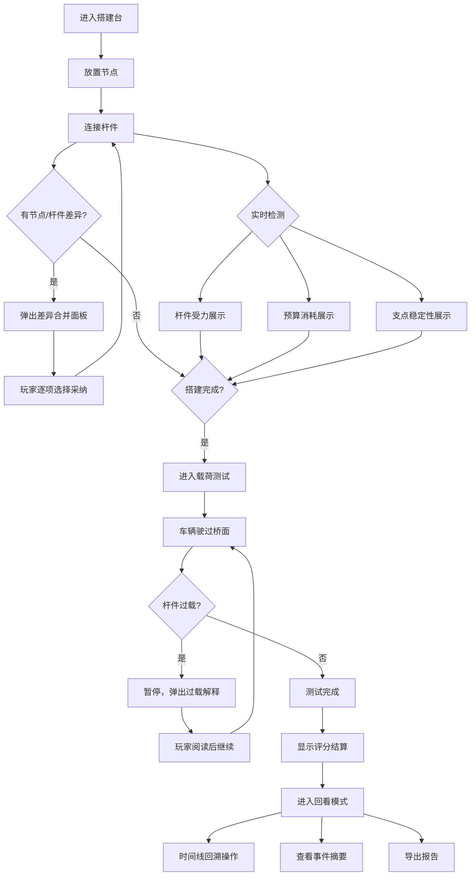

## 1. 产品概述

物理桥梁搭建赛是一款面向物理社团教学场景的2D桁架桥梁搭建与载荷测试游戏。学生通过放置节点、连接杆件来搭建桥梁，游戏实时计算并展示杆件受力、预算消耗和支点稳定性，让"搭桥能不能过车"的判断从凭直觉变成有物理依据的决策。最终导出报告直击物理老师最关心的问题：杆件过载有没有被拦住。

- 目标用户：高中物理社团学生及指导老师
- 核心价值：将抽象的结构力学概念转化为可交互、可回看、可解释的游戏体验

## 2. 核心功能

### 2.1 用户角色

| 角色 | 进入方式 | 核心权限 |
|------|----------|----------|
| 学生 | 直接进入 | 搭建桥梁、运行载荷测试、查看报告 |
| 老师 | 点击"教师模式"切换 | 查看所有学生的回放与导出报告 |

### 2.2 功能模块

1. **搭建台**：放置节点、连接杆件、查看实时受力/预算/支点状态，节点与杆件分别维护，合并时展示差异
2. **载荷测试场**：车辆驶过桥面，实时显示各杆件应力变化，过载时弹出解释
3. **回看与报告**：逐步回看搭建过程，查看载荷测试如何影响分数，导出文本报告

### 2.3 页面详情

| 页面名称 | 模块名称 | 功能描述 |
|----------|----------|----------|
| 搭建台 | 画布区域 | 网格画布，点击放置节点，拖拽连接杆件，实时渲染桥梁结构 |
| 搭建台 | 受力面板 | 右侧面板，实时显示每根杆件的受力值、应力比（受力/许用应力），颜色编码（绿/黄/红） |
| 搭建台 | 预算仪表 | 顶部横条，显示已用预算/总预算，超支时变红并提示具体超支金额 |
| 搭建台 | 支点状态 | 画布上支点标记，鼠标悬停显示反力，不稳时闪烁警告并文字说明原因 |
| 搭建台 | 差异合并弹窗 | 节点改动与杆件改动合并时，逐项列出差异（位置偏移、新增/删除），玩家选择采纳哪方 |
| 载荷测试场 | 车辆动画 | 车辆从桥一端匀速驶向另一端，实时更新杆件应力 |
| 载荷测试场 | 过载解释弹窗 | 杆件过载时暂停，显示该杆件的受力值、许用应力、过载原因（拉/压/屈曲） |
| 载荷测试场 | 评分结算 | 测试结束后显示：结构完整性分、预算效率分、总评 |
| 回看与报告 | 时间线 | 底部时间轴，标记每一步操作，点击跳转到对应状态 |
| 回看与报告 | 事件摘要 | 列出关键事件：杆件过载触发点、支点失稳触发点、预算超支触发点 |
| 回看与报告 | 导出报告 | 生成纯文本报告，核心问题：杆件过载有没有被拦住 |

## 3. 核心流程

学生进入搭建台，在网格画布上放置节点（桥面节点、支点节点），用杆件连接节点形成桁架。搭建过程中实时看到每根杆件的受力颜色和数值、预算消耗进度条、支点反力与稳定性。当桥面节点组与杆件组分别编辑后合并，系统弹出差异对比，玩家逐项选择。搭建完成后进入载荷测试，车辆驶过桥面，若杆件过载则暂停并解释原因。测试结束显示评分。学生可进入回看模式，沿时间线回溯每一步决策，查看哪些操作触发了结构变化和分数影响，最终导出纯文本报告。

## 4. 用户界面设计

### 4.1 设计风格

- 主色调：工程蓝图蓝（#1B3A5C）+ 警告橙（#E87722）+ 安全绿（#2ECC71）
- 辅助色：网格纸灰白（#F5F5F0）、杆件默认灰（#8C9EAF）
- 按钮风格：圆角矩形，3D微凸效果，受力颜色编码
- 字体：等宽字体用于数值显示（JetBrains Mono），标题用几何感字体（Chakra Petch）
- 布局风格：左画布 + 右面板 + 顶状态栏，工程图纸网格背景
- 图标风格：线稿风格，工程制图感

### 4.2 页面设计概览

| 页面名称 | 模块名称 | UI元素 |
|----------|----------|--------|
| 搭建台 | 画布区域 | 深蓝网格背景，白色节点圆点，灰色杆件线段，受力颜色渐变叠加 |
| 搭建台 | 受力面板 | 右侧竖向面板，杆件列表，每行显示编号+受力条+数值，颜色编码 |
| 搭建台 | 预算仪表 | 顶部横条，蓝→绿→黄→红渐变进度条，超支闪烁 |
| 搭建台 | 支点状态 | 三角形支点图标，悬停气泡显示反力数值，不稳时橙色脉冲动画 |
| 搭建台 | 差异合并弹窗 | 居中弹窗，左右分栏对比，差异项高亮，单选按钮选择采纳方 |
| 载荷测试场 | 车辆动画 | 简易车辆图标从左向右移动，杆件实时变色 |
| 载荷测试场 | 过载解释弹窗 | 红色边框弹窗，显示杆件编号、受力值、许用值、过载百分比、原因文字 |
| 载荷测试场 | 评分结算 | 三行大字：结构完整性、预算效率、总评，星级+数值 |
| 回看与报告 | 时间线 | 底部可拖拽时间轴，关键事件用圆点标记 |
| 回看与报告 | 事件摘要 | 侧栏列表，点击跳转时间轴位置 |
| 回看与报告 | 导出报告 | 纯文本预览区 + 复制/下载按钮 |

### 4.3 响应式设计

- 桌面优先，最小宽度1024px
- 画布区域自适应窗口高度
- 面板可折叠以适应小屏

### 4.4 3D场景指引

不适用，本项目为2D游戏。
