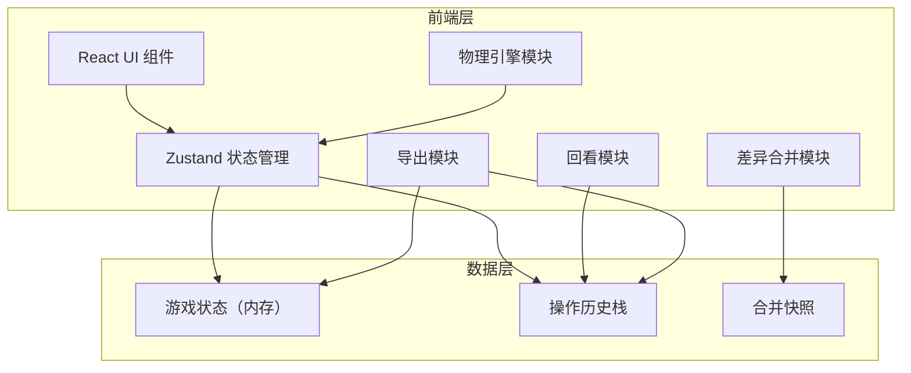
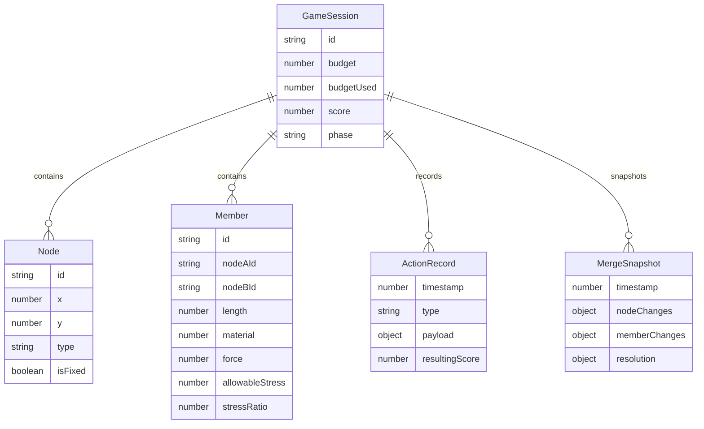

## 1. 架构设计



## 2. 技术说明

- 前端：React@18 + TypeScript + Tailwind CSS@3 + Vite
- 初始化工具：vite-init (react-ts 模板)
- 状态管理：Zustand
- 后端：无（纯前端，所有计算在浏览器端完成）
- 数据库：无（内存状态 + localStorage 持久化）

## 3. 路由定义

| 路由 | 用途 |
|------|------|
| / | 首页/游戏入口，选择新游戏或继续 |
| /build | 搭建台主界面，放置节点和杆件 |
| /test | 载荷测试场 |
| /review | 回看与报告 |

## 4. API 定义

无后端 API，所有数据通过 Zustand store 和 localStorage 管理。

## 5. 服务器架构图

不适用，纯前端项目。

## 6. 数据模型

### 6.1 数据模型定义



### 6.2 数据定义

核心 TypeScript 类型定义：

```typescript
interface Node {
  id: string;
  x: number;
  y: number;
  type: 'deck' | 'support' | 'free';
  isFixed: boolean;
  reactionForce?: { fx: number; fy: number };
  isStable?: boolean;
  instabilityReason?: string;
}

interface Member {
  id: string;
  nodeAId: string;
  nodeBId: string;
  length: number;
  crossSection: number;
  materialType: 'steel' | 'wood' | 'aluminum';
  internalForce: number;
  allowableStress: number;
  stressRatio: number;
  overloadReason?: string;
}

interface ActionRecord {
  timestamp: number;
  type: 'ADD_NODE' | 'MOVE_NODE' | 'REMOVE_NODE' | 'ADD_MEMBER' | 'REMOVE_MEMBER' | 'MERGE_RESOLVE' | 'LOAD_TEST';
  payload: unknown;
  resultingScore: number;
  structuralImpact?: string;
}

interface MergeSnapshot {
  timestamp: number;
  nodeDiffs: DiffEntry[];
  memberDiffs: DiffEntry[];
  resolution: Record<string, 'nodeSide' | 'memberSide'>;
}

interface DiffEntry {
  type: 'added' | 'removed' | 'modified';
  entityId: string;
  field: string;
  nodeSideValue: unknown;
  memberSideValue: unknown;
}

interface GameSession {
  id: string;
  nodes: Node[];
  members: Member[];
  budget: number;
  budgetUsed: number;
  phase: 'building' | 'testing' | 'review';
  actionHistory: ActionRecord[];
  mergeSnapshots: MergeSnapshot[];
  testResults: TestResult | null;
  score: number;
}

interface TestResult {
  vehicleCompleted: boolean;
  overloadedMembers: string[];
  failedMembers: string[];
  maxDeflection: number;
  structuralIntegrityScore: number;
  budgetEfficiencyScore: number;
  totalScore: number;
}
```
