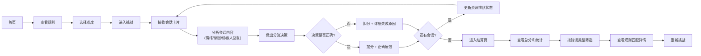

## 1. 产品概述

"AI客服分流挑战"是一款面向客服新人的游戏化培训原型，帮助学员在模拟场景中快速掌握客服分流决策能力——判断何时交给AI机器人、何时必须转人工坐席。

- 解决问题：传统培训流程枯燥，新人难以快速掌握分流规则，实操反馈不及时
- 目标用户：客服新人、坐席主管、客服培训师
- 核心价值：通过游戏化场景演练、即时反馈、详细错误分类，让新人"玩一局就懂"

## 2. 核心功能

### 2.1 用户角色

| 角色 | 登录方式 | 核心权限 |
|------|----------|----------|
| 培训学员 | 无需登录 | 参与挑战、查看个人成绩、查看规则说明 |
| 培训师 | 无需登录 | 查看所有成绩、筛选错误类型、导入会话数据 |

### 2.2 功能模块

1. **首页/开始页**：挑战说明、规则预览、开始按钮
2. **游戏主页面**：会话卡片流、分流决策操作、实时反馈、资源排队面板
3. **结算/结果页**：总分展示、错误分类筛选、转人工规则可视化、详细失败原因
4. **规则说明页**：分流规则详解、常见错误示例

### 2.3 页面详情

| 页面名称 | 模块名称 | 功能描述 |
|---------|---------|----------|
| 首页 | 规则预览区 | 展示核心分流规则摘要，可展开查看详情 |
| 首页 | 开始挑战 | 选择难度级别，进入游戏主界面 |
| 游戏主页 | 会话卡片区 | 展示当前待处理会话，包含客户消息、情绪标签、历史机器人回复、备注 |
| 游戏主页 | 分流决策区 | 三个核心操作按钮："AI机器人处理"、"转人工坐席"、"继续观察" |
| 游戏主页 | 反馈面板 | 每次决策后立即展示正确/错误提示，详细说明原因 |
| 游戏主页 | 资源排队区 | 展示当前人工坐席繁忙度、排队人数，影响转人工成本 |
| 游戏主页 | 意图判断区 | 学员可手动标注客户意图，影响后续分流建议 |
| 结算页 | 总分看板 | 展示最终得分、正确率、平均响应时间 |
| 结算页 | 错误分类筛选 | 按"情绪误判"、"重复答复"、"升级太晚"、"分流错误"等维度筛选 |
| 结算页 | 规则匹配可视化 | 展示每条决策对应的转人工规则命中情况 |
| 结算页 | 脏数据处理记录 | 展示系统自动处理的空值、缺失数据情况及处理策略 |
| 规则说明页 | 规则列表 | 详细展示所有分流规则及触发条件 |
| 规则说明页 | 案例库 | 正反案例对比展示 |

## 3. 核心流程

学员进入首页查看规则 → 选择难度开始挑战 → 依次处理会话卡片（查看客户消息、情绪、机器人回复、备注）→ 做出分流决策（AI/转人工/继续观察）→ 系统即时反馈对错及原因 → 处理过程中人工坐席资源动态变化 → 所有会话处理完成 → 进入结算页查看总分和错误分类 → 可筛选查看特定类型错误 → 可回溯每条决策对应的规则匹配情况

## 4. 用户界面设计

### 4.1 设计风格
- **主色调**：深蓝（#1e3a5f）作为主色，代表专业和信任；珊瑚橙（#ff6b6b）作为警示色，代表需人工干预；薄荷绿（#51cf66）代表AI可处理
- **辅助色**：琥珀黄（#fcc419）用于警告和提示，灰色系用于中性信息
- **设计风格**：科技感仪表盘风格，卡片式布局，适当的阴影和层次感
- **按钮风格**：圆角胶囊按钮，悬停时有缩放和阴影变化，点击有按压反馈
- **字体**：标题使用 Space Grotesk（粗体），正文使用 Inter（常规），数字和分数使用等宽字体 JetBrains Mono
- **布局风格**：三栏布局（左侧会话列表、中间详情区、右侧资源和反馈面板）
- **图标风格**：使用 lucide-react 线性图标，统一 20px 尺寸
- **氛围效果**：深色渐变背景，细微网格纹理，卡片悬浮动画

### 4.2 页面设计概述

| 页面名称 | 模块名称 | UI 元素 |
|---------|---------|---------|
| 首页 | Hero 区 | 大标题"AI客服分流挑战"，副标题，渐变背景，动画入场 |
| 首页 | 规则卡片 | 三张并排卡片展示核心规则，hover 时上浮 |
| 首页 | 开始按钮 | 大尺寸渐变按钮，脉冲动画 |
| 游戏主页 | 会话卡片流 | 垂直时间线布局，新卡片从右侧滑入 |
| 游戏主页 | 客户情绪标签 | 彩色徽章（红色=愤怒，橙色=不满，绿色=满意） |
| 游戏主页 | 脏数据提示 | 半透明黄色背景，带"已自动补全"/"数据缺失"标签 |
| 游戏主页 | 决策按钮区 | 三个并排大按钮，键盘快捷键提示 |
| 游戏主页 | 资源仪表盘 | 环形进度条显示坐席繁忙度，数字跳动动画 |
| 游戏主页 | 反馈弹窗 | 从底部滑入，正确/错误配色，详细原因说明 |
| 结算页 | 总分展示 | 大号数字动画计数，等级徽章 |
| 结算页 | 错误筛选标签 | 可点击标签页，带数量角标 |
| 结算页 | 规则匹配列表 | 时间线布局，每条决策对应规则高亮显示 |
| 结算页 | 错误详情面板 | 可展开查看每条错误的完整上下文 |

### 4.3 响应式设计
- **桌面端（1280px+）**：三栏完整布局，所有面板同时可见
- **平板端（768px-1279px）**：两栏布局，资源面板折叠为可展开侧边栏
- **移动端（<768px）**：单栏垂直布局，会话卡片和决策区上下排列，资源面板固定在底部

### 4.4 动效设计
- 页面入场：分阶段渐入动画（顶部→中部→底部）
- 会话卡片：新卡片从右侧滑入 + 轻微弹跳
- 决策反馈：正确时绿色闪光扩散，错误时红色抖动 + 详细信息展开
- 资源变化：排队数字变化时跳动动画，繁忙度变化时环形进度条平滑过渡
- 按钮交互：悬停放大 1.03 倍，点击缩小 0.98 倍，阴影变化
- 结算页：分数从 0 滚动到最终值，错误分类标签逐个淡入
