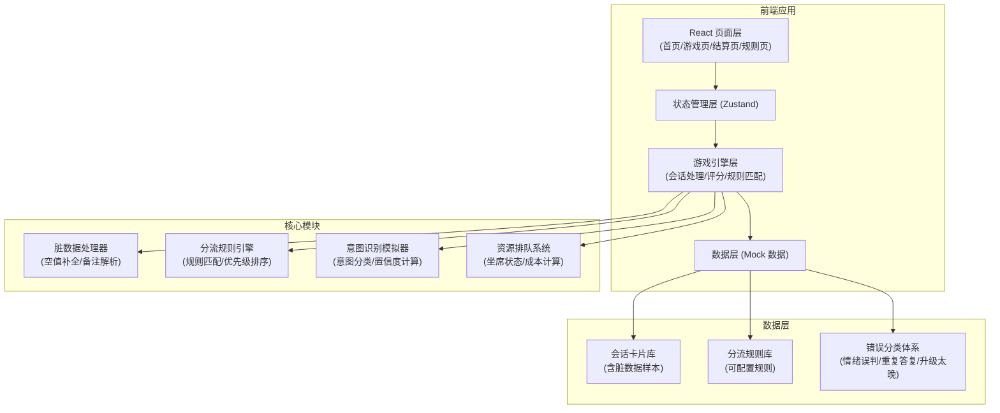

## 1. 架构设计



## 2. 技术选型

- **前端框架**：React@18 + TypeScript
- **构建工具**：Vite@5
- **状态管理**：Zustand@4
- **路由管理**：React Router DOM@6
- **样式方案**：Tailwind CSS@3
- **图标库**：Lucide React
- **包管理器**：npm
- **后端**：无（纯前端应用，使用 Mock 数据）
- **数据存储**：localStorage（保存游戏进度和历史成绩）

## 3. 路由定义

| 路由路径 | 页面组件 | 用途 |
|---------|---------|------|
| `/` | `HomePage` | 首页 - 规则预览、开始挑战入口 |
| `/game` | `GamePage` | 游戏主页 - 会话处理、分流决策 |
| `/result` | `ResultPage` | 结算页 - 成绩展示、错误筛选、规则可视化 |
| `/rules` | `RulesPage` | 规则说明页 - 分流规则详解 |

## 4. 数据模型

### 4.1 核心类型定义

```typescript
// 客户情绪枚举
type Emotion = 'angry' | 'frustrated' | 'neutral' | 'satisfied' | null;

// 客户意图枚举
type Intent = 
  | 'refund' 
  | 'complaint' 
  | 'inquiry' 
  | 'technical_support' 
  | 'cancellation'
  | 'unknown';

// 分流决策类型
type Decision = 'ai' | 'human' | 'observe';

// 错误类型枚举
type ErrorType = 
  | 'emotion_misjudge'      // 情绪误判
  | 'repeated_reply'        // 重复答复
  | 'delayed_escalation'    // 升级太晚
  | 'wrong_diversion'       // 分流错误
  | 'intent_misjudge'       // 意图误判
  | 'resource_ignore';      // 资源忽略

// 脏数据处理类型
type DirtyDataAction = 
  | 'auto_complete'         // 自动补全
  | 'warning'               // 显示警告
  | 'skip'                  // 跳过
  | 'user_hint';            // 给出用户提示

// 会话卡片
interface ConversationCard {
  id: string;
  customerMessage: string | null;        // 客户消息（可能为空）
  emotion: Emotion;                      // 客户情绪（可能为空）
  emotionConfidence: number | null;      // 情绪识别置信度
  botReply: string | null;               // 机器人回复（可能为空）
  botReplyHistory: string[];             // 机器人历史回复
  intent: Intent | null;                 // 客户意图（可能为空）
  intentConfidence: number | null;       // 意图识别置信度
  remarks: string | null;                // 备注信息
  isDirty: boolean;                      // 是否包含脏数据
  dirtyFields: string[];                 // 脏数据字段列表
  dirtyDataAction: DirtyDataAction;      // 脏数据处理方式
  requiredDecision: Decision;            // 正确决策
  escalationReason: string[];            // 转人工原因（规则命中）
  difficulty: 'easy' | 'medium' | 'hard';
  createdAt: number;
}

// 决策记录
interface DecisionRecord {
  cardId: string;
  userDecision: Decision;
  correctDecision: Decision;
  isCorrect: boolean;
  errorType: ErrorType | null;
  errorDetails: string | null;
  matchedRules: string[];
  responseTime: number;
  timestamp: number;
  dirtyDataHandled: boolean;
}

// 坐席资源状态
interface AgentResource {
  totalAgents: number;
  busyAgents: number;
  queueLength: number;
  avgWaitTime: number;  // 分钟
  busyLevel: 'low' | 'medium' | 'high' | 'critical';
}

// 分流规则
interface DiversionRule {
  id: string;
  name: string;
  description: string;
  condition: (card: ConversationCard, resources: AgentResource) => boolean;
  priority: number;
  category: 'emotion' | 'intent' | 'bot_limit' | 'resource' | 'special';
}

// 游戏状态
interface GameState {
  status: 'idle' | 'playing' | 'finished';
  currentCardIndex: number;
  cards: ConversationCard[];
  decisionRecords: DecisionRecord[];
  score: number;
  totalScore: number;
  resources: AgentResource;
  startTime: number | null;
  difficulty: 'easy' | 'medium' | 'hard';
}

// 结算统计
interface ResultStats {
  totalCards: number;
  correctCount: number;
  wrongCount: number;
  accuracy: number;
  avgResponseTime: number;
  score: number;
  errorBreakdown: Record<ErrorType, number>;
  ruleMatchBreakdown: Record<string, number>;
  dirtyDataHandled: number;
  level: 'S' | 'A' | 'B' | 'C' | 'D';
}
```

### 4.2 分流规则库（核心规则）

```typescript
const DIVERSION_RULES: DiversionRule[] = [
  {
    id: 'R001',
    name: '愤怒情绪强制转人工',
    description: '客户情绪为愤怒(angry)时必须转人工',
    condition: (card) => card.emotion === 'angry',
    priority: 1,
    category: 'emotion'
  },
  {
    id: 'R002',
    name: '投诉类意图转人工',
    description: '客户意图为投诉(complaint)时必须转人工',
    condition: (card) => card.intent === 'complaint',
    priority: 2,
    category: 'intent'
  },
  {
    id: 'R003',
    name: '退款请求转人工',
    description: '客户意图为退款(refund)时必须转人工',
    condition: (card) => card.intent === 'refund',
    priority: 2,
    category: 'intent'
  },
  {
    id: 'R004',
    name: '机器人重复答复',
    description: '机器人已有2次以上相同回复时转人工',
    condition: (card) => {
      const history = card.botReplyHistory;
      return history.length >= 2 && history.every(h => h === history[0]);
    },
    priority: 3,
    category: 'bot_limit'
  },
  {
    id: 'R005',
    name: '机器人回复缺失',
    description: '机器人无有效回复时转人工',
    condition: (card) => !card.botReply && card.botReplyHistory.length === 0,
    priority: 3,
    category: 'bot_limit'
  },
  {
    id: 'R006',
    name: '坐席资源空闲',
    description: '坐席空闲时可优先转人工处理复杂问题',
    condition: (card, resources) => resources.busyLevel === 'low' && card.emotion === 'frustrated',
    priority: 4,
    category: 'resource'
  },
  {
    id: 'R007',
    name: '坐席资源紧张',
    description: '坐席繁忙时，非紧急问题继续观察或AI处理',
    condition: (card, resources) => resources.busyLevel === 'critical' && card.emotion === 'neutral',
    priority: 4,
    category: 'resource'
  },
  {
    id: 'R008',
    name: '技术支持复杂问题',
    description: '技术支持类问题优先转人工',
    condition: (card) => card.intent === 'technical_support',
    priority: 2,
    category: 'intent'
  },
  {
    id: 'R009',
    name: '情绪识别置信度过低',
    description: '情绪置信度<0.6时需人工判断',
    condition: (card) => card.emotionConfidence !== null && card.emotionConfidence < 0.6,
    priority: 3,
    category: 'emotion'
  },
  {
    id: 'R010',
    name: '包含特殊备注标记',
    description: '备注中包含"VIP"、"紧急"等标记时转人工',
    condition: (card) => card.remarks !== null && /VIP|紧急|重要|投诉已登记/.test(card.remarks),
    priority: 1,
    category: 'special'
  }
];
```

### 4.3 脏数据处理逻辑

```typescript
// 脏数据处理器
class DirtyDataHandler {
  // 检测脏数据字段
  detectDirtyFields(card: Partial<ConversationCard>): string[] {
    const dirtyFields: string[] = [];
    if (!card.customerMessage) dirtyFields.push('customerMessage');
    if (card.emotion === null && card.emotionConfidence !== 0) dirtyFields.push('emotion');
    if (!card.botReply && card.botReplyHistory.length === 0) dirtyFields.push('botReply');
    if (card.intent === null) dirtyFields.push('intent');
    if (card.remarks && /备注|待补充|TODO/.test(card.remarks)) dirtyFields.push('remarks');
    return dirtyFields;
  }

  // 处理脏数据，返回处理后的卡片
  handleDirtyData(card: Partial<ConversationCard>): { 
    card: ConversationCard; 
    action: DirtyDataAction;
    userHint?: string;
  } {
    const dirtyFields = this.detectDirtyFields(card);
    const isDirty = dirtyFields.length > 0;

    // 处理策略
    let action: DirtyDataAction = 'skip';
    let userHint: string | undefined;
    const processedCard = { ...card } as ConversationCard;

    // 机器人回复缺失处理
    if (dirtyFields.includes('botReply')) {
      action = 'user_hint';
      userHint = '⚠️ 机器人回复缺失：此问题可能超出AI知识库范围，建议优先转人工';
      processedCard.dirtyDataAction = 'user_hint';
    }

    // 情绪空值处理 - 自动补全为 neutral 并标记
    if (dirtyFields.includes('emotion')) {
      processedCard.emotion = 'neutral';
      processedCard.emotionConfidence = 0.5;
      action = action === 'skip' ? 'auto_complete' : action;
      processedCard.dirtyDataAction = 'auto_complete';
      if (!userHint) userHint = 'ℹ️ 情绪数据缺失，已自动补全为"中性"，请注意甄别';
    }

    // 意图空值处理
    if (dirtyFields.includes('intent')) {
      processedCard.intent = 'unknown';
      processedCard.intentConfidence = 0.3;
      action = action === 'skip' ? 'auto_complete' : action;
      processedCard.dirtyDataAction = 'auto_complete';
    }

    // 客户消息为空 - 标记警告
    if (dirtyFields.includes('customerMessage')) {
      processedCard.customerMessage = '[客户消息为空]';
      action = 'warning';
      processedCard.dirtyDataAction = 'warning';
      userHint = '⚠️ 客户消息缺失，已标记为空消息';
    }

    // 备注包含脏数据
    if (dirtyFields.includes('remarks')) {
      action = 'warning';
      processedCard.dirtyDataAction = 'warning';
      userHint = userHint || 'ℹ️ 此会话包含培训师备注，请留意额外信息';
    }

    processedCard.isDirty = isDirty;
    processedCard.dirtyFields = dirtyFields;

    return { card: processedCard, action, userHint };
  }
}
```

## 5. 核心模块设计

### 5.1 游戏引擎模块 (`src/game/GameEngine.ts`)
- 会话卡片生成与脏数据处理
- 决策正确性判断
- 评分计算
- 资源状态动态更新
- 错误分类判定

### 5.2 规则引擎模块 (`src/game/RuleEngine.ts`)
- 分流规则匹配
- 规则优先级排序
- 正确决策判定
- 规则命中可视化数据生成

### 5.3 资源排队模块 (`src/game/ResourceManager.ts`)
- 坐席状态管理
- 排队长度动态变化
- 繁忙度计算
- 转人工成本计算

### 5.4 状态管理 (`src/store/gameStore.ts`)
- 游戏全局状态
- 决策记录
- 结算统计计算

### 5.5 UI 组件
- `ConversationCard` - 会话卡片组件
- `DecisionButtons` - 决策按钮组件
- `ResourcePanel` - 资源面板组件
- `FeedbackModal` - 反馈弹窗组件
- `ErrorFilter` - 错误筛选组件
- `RuleMatchTimeline` - 规则匹配时间线组件
