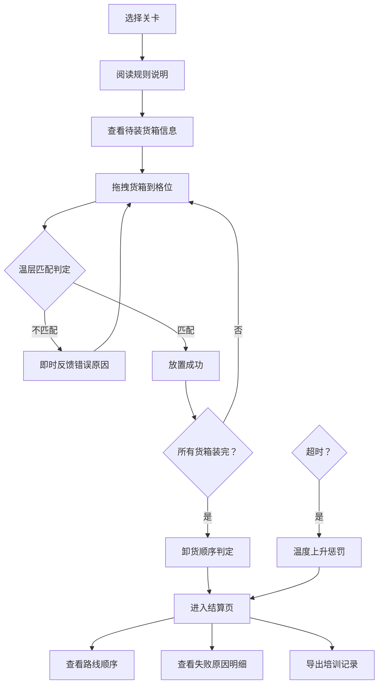

## 1. 产品概述

冷链装车闯关是一款面向物流司机上岗培训的交互式游戏原型，通过模拟真实的冷链装车场景，培训司机正确区分冷冻、冷藏、常温货物的存放规则，掌握正确的卸货顺序，避免因操作不当导致的温度失控问题。

- 目标用户：物流培训主管、新入职冷链司机
- 核心价值：将抽象的冷链规范转化为可操作的游戏体验，让培训内容可检验、可追溯

## 2. 核心功能

### 2.1 用户角色

| 角色 | 登录方式 | 核心权限 |
|------|----------|----------|
| 培训学员 | 无需登录 | 参与闯关练习、查看结算结果、导出培训记录 |
| 培训主管 | 无需登录 | 配置关卡参数、查看导出的培训记录 |

### 2.2 功能模块

1. **关卡选择页：关卡列表、难度选择、规则说明
2. **游戏主页面：货箱拖拽区、车厢格位区、计时器、操作反馈面板
3. **结算详情页：路线顺序图、失败原因明细、温度变化曲线、导出按钮
4. **导出报告页：温层混放检测结果、操作历史记录 |

### 2.3 页面详情

| 页面名称 | 模块名称 | 功能描述 |
|-----------|-----------|----------|
| 关卡选择页 | 关卡卡片 | 展示关卡名称、原始场景描述、难度标签 |
| 关卡选择页 | 规则说明 | 展示温层定义、卸货顺序规则、时间限制规则 |
| 游戏主页面 | 货箱待装区 | 展示待装货箱，显示货箱原始名称、温层标签、卸货站点 |
| 游戏主页面 | 车厢格位区 | 展示车厢分层格位，显示格位原始名称、温层要求、可拖拽放置 |
| 游戏主页面 | 实时反馈区 | 拖拽时显示当前温层状态、温度变化提示、操作错误即时提示 |
| 游戏主页面 | 计时器 | 显示剩余时间，超时触发温度上升机制 |
| 结算详情页 | 路线顺序图 | 可视化展示卸货顺序，标注被压住的货物 |
| 结算详情页 | 失败原因明细 | 逐条列出错误类型、涉及货箱、涉及格位、违规详情 |
| 结算详情页 | 温度变化曲线 | 展示全程温度变化趋势 |
| 结算详情页 | 导出按钮 | 导出培训记录，重点标注温层混放检测结果 |

## 3. 核心流程

学员选择关卡 → 阅读规则说明 → 进入游戏，查看待装货箱信息 → 拖拽货箱到对应温层格位 → 系统实时判定温层是否匹配 → 放置完成后系统判定卸货顺序 → 超时触发温度上升惩罚 → 完成装车后进入结算页 → 查看路线顺序和失败原因 → 导出培训记录

## 4. 用户界面设计

### 4.1 设计风格

- **主色调**：冷蓝色系（#165DFF 代表冷链专业感）搭配警示红（#F53F3F 代表温度超标）
- **辅助色**：冷冻区深紫蓝（#2B2A66）、冷藏区青蓝（#0E5D8C）、常温区暖灰（#5C5C5C）
- **按钮风格**：直角硬朗工业风，3D立体感，悬停有微动画
- **字体**：标题使用 Space Grotesk 粗体，正文使用 JetBrains Mono 等宽字体（便于对齐货箱编号和名称）
- **布局风格**：工业仪表盘风格，左右分栏，左侧货箱区，右侧车厢区
- **图标风格**：线性图标，使用冷链相关元素（温度计、货车、雪花、冰块）

### 4.2 页面设计概述

| 页面名称 | 模块名称 | UI 元素 |
|-----------|-----------|----------|
| 关卡选择页 | 关卡卡片 | 卡片式布局、悬浮动效、难度标签角标 |
| 游戏主页面 | 货箱待装区 | 网格排列、温层色标、拖拽高亮 |
| 游戏主页面 | 车厢格位区 | 3D立体格位、温层背景色、放置高亮反馈 |
| 游戏主页面 | 实时反馈区 | 错误提示浮层、温度指示器动画 |
| 结算详情页 | 路线顺序图 | 时间轴布局、箭头指示方向、高亮错误节点 |
| 结算详情页 | 失败原因明细 | 列表式、错误类型图标、涉及货箱高亮 |

### 4.3 响应式

- 桌面端优先设计，适配 1280px 及以上
- 移动端自适应，触控区域放大便于拖拽操作
- 移动端改为上下分栏布局

### 4.4 交互细节

- 拖拽时货箱半透明跟随鼠标
- 放置到正确格位时绿色边框闪烁
- 放置到错误格位时红色边框抖动
- 温度变化时温度计动画变化颜色
- 超时警告时屏幕边缘红色闪烁
