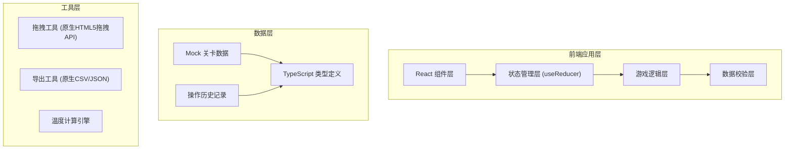

## 1. 架构设计



## 2. 技术描述

- **前端框架**：React@18 + TypeScript
- **构建工具**：Vite@5
- **样式方案**：TailwindCSS@3
- **拖拽实现**：原生 HTML5 Drag and Drop API（无需额外依赖）
- **图表实现**：原生 SVG 绘制温度曲线和路线图（无需额外图表库）
- **状态管理**：React useReducer + Context（轻量级，避免过度设计）
- **路由**：React Router DOM@6
- **后端**：无，纯前端应用，所有数据使用 Mock 数据
- **数据库**：无，数据存储在浏览器内存和 localStorage 中

## 3. 路由定义

| 路由 | 页面名称 | 说明 |
|-------|---------|------|
| / | 关卡选择页 | 展示所有可用关卡 |
| /game/:levelId | 游戏主页面 | 核心拖拽装车游戏界面 |
| /result/:levelId | 结算详情页 | 展示闯关结果、路线顺序、失败原因 |
| /export/:levelId | 导出报告页 | 展示可导出的培训记录详情 |

## 4. 核心数据类型定义

```typescript
// 温层类型
type TemperatureZone = 'frozen' | 'chilled' | 'normal';

// 货箱数据结构 - 保留原始名称
interface CargoBox {
  id: string;
  originalName: string;        // 货箱原始名称
  temperatureZone: TemperatureZone;
  originalWeight: string;      // 原始重量描述
  destination: string;         // 卸货站点
  deliveryOrder: number;       // 卸货顺序（数字越小越早卸）
  originalNotes?: string;      // 原始备注
}

// 车厢格位数据结构 - 保留原始名称
interface Compartment {
  id: string;
  originalName: string;        // 格位原始名称
  temperatureZone: TemperatureZone;
  capacity: number;            // 可容纳货箱数量
  originalLocation: string;    // 原始位置描述
  position: { row: number; col: number }; // 网格位置
}

// 关卡数据结构 - 保留原始名称
interface Level {
  id: string;
  originalName: string;        // 关卡原始名称
  originalDescription: string; // 原始场景描述
  difficulty: 'easy' | 'medium' | 'hard';
  originalTimeLimit: string;   // 原始时间限制描述（保留原文）
  timeLimitSeconds: number;    // 用于计算的秒数
  cargoBoxes: CargoBox[];
  compartments: Compartment[];
  originalRules: string;       // 原始规则说明
}

// 放置记录
interface PlacementRecord {
  cargoBoxId: string;
  compartmentId: string;
  timestamp: number;
  isCorrectZone: boolean;
}

// 失败原因
interface FailureReason {
  type: 'zone_mismatch' | 'delivery_order_blocked' | 'timeout';
  cargoBoxId: string;
  compartmentId?: string;
  blockedBy?: string;          // 被哪个货箱压住
  description: string;         // 详细描述，保留原始名称
  originalNames: {
    cargoBox: string;
    compartment?: string;
    blockedByBox?: string;
  };
}

// 游戏状态
interface GameState {
  levelId: string;
  status: 'idle' | 'playing' | 'paused' | 'completed' | 'failed';
  placements: PlacementRecord[];
  remainingTime: number;
  temperatureHistory: { time: number; temp: number }[];
  failureReasons: FailureReason[];
  operationHistory: {
    action: string;
    timestamp: number;
    details: string;
  }[];
}

// 导出报告结构
interface ExportReport {
  levelOriginalName: string;
  playerName: string;
  completionTime: string;
  totalTimeUsed: number;
  zoneMismatchDetected: boolean;      // 核心问题：温层混放是否被拦住
  zoneMismatchCount: number;
  zoneMismatchDetails: Array<{
    cargoBoxOriginalName: string;
    compartmentOriginalName: string;
    expectedZone: string;
    actualZone: string;
  }>;
  deliveryOrderIssues: FailureReason[];
  timeoutOccurred: boolean;
  temperatureMax: number;
  operationHistory: string[];
}
```

## 5. 游戏核心逻辑

### 5.1 温层判定逻辑
```
放置货箱时：
1. 获取货箱的 temperatureZone
2. 获取目标格位的 temperatureZone
3. 如果不匹配，立即记录失败原因，阻止放置或标记错误
4. 如果匹配，允许放置
```

### 5.2 卸货顺序判定逻辑
```
所有货箱放置完成后：
1. 按 deliveryOrder 从小到大排序，确定正确卸货顺序
2. 检查每个货箱在车厢中的物理位置
3. 如果应该先卸的货箱被后卸的货箱挡住（在同一列且更靠里），记录失败原因
```

### 5.3 超时温度上升逻辑
```
计时器每秒触发：
1. remainingTime 减 1
2. 如果 remainingTime <= 0，温度开始上升
3. 每超时 10 秒，温度上升 5 度
4. 温度超过阈值（如 8°C 对于冷藏），记录失败原因
```

## 6. 项目目录结构

```
src/
├── components/
│   ├── level-select/
│   │   ├── LevelCard.tsx
│   │   └── LevelList.tsx
│   ├── game/
│   │   ├── CargoBoxItem.tsx      # 可拖拽的货箱
│   │   ├── CompartmentSlot.tsx   # 可放置的格位
│   │   ├── GameBoard.tsx         # 游戏主板
│   │   ├── Timer.tsx             # 计时器
│   │   ├── TemperatureGauge.tsx  # 温度指示器
│   │   └── FeedbackToast.tsx     # 即时反馈
│   ├── result/
│   │   ├── RouteSequence.tsx     # 路线顺序图
│   │   ├── FailureList.tsx       # 失败原因列表
│   │   └── TemperatureChart.tsx  # 温度曲线
│   └── export/
│       └── ExportPanel.tsx       # 导出面板
├── data/
│   ├── levels.ts                 # Mock关卡数据
│   └── types.ts                  # TypeScript类型定义
├── hooks/
│   ├── useGameLogic.ts           # 游戏核心逻辑Hook
│   └── useDragAndDrop.ts         # 拖拽逻辑Hook
├── utils/
│   ├── zoneValidator.ts          # 温层校验
│   ├── orderValidator.ts         # 顺序校验
│   ├── temperatureEngine.ts      # 温度计算
│   └── exportGenerator.ts        # 导出生成
├── context/
│   └── GameContext.tsx           # 游戏状态Context
├── pages/
│   ├── LevelSelectPage.tsx
│   ├── GamePage.tsx
│   ├── ResultPage.tsx
│   └── ExportPage.tsx
└── App.tsx
```
