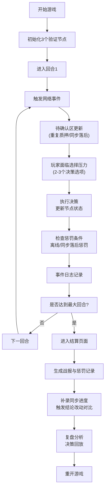

## 1. 产品概述

"Web3节点守城"是一款面向Web3社区运营人员的策略教育小游戏，通过游戏化方式帮助用户理解验证节点、质押、同步进度与惩罚机制之间的关联关系。

- 核心目标：让节点志愿者清晰掌握同步落后、重复质押、离线惩罚等概念，建立可复盘的决策思维
- 目标用户：Web3社区运营、节点志愿者、质押参与者
- 市场价值：将抽象的区块链节点运营概念转化为可交互、可复盘的游戏体验，降低学习门槛

## 2. 核心功能

### 2.1 用户角色

| 角色 | 注册方式 | 核心权限 |
|------|----------|----------|
| 玩家 | 无需注册，浏览器直接访问 | 完整游戏体验、复盘分析 |

### 2.2 功能模块

1. **主界面**：游戏控制区、节点状态面板、待确认区、事件日志
2. **游戏核心**：回合制防守、资源管理、事件响应
3. **结算复盘**：战报生成、惩罚记录追踪、决策路径回放
4. **异常样例**：内置"明显坏掉的验证节点"演示场景

### 2.3 页面详情

| 页面名称 | 模块名称 | 功能描述 |
|----------|----------|----------|
| 游戏主界面 | 顶部控制栏 | 开始、暂停、重开、结算按钮，当前回合显示 |
| 游戏主界面 | 节点状态面板 | 3个验证节点卡片，显示同步进度、质押量、健康状态 |
| 游戏主界面 | 待确认区 | 高亮显示重复质押、同步落后待处理事项，防止遗漏 |
| 游戏主界面 | 事件日志区 | 滚动显示网络事件、惩罚记录、操作历史 |
| 游戏主界面 | 选择压力区 | 每回合出现2-3个决策选项，影响节点状态 |
| 结算复盘页 | 战报总览 | 最终得分、惩罚总额、节点存活情况 |
| 结算复盘页 | 惩罚记录 | 逐条展示离线惩罚、同步惩罚明细，支持追溯 |
| 结算复盘页 | 改动追踪 | 补录同步进度后，自动对比并高亮显示结论变动 |
| 结算复盘页 | 决策回放 | 可逐步回看每回合决策及其后果 |
| 异常样例页 | 坏节点演示 | 预设一个明显异常的验证节点，直观展示异常路径 |

## 3. 核心流程

### 关键流程说明

1. **待确认区机制**：重复质押和同步落后事件不会自动消失，始终高亮显示在待确认区，直到玩家处理
2. **离线惩罚检测**：每回合自动检测节点在线状态，漏掉离线惩罚会在结算时标记为"运营失误"
3. **同步进度补录**：结算阶段可手动补录实际同步进度，系统自动对比游戏内记录，高亮显示结论差异
4. **选择压力设计**：每回合设置两难选择，例如：
   - 选项A：消耗资源提升节点A同步，但节点B可能离线
   - 选项B：保护节点B在线，但节点A同步落后加剧
   - 选项C：分配资源均衡，但整体效率下降

## 4. 用户界面设计

### 4.1 设计风格

- **主色调**：深科技蓝（#0A192F）作为底色，霓虹绿（#64FFDA）作为健康状态，警示红（#FF6B6B）作为惩罚状态，琥珀黄（#FFD93D）作为待确认状态
- **按钮风格**：赛博朋克风格，边框发光效果，悬停时脉冲动画
- **字体**：显示字体使用Orbitron（科技感），正文字体使用JetBrains Mono（等宽易读）
- **布局风格**：仪表盘式布局，模块化卡片，网格背景增强科技感
- **视觉元素**：进度条带数据流动画，节点卡片带扫描线效果，惩罚记录带闪烁警示

### 4.2 页面设计概述

| 页面名称 | 模块名称 | UI元素 |
|----------|----------|--------|
| 游戏主界面 | 顶部控制栏 | 发光按钮、回合计数器、状态指示灯 |
| 游戏主界面 | 节点状态面板 | 三张卡片式布局，每张含：节点ID头像、同步进度条（数据流动画）、质押量显示、健康状态指示灯 |
| 游戏主界面 | 待确认区 | 醒目的琥珀黄色背景区域，带闪烁边框，待处理事项带倒计时标记 |
| 游戏主界面 | 事件日志区 | 终端风格滚动列表，不同类型事件用不同颜色标识 |
| 游戏主界面 | 选择压力区 | 底部弹出式面板，三个选项卡片，悬停放大效果 |
| 结算复盘页 | 战报总览 | 大号数字展示，关键指标带趋势箭头 |
| 结算复盘页 | 惩罚记录 | 时间线布局，每条记录可展开查看详情 |
| 结算复盘页 | 改动追踪 | 前后对比表格，改动项用红色高亮+删除线，新值用绿色高亮 |
| 异常样例页 | 坏节点演示 | 故意设计一个同步进度0%、多次离线、重复质押的节点，所有异常状态同时显示，配文字说明 |

### 4.3 响应性

- 采用桌面优先设计，最小支持宽度1280px
- 平板端自适应调整卡片布局为2列
- 移动端简化为单列布局，折叠非核心模块
- 触摸操作优化：按钮最小尺寸44px，滑动手势支持日志滚动

### 4.4 动效设计

- 页面加载：元素从底部渐入，错落有致的延迟动画
- 节点状态变化：颜色渐变过渡，同步进度条带流动光效
- 惩罚触发：红色闪烁+轻微震动效果
- 待确认事项：呼吸灯动画吸引注意力
- 决策选择：卡片翻转效果展示结果
- 日志更新：新条目从底部滑入，旧条目向上滚动
