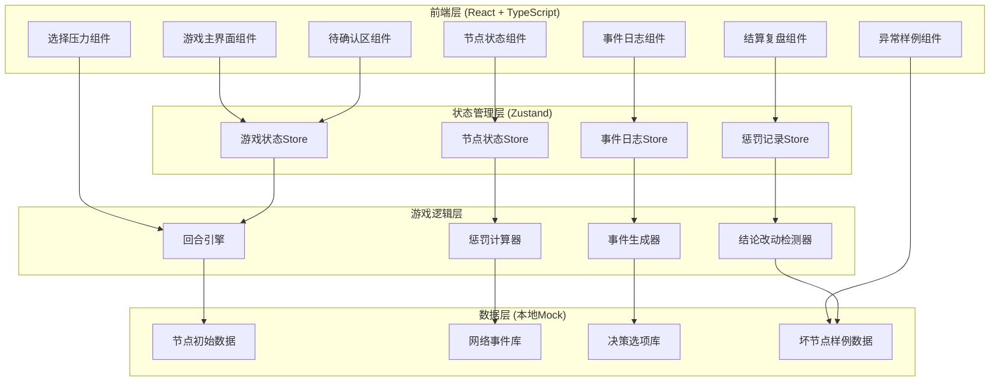
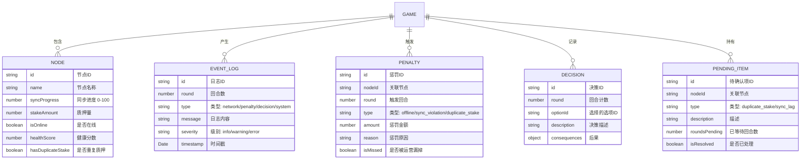

## 1. 架构设计



## 2. 技术描述

- **前端框架**：React@18 + TypeScript
- **构建工具**：Vite@5
- **样式方案**：TailwindCSS@3 + CSS变量（主题管理）
- **状态管理**：Zustand（轻量级，适合游戏状态）
- **动画库**：Framer Motion（复杂动画效果）
- **图标**：Lucide React（简洁科技风格）
- **后端**：无，纯前端本地运行
- **数据库**：无，使用localStorage持久化游戏进度
- **数据**：全部使用Mock数据，内置网络事件库、决策选项库、坏节点样例

## 3. 路由定义

| 路由 | 页面组件 | 用途 |
|------|----------|------|
| `/` | GameBoard | 游戏主界面，包含所有游戏元素 |
| `/settlement` | SettlementPage | 结算复盘页面 |
| `/bad-node-demo` | BadNodeDemo | 异常节点样例演示页 |

## 4. 数据模型

### 4.1 数据模型定义



### 4.2 TypeScript 类型定义

```typescript
// 节点状态
interface NodeState {
  id: string;
  name: string;
  syncProgress: number;
  stakeAmount: number;
  isOnline: boolean;
  healthScore: number;
  hasDuplicateStake: boolean;
  consecutiveOfflineRounds: number;
  syncLagRounds: number;
}

// 游戏状态
interface GameState {
  currentRound: number;
  maxRounds: number;
  isPlaying: boolean;
  isPaused: boolean;
  isGameOver: boolean;
  totalScore: number;
  totalPenalties: number;
  resourcePoints: number;
  nodes: NodeState[];
  eventLogs: EventLog[];
  penalties: Penalty[];
  decisions: Decision[];
  pendingItems: PendingItem[];
}

// 决策选项
interface DecisionOption {
  id: string;
  title: string;
  description: string;
  effects: {
    nodeId?: string;
    syncChange?: number;
    stakeChange?: number;
    onlineChange?: boolean;
    resourceCost: number;
    penaltyRisk?: number;
  };
}

// 补录数据对比结果
interface ConclusionDiff {
  field: string;
  oldValue: string | number;
  newValue: string | number;
  conclusionChange: string;
  isCritical: boolean;
}
```

## 5. 核心模块设计

### 5.1 回合引擎 (RoundEngine)

- 负责回合推进、事件触发、决策执行
- 每回合自动检测节点状态，触发相应惩罚
- 管理待确认事项的生命周期

### 5.2 惩罚计算器 (PenaltyCalculator)

- 离线惩罚：节点连续离线≥2回合，每回合扣除质押量10%
- 同步惩罚：同步进度<50%持续≥3回合，扣除健康分数20点
- 重复质押惩罚：检测到重复质押标记，一次性扣除质押量15%
- 漏检标记：如果待确认区事项超过3回合未处理，标记为"运营失误"

### 5.3 结论改动检测器 (ConclusionDiffDetector)

- 结算时接收用户补录的同步进度数据
- 对比游戏内记录与补录数据
- 自动计算结论变化，例如：
  - 原结论："节点A同步正常" → 补录后："节点A实际同步落后30%"
  - 高亮显示所有改动项，标记关键结论变更

### 5.4 坏节点样例数据

```typescript
const badNodeExample: NodeState = {
  id: "node-bad-001",
  name: "故障演示节点",
  syncProgress: 0,  // 同步进度为0
  stakeAmount: 1000,
  isOnline: false,  // 离线状态
  healthScore: 15,  // 极低健康分
  hasDuplicateStake: true,  // 重复质押标记
  consecutiveOfflineRounds: 5,  // 连续离线5回合
  syncLagRounds: 8,  // 同步落后8回合
};
```

## 6. 状态管理设计

使用Zustand创建单一Store，包含：

```typescript
// 游戏动作
interface GameActions {
  startGame: () => void;
  pauseGame: () => void;
  resumeGame: () => void;
  restartGame: () => void;
  endGame: () => void;
  makeDecision: (optionId: string) => void;
  resolvePendingItem: (itemId: string) => void;
  supplementSyncData: (nodeId: string, actualSync: number) => ConclusionDiff[];
  replayDecision: (round: number) => void;
}
```

## 7. 性能优化

- 使用React.memo优化节点卡片、日志条目等频繁渲染组件
- 事件日志使用虚拟滚动（React Virtuoso），支持1000+条日志流畅滚动
- 动画使用will-change和transform，避免布局抖动
- 游戏状态变更使用Immer进行不可变更新
