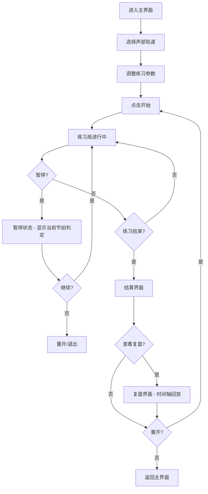

## 1. 产品概述

"合唱指挥练习局"是一款浏览器端的合唱指挥训练小游戏，帮助音乐社学生直观地看到声部进入时机、停顿控制和音量平衡问题。通过可视化的节拍判定系统，解决排练时声部抢拍、延迟进入、音量失衡等常见问题。

- 核心目的：让学生"看见"自己的指挥问题，通过游戏化练习提升合唱指挥能力
- 目标用户：音乐社指导老师、合唱团员、指挥学习者
- 产品价值：将抽象的音乐概念转化为可视化的游戏体验，降低指挥学习门槛

## 2. 核心功能

### 2.1 用户角色

| 角色 | 注册方式 | 核心权限 |
|------|----------|----------|
| 音乐社指导老师 | 无需注册 | 导入声部轨道、配置练习参数、查看完整复盘报告 |
| 学生用户 | 无需注册 | 进行指挥练习、查看个人结算数据 |

### 2.2 功能模块

1. **主界面**：游戏控制区（开始/暂停/重开）、节拍显示、声部轨道可视化
2. **练习局**：实时指挥手势输入、声部轨道滚动、音量条控制、节拍判定反馈
3. **结算界面**：得分统计、问题标注（抢拍/延迟/音量）、总体评价
4. **复盘界面**：时间轴回放、问题点定位、详细数据分析、声部平衡影响展示

### 2.3 页面详情

| 页面名称 | 模块名称 | 功能描述 |
|-----------|-------------|---------------------|
| 主界面 | 控制面板 | 开始/暂停/重开按钮，节拍器速度调节，声部选择 |
| 主界面 | 轨道可视化 | 多条声部轨道平行显示，音符随时间滚动 |
| 主界面 | 音量控制 | 每个声部独立音量条，实时显示当前音量 |
| 练习局 | 节拍判定线 | 中央判定线，标注完美/提前/延迟/错过 |
| 练习局 | 指挥反馈 | 实时显示当前节拍判定结果，颜色编码提示 |
| 结算界面 | 得分面板 | 总分、准确率、抢拍次数、延迟次数统计 |
| 结算界面 | 问题列表 | 按时间顺序列出所有问题点，可点击跳转复盘 |
| 复盘界面 | 时间轴回放 | 可拖动进度条回放练习过程，暂停查看细节 |
| 复盘界面 | 声部平衡分析 | 音量曲线图，标注声部盖过主旋律的时间点 |

## 3. 核心流程

用户从主界面开始，选择声部轨道样例，点击开始进入练习局。在练习过程中，系统实时判定节拍准确性和音量平衡。练习结束后自动进入结算界面，用户可选择重开或进入详细复盘。

## 4. 用户界面设计

### 4.1 设计风格
- **主色调**：深靛蓝 (#1a1a2e) 背景，金色 (#e94560) 强调色，青色 (#00d9ff) 辅助色
- **按钮风格**：圆角渐变按钮，悬停时有发光效果，按压有微缩动画
- **字体**：标题使用 Orbitron（科技感字体），正文使用 Noto Sans SC（清晰易读）
- **布局风格**：暗黑科技风，玻璃拟态卡片，霓虹发光边框
- **图标风格**：线性图标，带发光效果，音乐主题元素

### 4.2 页面设计概述

| 页面名称 | 模块名称 | UI元素 |
|-----------|-------------|-------------|
| 主界面 | 控制面板 | 玻璃拟态卡片，发光按钮，旋钮式速度调节，霓虹边框 |
| 主界面 | 轨道可视化 | 深色轨道背景，彩色音符粒子，滚动动画，判定线发光 |
| 主界面 | 音量控制 | 垂直渐变音量条，实时波形动画，峰值指示器 |
| 结算界面 | 得分面板 | 大型数字显示，环形进度条，粒子特效庆祝动画 |
| 复盘界面 | 时间轴 | 可拖动滑块，问题标记点，悬停显示详情，分段高亮 |

### 4.3 响应性
- 桌面端优先设计，最小支持宽度 1280px
- 声部轨道区域自适应宽度，音量条在小屏幕转为水平排列
- 触摸屏优化：增大按钮点击区域，支持滑动调节音量

### 4.4 动画与交互
- 音符进入判定区时有脉冲动画
- 完美判定时播放金色粒子爆炸效果
- 抢拍/延迟时轨道边缘闪烁红色/黄色警告
- 音量条随音乐实时波动
- 页面切换使用淡入淡出+滑动过渡
