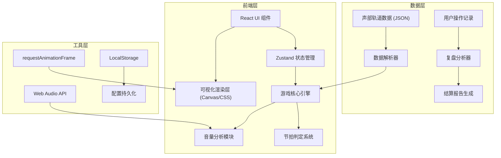

## 1. 架构设计



## 2. 技术描述

- **前端框架**: React@18 + TypeScript
- **构建工具**: Vite@5
- **样式方案**: TailwindCSS@3
- **状态管理**: Zustand
- **可视化**: Canvas API + CSS Animations
- **音频处理**: Web Audio API
- **图标库**: Lucide React

## 3. 路由定义

| 路由 | 页面 | 功能 |
|------|------|------|
| / | 主练习界面 | 游戏控制、声部轨道、音量条、实时判定 |
| /result | 结算页面 | 得分统计、问题列表、重开/复盘入口 |
| /review | 复盘页面 | 时间轴回放、详细分析、声部平衡图表 |

## 4. 核心数据模型

### 4.1 声部轨道数据结构

```typescript
interface Note {
  id: string;
  time: number;      // 进入时间(毫秒)
  duration: number;  // 持续时间(毫秒)
  pitch: string;     // 音高
  volume: number;    // 标准音量 0-100
  part: string;      // 所属声部
}

interface VoicePart {
  id: string;
  name: string;      // 声部名称: 女高/女低/男高/男低
  color: string;     // 显示颜色
  notes: Note[];
}

interface TrackData {
  id: string;
  name: string;
  bpm: number;
  timeSignature: [number, number];  // 拍号
  totalDuration: number;
  parts: VoicePart[];
}
```

### 4.2 判定结果数据结构

```typescript
type JudgeResult = 'perfect' | 'early' | 'late' | 'missed';

interface JudgeRecord {
  noteId: string;
  partId: string;
  judgeTime: number;      // 实际判定时间
  expectedTime: number;   // 期望判定时间
  result: JudgeResult;
  offset: number;         // 时间偏差(毫秒)
  volumeRatio: number;    // 实际音量/标准音量
}

interface VolumeRecord {
  time: number;
  partId: string;
  volume: number;
  isOverpowering: boolean;  // 是否盖过主旋律
}

interface GameResult {
  totalScore: number;
  accuracy: number;
  perfectCount: number;
  earlyCount: number;
  lateCount: number;
  missedCount: number;
  judgeRecords: JudgeRecord[];
  volumeRecords: VolumeRecord[];
}
```

## 5. 状态管理 (Zustand Store)

```typescript
interface GameState {
  // 游戏状态
  status: 'idle' | 'playing' | 'paused' | 'finished';
  currentTime: number;
  bpm: number;
  
  // 轨道数据
  currentTrack: TrackData | null;
  activeParts: string[];  // 当前激活的声部
  
  // 用户输入
  userVolumes: Record<string, number>;  // 各声部用户控制音量
  inputEvents: InputEvent[];
  
  // 判定结果
  judgeRecords: JudgeRecord[];
  volumeRecords: VolumeRecord[];
  
  // Actions
  startGame: () => void;
  pauseGame: () => void;
  resumeGame: () => void;
  restartGame: () => void;
  setVolume: (partId: string, volume: number) => void;
  triggerInput: (partId: string) => void;
}
```

## 6. 核心组件结构

```
src/
├── components/
│   ├── game/
│   │   ├── GameControls.tsx     # 游戏控制按钮
│   │   ├── BeatIndicator.tsx    # 节拍指示器
│   │   ├── VoiceTrack.tsx       # 单声部轨道
│   │   ├── TrackContainer.tsx   # 轨道容器
│   │   ├── VolumeSlider.tsx     # 音量滑块
│   │   ├── JudgeLine.tsx        # 判定线
│   │   └── JudgeEffect.tsx      # 判定特效
│   ├── result/
│   │   ├── ScorePanel.tsx       # 得分面板
│   │   ├── ProblemList.tsx      # 问题列表
│   │   └── ResultSummary.tsx    # 结果摘要
│   └── review/
│       ├── TimelinePlayer.tsx   # 时间轴播放器
│       ├── VolumeChart.tsx      # 音量图表
│       └── AnalysisPanel.tsx    # 分析面板
├── hooks/
│   ├── useGameLoop.ts           # 游戏主循环
│   ├── useJudgeSystem.ts        # 判定系统
│   └── useAudioEngine.ts        # 音频引擎
├── store/
│   └── useGameStore.ts          # Zustand Store
├── data/
│   └── sampleTracks.ts          # 样例声部轨道
├── utils/
│   ├── judgeUtils.ts            # 判定工具函数
│   └── timeUtils.ts             # 时间工具函数
├── pages/
│   ├── GamePage.tsx
│   ├── ResultPage.tsx
│   └── ReviewPage.tsx
└── types/
    └── index.ts                 # 类型定义
```

## 7. 节拍判定算法

1. **时间窗口判定**:
   - Perfect: ±50ms
   - Early: -150ms ~ -50ms
   - Late: +50ms ~ +150ms
   - Missed: 超出 ±150ms 范围

2. **音量平衡判定**:
   - 主旋律声部音量基准: 70-85
   - 和声声部音量基准: 50-70
   - 盖过判定: 和声声部音量 > 主旋律音量 * 1.2

3. **得分计算**:
   - Perfect: 100分
   - Early: 60分 + 时间偏移修正
   - Late: 60分 + 时间偏移修正
   - Missed: 0分
   - 音量修正: 音量在合理范围内额外加分
