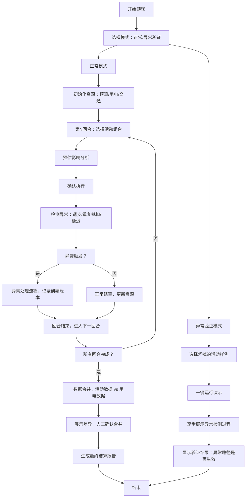

## 1. 产品概述

校园碳中和经营赛是一款回合制经营模拟游戏，玩家扮演环保社团负责人，在有限的活动经费、校园用电和交通资源之间做取舍，通过策划和执行各类低碳活动来降低校园碳足迹。游戏旨在通过沉浸式体验让学生理解碳预算管理的挑战，重点暴露并处理预算透支、重复抵扣、低碳方案延迟等实际操作中的常见问题。

- 核心目标：让学生在游戏中理解碳预算管理，学会在多重约束下做决策
- 目标用户：高校环保社团成员、选修 sustainability 课程的学生
- 价值：将抽象的碳预算概念具象化，通过游戏化方式传递环保知识和项目管理经验

## 2. 核心功能

### 2.1 用户角色

| 角色 | 注册方式 | 核心权限 |
|------|----------|----------|
| 玩家（学生） | 无需注册，直接开始 | 进行回合决策、查看碳账本、体验异常路径 |
| 管理员（老师） | 无需注册 | 查看异常路径验证、使用坏掉的活动样例 |

### 2.2 功能模块

1. **游戏首页**：游戏介绍、开始按钮、规则说明、异常样例入口
2. **回合经营页**：资源面板、活动选择区、决策确认、回合结算
3. **碳账本页**：碳排放记录、碳减排记录、抵扣明细、异常告警
4. **结算报告页**：最终评分、预算使用明细、碳足迹分析、异常事件回顾
5. **数据合并页**：活动数据与用电数据对比、差异展示、人工确认合并
6. **异常样例页**：预置坏掉的活动项目、一键触发异常路径、验证结果展示

### 2.3 页面详情

| 页面名称 | 模块名称 | 功能描述 |
|----------|----------|----------|
| 游戏首页 | Hero区域 | 游戏标题、动态碳足迹可视化、开始游戏按钮 |
| 游戏首页 | 规则说明 | 三列卡片展示经费/用电/交通三大约束 |
| 游戏首页 | 异常入口 | 醒目的红色区域，提供坏掉的活动样例快速入口 |
| 回合经营页 | 资源面板 | 实时显示剩余预算、用电额度、交通配额 |
| 回合经营页 | 活动选择区 | 6-8个活动卡片，每个标注成本、用电量、交通需求、碳减排量 |
| 回合经营页 | 决策区 | 选择活动组合、显示预估影响、确认执行 |
| 回合经营页 | 回合结算 | 动画展示资源变化、触发异常事件提示 |
| 碳账本页 | 排放记录 | 时间线展示各回合碳排放来源和数值 |
| 碳账本页 | 减排记录 | 树形结构展示各活动碳减排贡献 |
| 碳账本页 | 异常告警 | 红色标记的异常事件，可展开查看详情 |
| 结算报告页 | 评分面板 | 碳减排效率、预算使用率、合规性三大评分 |
| 结算报告页 | 预算明细 | 对比实际支出vs预算，超支部分红色高亮 |
| 结算报告页 | 异常回顾 | 按时间线展示触发的所有异常事件及处理结果 |
| 数据合并页 | 数据对比 | 左右两栏分别展示活动数据和用电数据 |
| 数据合并页 | 差异展示 | 冲突数据用不同颜色标记，显示具体差异值 |
| 数据合并页 | 人工确认 | 逐条选择采用哪份数据，或手动输入修正值 |
| 异常样例页 | 样例列表 | 3个预置的坏掉的活动项目卡片 |
| 异常样例页 | 触发演示 | 一键运行，逐步展示异常如何被检测和处理 |
| 异常样例页 | 验证结果 | 绿色/红色指示器显示异常路径是否生效 |

## 3. 核心流程

玩家进入首页后，可以选择正常游戏模式或异常样例验证模式。正常模式下，玩家历经5个回合，每回合选择活动组合，系统计算资源消耗和碳减排效果，触发可能的异常事件（预算透支、重复抵扣、方案延迟），最后生成结算报告。数据合并环节会模拟活动数据与用电数据来自不同维护者的场景，强制展示差异并要求人工确认。

## 4. 用户界面设计

### 4.1 设计风格

- **设计方向**：科技环保风，结合数据可视化的未来感与自然元素的有机感
- **主色调**：深森林绿 (#0F3D3E) 作为主色，代表环保与自然
- **辅助色**：暖橙色 (#E2703A) 用于警示和异常，薄荷绿 (#93B1A6) 用于成功和减排
- **背景**：深色渐变背景，带细微的碳分子点阵纹理
- **字体**：标题使用 Space Grotesk，正文使用 Inter，数字使用 JetBrains Mono 等宽字体
- **交互元素**：圆角卡片（12px）、细边框、微玻璃拟态效果、悬停时微妙上浮
- **动效**：数据变化时数字滚动动画、异常事件时的脉冲红光提示、资源耗尽时的抖动效果

### 4.2 页面设计概览

| 页面名称 | 模块名称 | UI元素 |
|----------|----------|--------|
| 游戏首页 | Hero区域 | 大标题悬浮在动态碳足迹粒子动画上，开始按钮有呼吸灯效 |
| 游戏首页 | 规则说明 | 三张倾斜排列的卡片，分别对应经费/用电/交通，悬停时展开详情 |
| 回合经营页 | 资源面板 | 顶部三个半圆仪表盘，实时显示资源剩余比例，低于20%时变红色 |
| 回合经营页 | 活动选择区 | 瀑布流卡片布局，选中状态有绿色发光边框 |
| 回合经营页 | 决策区 | 底部固定栏，实时计算所选活动的综合影响 |
| 碳账本页 | 时间线 | 左侧竖线时间轴，右侧交替显示排放和减排记录 |
| 碳账本页 | 异常告警 | 折叠卡片，展开后显示红色异常详情和处理建议 |
| 结算报告页 | 评分面板 | 三个环形进度图，分别显示三大评分，中间显示总分 |
| 结算报告页 | 预算明细 | 横向条形图对比预算与实际，超支部分用红色斜线填充 |
| 数据合并页 | 数据对比 | 左右分栏，中间用VS Code风格的差异对比标记 |
| 数据合并页 | 差异展示 | 冲突行背景黄色，鼠标悬停显示具体差异数值 |
| 异常样例页 | 样例卡片 | 红色边框的警告卡片，标注"⚠️ 异常样例"标签 |
| 异常样例页 | 验证结果 | 交通灯式指示器：绿色=异常已捕获，红色=异常未捕获 |

### 4.3 响应式

- **桌面优先**设计，主内容区最大宽度 1280px
- **平板适配**：活动卡片从3列变为2列，仪表盘从横向变为纵向排列
- **移动端**：活动卡片单列，底部决策区变为浮动抽屉，通过上滑呼出
- **触控优化**：所有可点击元素最小尺寸 44x44px，重要按钮额外加大触控区域

### 4.4 可视化设计

- **碳足迹动画**：首页背景的粒子系统，粒子数量随游戏进度变化，颜色从灰变绿
- **资源仪表盘**：SVG绘制的半圆仪表，指针平滑过渡，颜色根据剩余比例渐变
- **碳账本时间线**：每回合记录带入场动画，从下往上滑入
- **异常脉冲**：触发异常时，相关区域产生3次红色脉冲光晕
- **数据合并差异**：类似Git diff的展示方式，+/-号标记差异行
