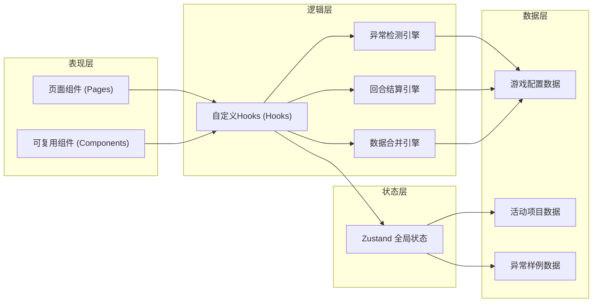
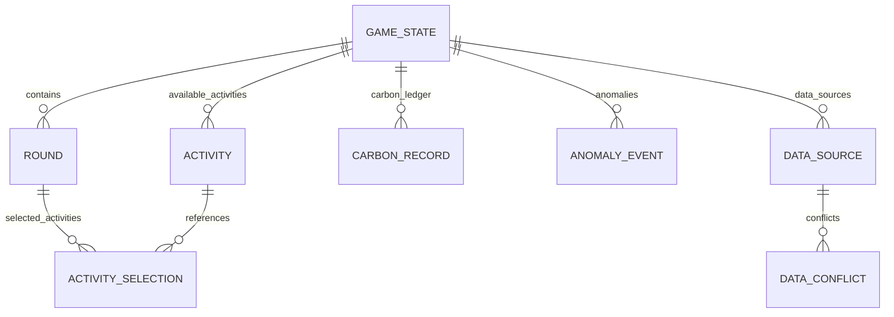

## 1. 架构设计

本项目为纯前端单页应用，采用React组件化架构，通过Zustand进行全局状态管理。游戏数据、异常检测、回合结算等核心逻辑封装在自定义Hooks中，UI组件与业务逻辑分离，便于维护和扩展。



## 2. 技术描述

- **前端框架**：React@18 + TypeScript
- **构建工具**：Vite@5
- **状态管理**：Zustand@4
- **路由管理**：React Router DOM@6
- **样式方案**：Tailwind CSS@3 + CSS变量
- **图标库**：Lucide React
- **数据可视化**：自定义SVG组件 + CSS动画
- **后端**：无（纯前端应用，数据全部Mock）
- **数据库**：无（使用localStorage持久化游戏进度）

## 3. 路由定义

| 路由路径 | 页面组件 | 功能说明 |
|----------|----------|----------|
| `/` | `HomePage` | 游戏首页，展示介绍、规则、开始入口 |
| `/game` | `GamePage` | 回合经营主界面，选择活动、执行决策 |
| `/carbon-ledger` | `CarbonLedgerPage` | 碳账本页面，查看排放/减排记录和异常 |
| `/data-merge` | `DataMergePage` | 数据合并页面，对比活动与用电数据差异 |
| `/report` | `ReportPage` | 结算报告页面，展示最终评分和明细 |
| `/anomaly-demo` | `AnomalyDemoPage` | 异常样例页面，演示异常检测和处理 |

## 4. 数据模型

### 4.1 数据模型定义



### 4.2 TypeScript 类型定义

```typescript
// 资源类型
interface Resources {
  budget: number;      // 活动经费（元）
  electricity: number; // 用电量（度）
  transport: number;   // 交通配额（人次）
}

// 活动项目
interface Activity {
  id: string;
  name: string;
  description: string;
  cost: Resources;           // 资源消耗
  carbonReduction: number;   // 碳减排量（kg CO2）
  carbonEmission: number;    // 碳排放量（kg CO2）
  delayRisk: number;         // 延迟风险 0-1
  isLowCarbon: boolean;      // 是否低碳方案
  category: 'energy' | 'transport' | 'education' | 'planting';
  maxTimesPerRound: number;  // 每回合最多选择次数
}

// 活动选择
interface ActivitySelection {
  activityId: string;
  count: number;
  round: number;
}

// 碳记录
interface CarbonRecord {
  id: string;
  round: number;
  type: 'emission' | 'reduction';
  amount: number;
  source: string;      // 来源活动ID或描述
  timestamp: number;
  isOffset: boolean;   // 是否用于抵扣
  offsetId?: string;   // 关联的抵扣记录ID
}

// 异常事件
interface AnomalyEvent {
  id: string;
  round: number;
  type: 'overdraft' | 'double_offset' | 'delay';
  severity: 'warning' | 'critical';
  description: string;
  activityId?: string;
  detected: boolean;   // 是否已被检测到
  resolved: boolean;   // 是否已处理
  resolution?: string; // 处理结果
}

// 数据源（用于数据合并）
interface DataSource {
  id: string;
  name: 'activity' | 'electricity';
  maintainer: string;  // 维护者名称
  records: DataRecord[];
  lastUpdated: number;
}

// 数据记录
interface DataRecord {
  round: number;
  activityId?: string;
  value: number;
  unit: string;
}

// 数据冲突
interface DataConflict {
  id: string;
  round: number;
  activityId?: string;
  field: string;
  activityValue: number;
  electricityValue: number;
  resolved: boolean;
  chosenSource?: 'activity' | 'electricity' | 'manual';
  manualValue?: number;
}

// 游戏状态
interface GameState {
  currentRound: number;
  totalRounds: number;
  phase: 'home' | 'playing' | 'merging' | 'report' | 'demo';
  initialResources: Resources;
  currentResources: Resources;
  totalCarbonReduction: number;
  totalCarbonEmission: number;
  selectedActivities: ActivitySelection[];
  carbonLedger: CarbonRecord[];
  anomalies: AnomalyEvent[];
  dataSources: DataSource[];
  conflicts: DataConflict[];
  score: {
    reduction: number;
    budget: number;
    compliance: number;
  };
}
```

## 5. 核心引擎设计

### 5.1 异常检测引擎

**预算透支检测** (`detectOverdraft`)
- 触发条件：选择活动后剩余资源 < 0
- 检测逻辑：计算所选活动总成本，与当前剩余资源对比
- 处理逻辑：标记异常，计算超支金额，限制超支活动执行或扣除信用分

**重复抵扣检测** (`detectDoubleOffset`)
- 触发条件：同一碳减排记录被多次用于抵扣
- 检测逻辑：维护已抵扣记录ID集合，新增抵扣时检查是否已存在
- 处理逻辑：标记异常，撤销重复抵扣，记录到异常日志

**低碳方案延迟检测** (`detectDelay`)
- 触发条件：选中的低碳活动实际生效回合晚于预期
- 检测逻辑：根据活动`delayRisk`属性随机触发，或在异常样例中强制触发
- 处理逻辑：标记异常，将碳减排效果延后1-2回合生效

### 5.2 回合结算引擎

**执行步骤**：
1. 验证所选活动资源是否充足
2. 运行异常检测引擎
3. 扣除资源消耗
4. 计算碳排放和碳减排
5. 更新碳账本
6. 处理异常（如延迟则延后减排生效）
7. 生成本回合摘要

### 5.3 数据合并引擎

**执行步骤**：
1. 分别生成活动数据和用电数据（模拟两人维护）
2. 逐字段对比两份数据
3. 标记差异项（偏差 > 5% 视为冲突）
4. 生成差异报告
5. 等待人工确认每条冲突
6. 根据确认结果生成最终数据

## 6. 项目结构

```
/
├── src/
│   ├── components/          # 可复用组件
│   │   ├── ResourceGauge.tsx       # 资源仪表盘
│   │   ├── ActivityCard.tsx        # 活动卡片
│   │   ├── CarbonTimeline.tsx      # 碳账本时间线
│   │   ├── AnomalyAlert.tsx        # 异常告警
│   │   ├── DataDiffView.tsx        # 数据差异对比
│   │   ├── ScoreRing.tsx           # 评分环形图
│   │   └── ParticleBackground.tsx  # 粒子背景
│   ├── hooks/               # 自定义Hooks
│   │   ├── useGameEngine.ts        # 游戏核心引擎
│   │   ├── useAnomalyDetector.ts   # 异常检测
│   │   ├── useDataMerge.ts         # 数据合并
│   │   └── useCarbonLedger.ts      # 碳账本管理
│   ├── pages/               # 页面组件
│   │   ├── HomePage.tsx
│   │   ├── GamePage.tsx
│   │   ├── CarbonLedgerPage.tsx
│   │   ├── DataMergePage.tsx
│   │   ├── ReportPage.tsx
│   │   └── AnomalyDemoPage.tsx
│   ├── store/               # Zustand状态
│   │   └── useGameStore.ts
│   ├── data/                # Mock数据
│   │   ├── activities.ts
│   │   ├── anomalySamples.ts
│   │   └── gameConfig.ts
│   ├── types/               # 类型定义
│   │   └── index.ts
│   ├── utils/               # 工具函数
│   │   ├── carbonCalculator.ts
│   │   └── anomalyUtils.ts
│   ├── App.tsx
│   ├── main.tsx
│   └── index.css
├── api/                     # 无后端，保留目录结构
├── .trae/
│   └── documents/
│       ├── prd.md
│       └── technical-architecture.md
├── package.json
├── tsconfig.json
├── vite.config.ts
├── tailwind.config.js
└── postcss.config.js
```

## 7. 异常样例数据设计

为了让学生会老师不用读代码也能确认异常路径生效，预置3个明显坏掉的活动项目：

| 样例编号 | 异常类型 | 活动名称 | 设计缺陷 | 预期触发结果 |
|----------|----------|----------|----------|--------------|
| 1 | 预算透支 | "超豪华环保论坛" | 经费需求是初始预算的150% | 选择后立即触发预算透支警告，无法执行，或执行后预算变为负数并在报告中高亮 |
| 2 | 重复抵扣 | "神奇双重碳汇林" | 同一个碳减排记录会被自动抵扣两次 | 执行后在碳账本中显示两条相同的抵扣记录，系统检测到后自动撤销并标记异常 |
| 3 | 低碳方案延迟 | "永远等不到的光伏板" | delayRisk设为100%，强制延迟3回合 | 选择后碳减排效果不会立即生效，连续3回合显示"延迟中"，最后才生效或失败 |
