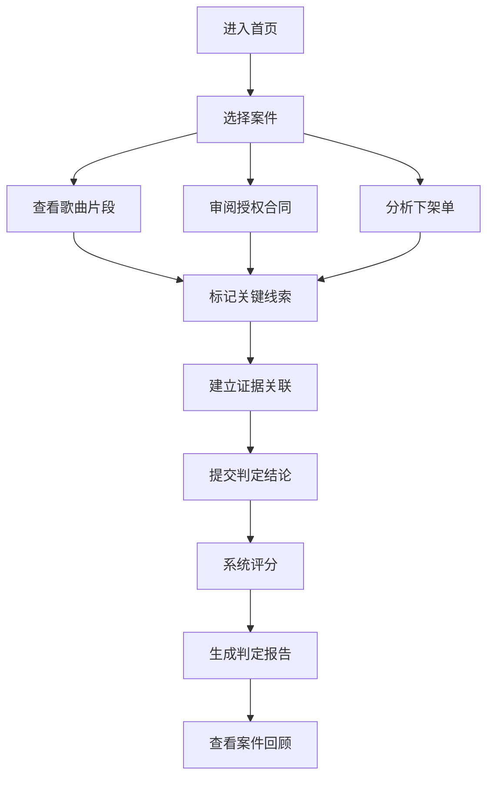

## 1. 产品概述

"音乐版权侦探局"是一款面向音乐版权行业新人的推理训练游戏，通过沉浸式侦探角色扮演，帮助学习者区分翻唱、采样和背景音乐授权等核心概念，建立证据链思维。

- **核心问题**：新人混淆翻唱、采样、BGM授权概念，难以从复杂材料中识别版权风险
- **目标用户**：音乐平台内容审核员、版权专员、法务新人
- **产品价值**：通过游戏化方式训练证据链构建能力，降低实际工作中的误判率

## 2. 核心功能

### 2.1 用户角色

| 角色 | 注册方式 | 核心权限 |
|------|----------|----------|
| 侦探学员 | 直接进入 | 体验案件、查看报告、回顾操作历史 |

### 2.2 功能模块

1. **首页大厅**：游戏介绍、案件列表、开始新案件
2. **案件调查**：查看歌曲片段、审阅授权合同、分析平台下架单、关联线索
3. **证据链板**：拖拽式证据关联、结论来源追溯
4. **判定报告**：生成判定结论、计算得分、显示错误类型
5. **案件回顾**：操作历史回放、线索关联触发点、合同判定分数影响分析

### 2.3 页面详情

| 页面名称 | 模块名称 | 功能描述 |
|-----------|-------------|---------------------|
| 首页大厅 | 案件列表 | 展示可用案件，显示难度和预计时长 |
| 案件调查 | 材料审阅区 | 三栏布局：歌曲片段、授权合同、平台下架单 |
| 案件调查 | 证据关联区 | 拖拽线索建立关联，标记证据类型 |
| 判定报告 | 结果展示 | 显示最终判定、得分详情、错误类型统计 |
| 案件回顾 | 时间线回放 | 可视化展示每一步操作及其影响 |

## 3. 核心流程

玩家进入案件后，通过审阅三类材料（歌曲片段、授权合同、平台下架单），识别关键线索并建立证据关联，最终提交判定结论。系统根据证据链完整性和判定准确性计算得分，并生成可追溯的详细报告。

## 4. 用户界面设计

### 4.1 设计风格

- **主色调**：深海军蓝 #0F172A（专业、权威）+ 琥珀金 #F59E0B（线索高亮）+ 警示红 #EF4444（风险标记）
- **辅助色**：翡翠绿 #10B981（正确判定）+ 石板灰 #64748B（中性信息）
- **字体**：标题使用 "Playfair Display"（侦探/复古感），正文使用 "Noto Sans SC"（清晰易读）
- **按钮风格**：圆角矩形，微悬浮阴影，点击时轻微下陷
- **布局风格**：卡片式三栏布局，模拟侦探办公桌，材料可拖拽
- **视觉元素**：放大镜、文件夹、图钉、证据板等侦探主题图标
- **动效**：线索关联时的连线动画，证据钉入时的敲击动效

### 4.2 页面设计概述

| 页面名称 | 模块名称 | UI元素 |
|-----------|-------------|-------------|
| 首页大厅 | Hero区域 | 大型侦探局徽章、游戏标题、开始按钮 |
| 首页大厅 | 案件卡片 | 案件封面、难度标签、时长、完成状态 |
| 案件调查 | 材料卡片 | 模拟真实文件样式，边角微卷，可展开详情 |
| 案件调查 | 证据板 | 软木板纹理背景，可用图钉固定证据卡片 |
| 判定报告 | 分数圆环 | 动态填充的得分圆环，分项得分条形图 |
| 判定报告 | 错误分类 | 采样未申报、授权过期、同名误判等分类标签 |
| 案件回顾 | 时间线 | 垂直时间线，标注关键决策点和影响 |

### 4.3 响应式设计

- **桌面优先**：三栏并排布局，充分利用屏幕空间
- **平板适配**：两栏布局，第三栏折叠为抽屉
- **移动端**：单栏垂直滚动，材料切换使用标签页

### 4.4 交互细节

- 线索卡片可拖拽到证据板，拖拽时有半透明跟随效果
- 建立证据关联时，两点之间绘制动态贝塞尔曲线
- 悬停在结论上时，高亮显示所有支撑证据的来源
- 合同判定影响分数时，显示+/-分数的浮动动画
