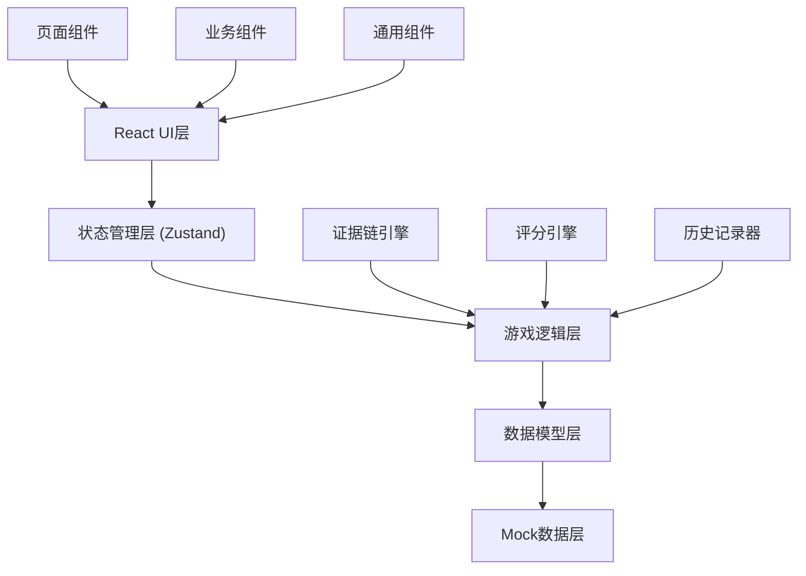

## 1. 架构设计

纯前端React应用，使用本地状态管理存储游戏进度，Mock数据模拟案件材料。



## 2. 技术描述

- **前端框架**：React@18 + TypeScript@5 + Vite@5
- **状态管理**：Zustand@4
- **路由**：React Router DOM@6
- **样式**：TailwindCSS@3
- **图标**：Lucide React
- **拖拽交互**：原生HTML5 Drag & Drop API
- **后端**：无（纯前端应用，使用Mock数据）
- **数据持久化**：LocalStorage（保存游戏进度）

## 3. 路由定义

| 路由 | 页面组件 | 用途 |
|-------|---------|------|
| `/` | HomePage | 首页大厅，案件列表 |
| `/case/:caseId` | CasePage | 案件调查主界面 |
| `/case/:caseId/report` | ReportPage | 判定报告页面 |
| `/case/:caseId/review` | ReviewPage | 案件回顾页面 |

## 4. 数据模型

### 4.1 核心数据结构

```mermaid
erDiagram
    CASE ||--o{ CLUE : contains
    CASE ||--o{ EVIDENCE_LINK : has
    CASE ||--o{ OPERATION_HISTORY : records
    CASE ||--|| SCORE : has
    
    CLUE ||--o| EVIDENCE_LINK : from
    CLUE ||--o| EVIDENCE_LINK : to
    
    CASE {
        string id
        string title
        string description
        string difficulty
        number estimatedTime
        array songClips
        array contracts
        array takedownNotices
    }
    
    CLUE {
        string id
        string caseId
        string type "SONG_CLIP|CONTRACT|TAKEDOWN"
        string content
        string sourceRef
        array tags
        boolean isMarked
    }
    
    EVIDENCE_LINK {
        string id
        string fromClueId
        string toClueId
        string relationshipType
        string conclusion
        string[] evidenceSources
        boolean isValid
    }
    
    OPERATION_HISTORY {
        string id
        timestamp timestamp
        string operationType
        string detail
        number scoreImpact
        string triggeredAt
    }
    
    SCORE {
        number total
        number evidenceChainScore
        number conclusionAccuracy
        object errorBreakdown
    }
```

### 4.2 TypeScript 类型定义

```typescript
// 案件类型
type Case = {
  id: string;
  title: string;
  description: string;
  difficulty: 'easy' | 'medium' | 'hard';
  estimatedTime: number;
  materials: CaseMaterials;
  correctConclusion: Conclusion;
};

// 案件材料
type CaseMaterials = {
  songClips: SongClip[];
  contracts: Contract[];
  takedownNotices: TakedownNotice[];
};

// 歌曲片段
type SongClip = {
  id: string;
  title: string;
  artist: string;
  audioUrl: string;
  waveformData: number[];
  lyrics: string;
  duration: number;
  copyrightNotes: string[];
};

// 授权合同
type Contract = {
  id: string;
  contractNumber: string;
  partyA: string;
  partyB: string;
  licenseType: 'COVER' | 'SAMPLE' | 'BGM';
  effectiveDate: string;
  expiryDate: string;
  territory: string[];
  royaltyRate: number;
  restrictions: string[];
  isExpired: boolean;
};

// 平台下架单
type TakedownNotice = {
  id: string;
  noticeNumber: string;
  platform: string;
  issuedDate: string;
  reason: string;
  affectedContent: string;
  complainant: string;
  isDisputed: boolean;
};

// 线索
type Clue = {
  id: string;
  sourceId: string;
  sourceType: 'SONG_CLIP' | 'CONTRACT' | 'TAKEDOWN';
  content: string;
  category: 'COVER' | 'SAMPLE' | 'BGM' | 'EXPIRED' | 'UNDECLARED' | 'NAME_CONFLICT';
  position: { x: number; y: number };
};

// 证据关联
type EvidenceLink = {
  id: string;
  fromClueId: string;
  toClueId: string;
  relationship: string;
  isValid: boolean;
  scoreImpact: number;
};

// 判定结论
type Conclusion = {
  mainIssue: 'COVER_OK' | 'COVER_NO_AUTH' | 'SAMPLE_DECLARED' | 'SAMPLE_UNDECLARED' | 'BGM_AUTHORIZED' | 'BGM_EXPIRED' | 'NAME_CONFLICT';
  severity: 'LOW' | 'MEDIUM' | 'HIGH' | 'CRITICAL';
  recommendedAction: string;
};

// 操作历史
type OperationRecord = {
  id: string;
  timestamp: number;
  type: 'MARK_CLUE' | 'CREATE_LINK' | 'SUBMIT_CONCLUSION' | 'VIEW_MATERIAL';
  detail: string;
  scoreImpact: number;
  triggeredAt: string;
};

// 游戏状态
type GameState = {
  currentCaseId: string | null;
  clues: Clue[];
  evidenceLinks: EvidenceLink[];
  markedClueIds: string[];
  operationHistory: OperationRecord[];
  userConclusion: Conclusion | null;
  score: Score | null;
  isCompleted: boolean;
};
```

## 5. 评分引擎规则

### 5.1 证据链评分（40分）

- 每条正确关联：+8分
- 每条错误关联：-5分
- 完整证据链（覆盖所有关键线索）：额外+10分

### 5.2 结论准确性评分（60分）

- 主问题判定正确：+30分
- 严重程度判定正确：+15分
- 建议措施合理：+15分

### 5.3 错误类型单独统计

- `SAMPLE_UNDECLARED` - 采样未申报
- `BGM_EXPIRED` - 授权过期
- `NAME_CONFLICT` - 同名歌曲误判

## 6. 项目结构

```
src/
├── components/          # 通用组件
│   ├── ClueCard.tsx
│   ├── EvidenceBoard.tsx
│   ├── MaterialCard.tsx
│   ├── ScoreRing.tsx
│   └── Timeline.tsx
├── pages/               # 页面组件
│   ├── HomePage.tsx
│   ├── CasePage.tsx
│   ├── ReportPage.tsx
│   └── ReviewPage.tsx
├── store/               # 状态管理
│   └── useGameStore.ts
├── data/                # Mock数据
│   └── cases.ts
├── types/               # 类型定义
│   └── index.ts
├── utils/               # 工具函数
│   ├── scoringEngine.ts
│   └── evidenceValidator.ts
├── App.tsx
├── main.tsx
└── index.css
```
