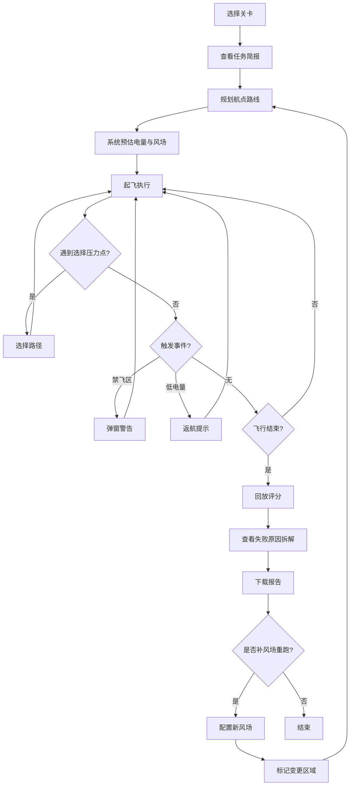

## 1. 产品概述

"无人机航拍避障赛"是一款面向航拍队长和新飞手的路线规划训练小游戏原型。核心解决三个问题：新飞手只看画面忽略风场与电量、逆风耗电缺乏解释、失败原因被总分掩盖。通过关卡中的选择压力和实时反馈，让路径规划、风场影响、返航余量从"摆设"变成"必修"。

- 目标用户：航拍队长（用于培训新飞手）、新飞手（练习路线规划与返航判断）
- 核心价值：用游戏化方式让飞手理解风场-电量-禁飞区的联动关系，减少实际飞行事故

## 2. 核心功能

### 2.1 用户角色
| 角色 | 进入方式 | 核心权限 |
|------|----------|----------|
| 航拍队长 | 直接进入 | 编辑关卡、配置风场、导出报告、查看变更对比 |
| 新飞手 | 直接进入 | 选择关卡、规划路线、执行飞行、查看评分与反馈 |

### 2.2 功能模块
1. **任务简报页**：关卡选择、风场预览、航点标注、目标说明
2. **飞行规划页**：2D 俯视地图、拖拽航点、路径预览、电量/风场实时预估
3. **飞行执行页**：实时飞行动画、电量条、风速指示、事件弹窗（禁飞区/低电量）
4. **回放评分页**：逐段回放、失败原因拆解、逆风耗电详解、风场变更对比标记
5. **报告下载**：生成 JSON 报告文件，航点结论与界面摘要严格一致

### 2.3 页面详情
| 页面名称 | 模块名称 | 功能描述 |
|----------|----------|----------|
| 任务简报页 | 关卡选择器 | 展示3个预设关卡，每关含不同禁飞区和选择压力点 |
| 任务简报页 | 风场预览 | 显示风向箭头和风速等级色带，第二次运行标出变更区域 |
| 任务简报页 | 目标与约束 | 列出航点顺序、最低返航电量、禁飞区范围 |
| 飞行规划页 | 地图画布 | 2D 俯视图，可拖拽添加/移动航点，实时显示路径连线 |
| 飞行规划页 | 电量预估面板 | 根据路径和风场估算各段耗电，逆风段标红并显示"逆风×1.8倍耗电" |
| 飞行规划页 | 风场叠加层 | 在地图上叠加风向箭头，不同颜色表示风速等级 |
| 飞行执行页 | 飞行动画 | 无人机沿规划路径移动，实时显示位置和朝向 |
| 飞行执行页 | 状态仪表板 | 电量条（带警告色）、当前风速、距下一航点距离、已飞行时间 |
| 飞行执行页 | 事件弹窗 | 进入禁飞区时弹窗提示"⚠ 禁飞区穿越！立即返航或接受扣分"；电量低于返航阈值时提示"🔋 返航电量不足！逆风已多消耗XX%电量" |
| 飞行执行页 | 选择压力点 | 到达分叉点时暂停，要求飞手选择左/右路径（一条短但逆风，一条长但顺风） |
| 回放评分页 | 逐段回放 | 可拖动进度条回看任意飞行片段，每段标注耗电和风场影响 |
| 回放评分页 | 失败原因拆解 | 不只给总分，而是分项列出：路径效率、电量管理、禁飞区违规、返航余量，每项有文字解释 |
| 回放评分页 | 逆风耗电详解 | 展示每段逆风的具体耗电计算：基础耗电×逆风系数=实际耗电，对比顺风段 |
| 回放评分页 | 风场变更对比 | 第二次运行时，在地图上用高亮边框标出风场变更区域，变更段旁显示"风场已变更"标签 |
| 报告下载 | JSON 报告生成 | 包含航点坐标、各段耗电明细、风场数据、失败原因、总分，与界面显示完全一致 |

## 3. 核心流程

**首次运行流程**：航拍队长选择关卡 → 查看任务简报 → 在地图上拖拽规划航点 → 系统估算电量与风场影响 → 点击"起飞"执行飞行 → 遇到选择压力点做决策 → 飞行结束（成功/失败）→ 回放评分页查看详细反馈 → 下载报告

**第二次运行（补风场）流程**：航拍队长配置新风场数据 → 系统标记风场变更区域 → 重新规划与执行 → 回放页对比显示"风场已变更"段 → 更新报告

## 4. 用户界面设计

### 4.1 设计风格
- **主色调**：深蓝灰 (#0f172a) 背景配亮青 (#06d6a0) 强调色，辅以警告橙 (#fbbf24) 和危险红 (#ef4444)
- **次色调**：地图用浅灰网格底，风场用蓝-橙渐变色带
- **按钮风格**：圆角矩形，微发光边框，hover 时亮度提升
- **字体**：标题用 Rajdhani（科技感），正文用 Source Sans 3
- **布局**：左侧地图画布（占70%），右侧控制面板（占30%）
- **图标**：lucide-react 图标库

### 4.2 页面设计概览
| 页面名称 | 模块名称 | UI 元素 |
|----------|----------|---------|
| 任务简报页 | 关卡卡片 | 深色卡片，悬停发光边框，关卡缩略地图预览 |
| 任务简报页 | 风场色带 | 蓝到橙渐变色带，风速等级标注 |
| 飞行规划页 | 地图画布 | 暗色网格底，航点为发光圆点，路径为虚线，禁飞区为半透明红区 |
| 飞行规划页 | 电量面板 | 竖向电量条，绿色→黄色→红色渐变，逆风段标注闪电图标 |
| 飞行执行页 | 无人机 | 三角形指示器带尾迹，朝向跟随飞行方向 |
| 飞行执行页 | 事件弹窗 | 半透明遮罩+居中弹窗，禁飞区警告用红色边框，低电量用橙色 |
| 回放评分页 | 分项评分 | 环形进度条展示各维度得分，下方配文字详解 |
| 回放评分页 | 变更标记 | 变更区域用闪烁虚线边框高亮，旁标"风场已变更"标签 |

### 4.3 响应式设计
- 桌面优先设计，最小宽度 1024px
- 地图画布自适应容器大小
- 控制面板在窄屏时折叠为底部抽屉

### 4.4 2D 场景设计
- 地图采用网格坐标系，每格代表 50 米
- 风场用箭头粒子系统可视化，箭头长度表示风速，颜色表示等级
- 禁飞区用红色半透明多边形 + 闪烁边框
- 航点用编号圆点，选中时放大并显示坐标
- 无人机用三角形 + 尾迹效果
