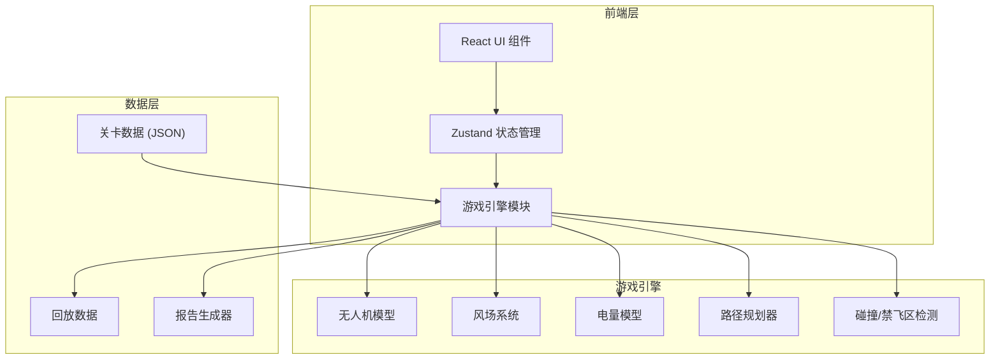

## 1. 架构设计



## 2. 技术说明
- **前端**：React@18 + TypeScript + Tailwind CSS@3 + Vite
- **初始化工具**：vite-init
- **后端**：无（纯前端项目，数据存内存）
- **数据库**：无（关卡数据为 JSON 常量，回放数据存 Zustand store）
- **状态管理**：Zustand
- **图标**：lucide-react

## 3. 路由定义
| 路由 | 用途 |
|------|------|
| `/` | 任务简报页：关卡选择与风场预览 |
| `/plan` | 飞行规划页：航点拖拽与路径规划 |
| `/fly` | 飞行执行页：实时飞行动画与事件反馈 |
| `/result` | 回放评分页：失败拆解与风场变更对比 |

## 4. 核心数据模型

### 4.1 关卡数据
```typescript
interface Waypoint {
  id: string;
  x: number;
  y: number;
  label: string;
  isRequired: boolean;
}

interface NoFlyZone {
  id: string;
  vertices: { x: number; y: number }[];
  label: string;
}

interface WindField {
  segments: WindSegment[];
}

interface WindSegment {
  region: { x: number; y: number; width: number; height: number };
  direction: number;
  speed: number;
}

interface ChoicePoint {
  id: string;
  position: { x: number; y: number };
  options: ChoiceOption[];
}

interface ChoiceOption {
  label: string;
  pathOffset: { x: number; y: number }[];
  windMultiplier: number;
  description: string;
}

interface Level {
  id: string;
  name: string;
  description: string;
  gridSize: { width: number; height: number };
  start: { x: number; y: number };
  home: { x: number; y: number };
  waypoints: Waypoint[];
  noFlyZones: NoFlyZone[];
  windField: WindField;
  choicePoints: ChoicePoint[];
  batteryCapacity: number;
  minReturnBattery: number;
  baseDrainRate: number;
  headwindMultiplier: number;
}
```

### 4.2 飞行状态
```typescript
interface FlightState {
  position: { x: number; y: number };
  heading: number;
  battery: number;
  speed: number;
  currentWaypointIndex: number;
  inNoFlyZone: boolean;
  windAtPosition: { direction: number; speed: number };
  isHeadwind: boolean;
  drainRate: number;
}

interface FlightEvent {
  type: 'no_fly_zone_enter' | 'no_fly_zone_exit' | 'low_battery' | 'return_battery_critical' | 'choice_point' | 'waypoint_reached' | 'headwind_start' | 'headwind_end';
  timestamp: number;
  position: { x: number; y: number };
  message: string;
  details: Record<string, number | string | boolean>;
}

interface FlightSegment {
  fromWaypoint: string;
  toWaypoint: string;
  distance: number;
  basePowerCost: number;
  windEffect: number;
  actualPowerCost: number;
  isHeadwind: boolean;
  headwindExplanation: string;
  windChanged: boolean;
  windChangeLabel: string;
}
```

### 4.3 评分数据
```typescript
interface ScoreBreakdown {
  pathEfficiency: { score: number; max: number; explanation: string };
  batteryManagement: { score: number; max: number; explanation: string };
  noFlyZoneCompliance: { score: number; max: number; explanation: string };
  returnBatteryMargin: { score: number; max: number; explanation: string };
  headwindHandling: { score: number; max: number; explanation: string };
  totalScore: number;
  maxTotalScore: number;
}

interface FlightReport {
  levelId: string;
  levelName: string;
  timestamp: string;
  waypoints: Waypoint[];
  segments: FlightSegment[];
  events: FlightEvent[];
  score: ScoreBreakdown;
  batteryRemaining: number;
  flightSuccess: boolean;
  windFieldVersion: number;
  windChanges: WindChange[];
}

interface WindChange {
  region: { x: number; y: number; width: number; height: number };
  previousSpeed: number;
  previousDirection: number;
  newSpeed: number;
  newDirection: number;
  affectedSegments: string[];
}
```

## 5. 核心算法

### 5.1 电量消耗计算
```
基础耗电率 = baseDrainRate (单位: %/格)
实际耗电率 = 基础耗电率 × 风场系数
风场系数 = 1 + (逆风分量 / 基准风速) × (headwindMultiplier - 1)
逆风分量 = windSpeed × cos(风向 - 航向)  (仅取正值)
顺风时风场系数 = 1 - 顺风分量 × 0.2 (最低0.7)
```

### 5.2 禁飞区检测
- 点在多边形内检测（射线法）
- 无人机每帧检测当前位置是否在任一禁飞区多边形内
- 进入时触发事件，持续在禁飞区内每秒扣分

### 5.3 返航电量判断
```
距家的直线距离 = distance(drone.position, home)
预估返航耗电 = 距离 × 基础耗电率 × 预估风场系数
当前电量 < 预估返航耗电 + minReturnBattery 时触发返航警告
```
