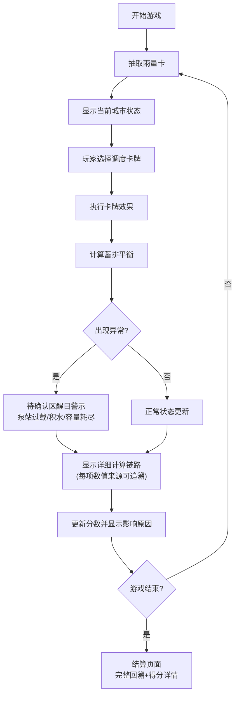

## 1. 产品概述

城市雨洪调度牌是一款海绵城市科普卡牌游戏，通过模拟城市雨洪调度场景，让参与者理解内涝治理中的资源取舍决策。游戏核心在于权衡泵站、雨水花园和管网等设施的使用，学习海绵城市的运作原理。

- 核心目的：通过卡牌交互形式科普海绵城市知识，帮助理解内涝治理中的权衡决策
- 目标用户：海绵城市讲解员、科普活动参与者、城市规划学习者
- 产品价值：将抽象的雨洪调度知识转化为可交互的游戏体验，降低学习门槛

## 2. 核心功能

### 2.1 用户角色
| 角色 | 参与方式 | 核心权限 |
|------|----------|----------|
| 玩家 | 直接参与游戏 | 进行卡牌调度、查看计算详情、回顾游戏过程 |
| 讲解员 | 引导游戏 | 可配置初始参数、讲解关键节点 |

### 2.2 功能模块
1. **游戏主界面**：卡牌区域、城市状态面板、待确认警示区、实时反馈区
2. **卡牌系统**：雨量卡、泵站卡、雨水花园卡、管网调度卡
3. **计算追踪系统**：每条决策的详细计算链路、分数影响溯源
4. **游戏回顾功能**：步骤回放、关键节点标记、决策影响分析
5. **警示系统**：泵站过载、低洼积水、绿地容量耗尽的醒目提醒

### 2.3 页面详情
| 页面名称 | 模块名称 | 功能描述 |
|---------|---------|----------|
| 游戏主界面 | 卡牌手牌区 | 展示当前可用的调度卡牌，支持拖拽/点击使用 |
| 游戏主界面 | 城市状态面板 | 实时显示积水水位、泵站负荷、绿地容量等关键指标 |
| 游戏主界面 | 待确认警示区 | 醒目展示泵站过载、低洼积水等需要关注的问题 |
| 游戏主界面 | 操作反馈区 | 实时显示每一步操作的计算详情和分数变化 |
| 游戏主界面 | 步骤回溯区 | 可点击回顾历史每一步的决策和影响 |
| 结算页面 | 得分详情 | 分条展示各项得分/扣分的计算依据和来源 |
| 结算页面 | 决策回放 | 时间轴形式展示关键决策节点 |

## 3. 核心流程

玩家每回合根据降雨情况打出调度卡牌，系统实时计算城市状态变化，出现问题时在警示区醒目提示，游戏结束后可完整回溯每一步决策的影响链路。

## 4. 用户界面设计

### 4.1 设计风格
- **主色调**：深蓝(#1e3a5f)代表水体，搭配警示红(#dc2626)、安全绿(#16a34a)、警告橙(#f59e0b)
- **视觉风格**：工业/市政风格，简洁实用，信息优先
- **按钮样式**：方角按钮，强调功能感，状态变化有明显视觉反馈
- **字体**：等宽字体用于数值显示，确保数字对齐易读；无衬线字体用于正文
- **布局**：模块化面板布局，关键区域（警示区）采用高对比度边框和背景
- **警示设计**：问题条目使用闪烁边框、醒目图标、背景高亮三重强调

### 4.2 页面设计概述
| 页面名称 | 模块名称 | UI元素 |
|---------|---------|--------|
| 游戏主界面 | 待确认警示区 | 红色边框、黄色闪烁背景、警告图标、问题详情展开按钮 |
| 游戏主界面 | 计算追踪区 | 缩进式层级展示、数值来源链接、悬停显示计算公式 |
| 游戏主界面 | 卡牌区 | 卡片式设计、不同类型卡牌有不同配色、选中态放大效果 |
| 结算页面 | 得分详情 | 表格形式展示、每行列示计算过程、支持展开查看影响链 |
| 结算页面 | 时间轴回放 | 垂直时间轴、关键节点标记、点击跳转到对应步骤详情 |

### 4.3 响应性
- 桌面端优先设计，保证信息密度
- 平板端自适应，面板可折叠
- 警示区和关键数值始终保持醒目

### 4.4 交互细节
- 每张卡牌使用后立即在反馈区显示计算过程
- 出现泵站过载等问题时，警示区条目自动展开并轻微抖动
- 悬停任意数值时，浮窗显示其计算链路和来源卡牌
- 历史步骤可点击展开，查看当时的完整状态和决策
