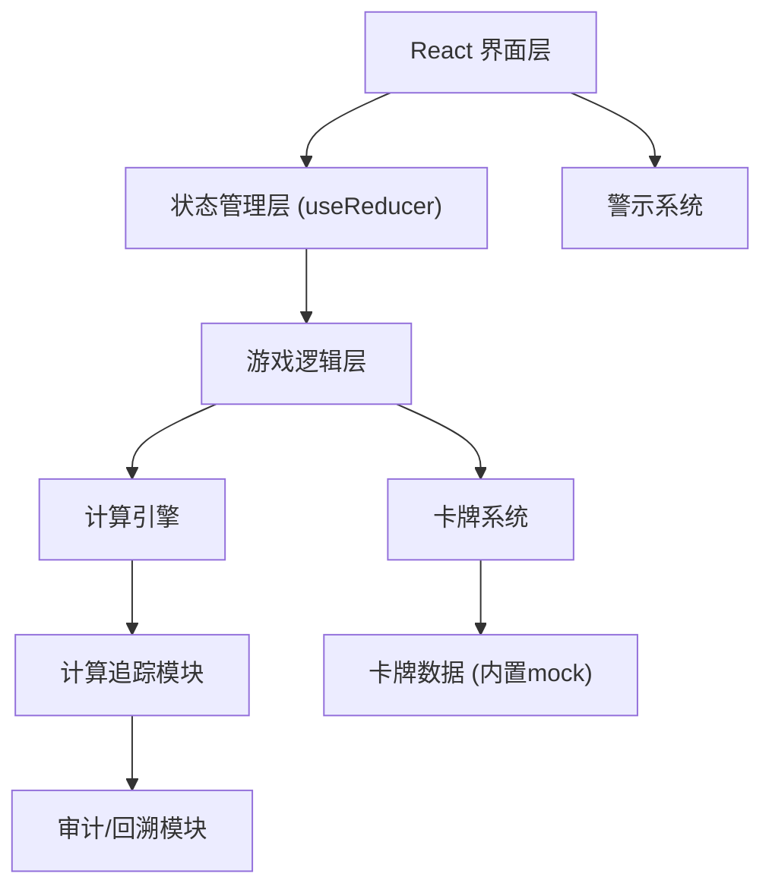
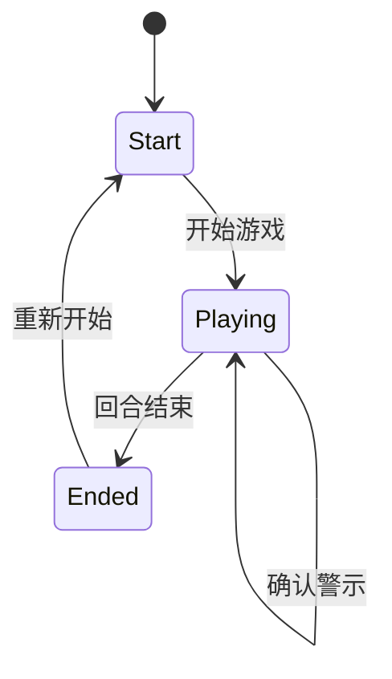

## 1. 架构设计



## 2. 技术描述

- **前端框架**: React@18 + TypeScript + Vite
- **样式方案**: TailwindCSS@3
- **状态管理**: React useReducer (轻量级游戏状态机)
- **构建工具**: Vite@5
- **包管理**: npm
- **数据来源**: 内置Mock数据，无需后端服务

## 3. 路由定义

| 路由 | 页面/组件 | 功能 |
|------|----------|------|
| / | GamePage | 游戏主界面 |
| /result | ResultPage | 结算与回溯页面 |

## 4. 核心数据模型

### 4.1 类型定义

```typescript
// 卡牌类型
type CardType = 'rain' | 'pump' | 'garden' | 'pipe';

interface Card {
  id: string;
  type: CardType;
  name: string;
  description: string;
  effect: {
    waterChange?: number;      // 水量变化(正数增加,负数减少)
    pumpLoad?: number;        // 泵站负荷变化
    gardenCapacity?: number;  // 绿地容量变化
    pipeFlow?: number;        // 管网流量
  };
}

// 城市状态
interface CityState {
  waterLevel: number;         // 当前积水水位
  pumpLoad: number;           // 泵站负荷 0-100
  pumpCapacity: number;       // 泵站最大容量
  gardenCapacity: number;     // 绿地剩余容量
  gardenMaxCapacity: number;  // 绿地最大容量
  lowAreaWater: number;       // 低洼积水
}

// 警示类型
type AlertType = 'pump_overload' | 'low_area_flood' | 'garden_depleted';

interface Alert {
  id: string;
  type: AlertType;
  message: string;
  severity: 'warning' | 'critical';
  stepIndex: number;
  confirmed: boolean;
}

// 计算追踪节点
interface CalcTraceNode {
  id: string;
  label: string;
  value: number;
  formula?: string;
  source?: string;       // 来源卡牌/操作ID
  children?: CalcTraceNode[];
}

// 游戏步骤记录
interface GameStep {
  index: number;
  action: string;
  cardUsed?: Card;
  stateBefore: CityState;
  stateAfter: CityState;
  calcTrace: CalcTraceNode;
  scoreChange: number;
  scoreReason: string;
  alerts: Alert[];
  timestamp: number;
}

// 游戏状态
interface GameState {
  phase: 'start' | 'playing' | 'ended';
  currentRound: number;
  totalRounds: number;
  score: number;
  cityState: CityState;
  handCards: Card[];
  currentRainCard?: Card;
  steps: GameStep[];
  activeAlerts: Alert[];
  confirmedAlerts: Alert[];
}
```

## 5. 核心模块设计

### 5.1 计算引擎 (CalcEngine)
- 负责所有数值计算的执行
- 每项计算都生成追踪节点，记录来源和公式
- 支持链式计算的审计

### 5.2 警示系统 (AlertSystem)
- 实时监控状态阈值
- 泵站过载: pumpLoad > 90
- 低洼积水: lowAreaWater > 50
- 绿地耗尽: gardenCapacity <= 0
- 触发时生成醒目警示

### 5.3 回溯系统 (AuditSystem)
- 存储每一步完整状态快照
- 支持按时间轴回放
- 支持点击任意节点查看计算详情链路

## 6. 状态机设计


