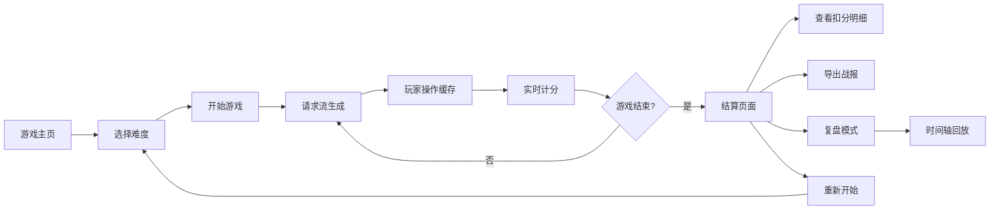

## 1. 产品概述
"算法缓存攻防战"是一款面向后端工程师的培训小游戏，通过模拟真实缓存场景，帮助新人理解缓存击穿、脏数据、过期误读等常见问题，建立正确的缓存策略思维。

- 目标用户：后端开发新人、缓存策略学习者、技术培训师
- 核心价值：将抽象的缓存理论转化为可交互的实战体验，降低学习门槛

## 2. 核心 Features

### 2.1 用户角色
| 角色 | 注册方式 | 核心权限 |
|------|----------|----------|
| 玩家 | 无需注册 | 开始游戏、操作缓存、查看结算 |
| 培训师 | 无需注册 | 导出战报、分析数据、复盘教学 |

### 2.2 功能模块
1. **游戏主页**：游戏介绍、开始按钮、难度选择
2. **游戏主界面**：缓存网格、请求流、操作面板、实时战报
3. **结算页面**：得分明细、扣分原因、策略分析、导出功能
4. **复盘模式**：时间轴回放、关键事件标记、冲突来源追溯

### 2.3 页面详情
| 页面名称 | 模块名称 | 功能描述 |
|----------|----------|----------|
| 游戏主页 | Hero区域 | 游戏标题、核心玩法说明、开始按钮 |
| 游戏主页 | 难度选择 | 简单/普通/困难三档，影响请求速度和复杂度 |
| 游戏主界面 | 缓存网格 | 可视化缓存槽，显示数据状态（有效/过期/脏数据） |
| 游戏主界面 | 请求流 | 动态显示待处理请求队列，标注请求类型 |
| 游戏主界面 | 操作面板 | 读取、写入、删除、刷新缓存等操作按钮 |
| 游戏主界面 | 实时战报 | 显示命中/ miss、冲突事件、当前得分 |
| 游戏主界面 | 控制面板 | 开始、暂停、重开、速度调节 |
| 结算页面 | 得分总览 | 总分、命中率、各项指标雷达图 |
| 结算页面 | 扣分明细 | 逐条列出扣分事件及人文化解释 |
| 结算页面 | 导出功能 | 导出战报JSON，重点标注缓存击穿拦截情况 |
| 复盘模式 | 时间轴 | 可拖动回放游戏全过程 |
| 复盘模式 | 冲突追溯 | 高亮显示脏数据来源、击穿点等关键事件 |

## 3. 核心流程
玩家选择难度后进入游戏，请求流持续产生数据请求，玩家通过操作缓存响应请求，系统实时计算得分。游戏结束后展示详细结算报告，支持导出和复盘。

## 4. 用户界面设计

### 4.1 设计风格
- **主题色**：深科技蓝 (#0F172A) 为主色调，霓虹青 (#06B6D4) 为强调色，警示红 (#EF4444) 标记错误
- **按钮风格**：圆角矩形，悬浮发光效果，点击有按压反馈
- **字体**：等宽字体 (JetBrains Mono) 显示代码类数据，现代无衬线字体 (Inter) 显示正文
- **布局风格**：分栏式布局，左侧缓存网格，中间请求流，右侧战报
- **图标风格**：线性图标，带有科技感，状态变化有颜色过渡动画

### 4.2 页面设计概述
| 页面名称 | 模块名称 | UI 元素 |
|----------|----------|----------|
| 游戏主页 | Hero区域 | 大标题、渐变背景、动效说明卡片 |
| 游戏主界面 | 缓存网格 | 3x3或4x4网格，每个格子显示key、value、ttl、状态标签 |
| 游戏主界面 | 请求流 | 垂直滚动列表，请求卡片带类型标识，过期倒计时 |
| 游戏主界面 | 实时战报 | 事件列表，新事件高亮入场，冲突事件红色标记 |
| 结算页面 | 扣分明细 | 时间线布局，每条扣分带解释和改进建议 |

### 4.3 响应式
- 桌面端优先，三栏布局
- 平板端：缓存网格与请求流并排，战报下移
- 移动端：单列滚动布局，折叠次要面板

### 4.4 动效设计
- 缓存命中：绿色闪光 + 数字跳转动画
- 缓存miss：橙色提示 + 回源加载动画
- 脏数据产生：红色警告闪烁 + 来源连线
- 缓存击穿：强烈红色脉冲 + 全屏警告边框
- 请求超时：灰色渐变消失 + 扣分飘字
